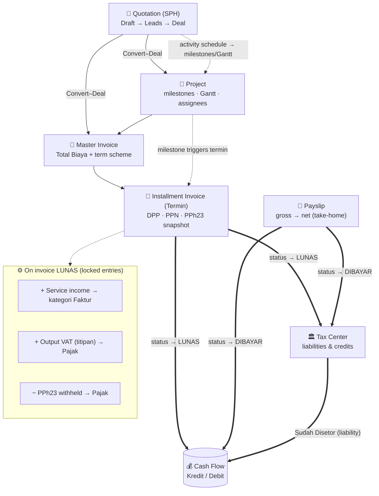
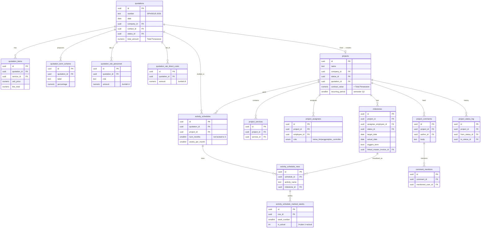
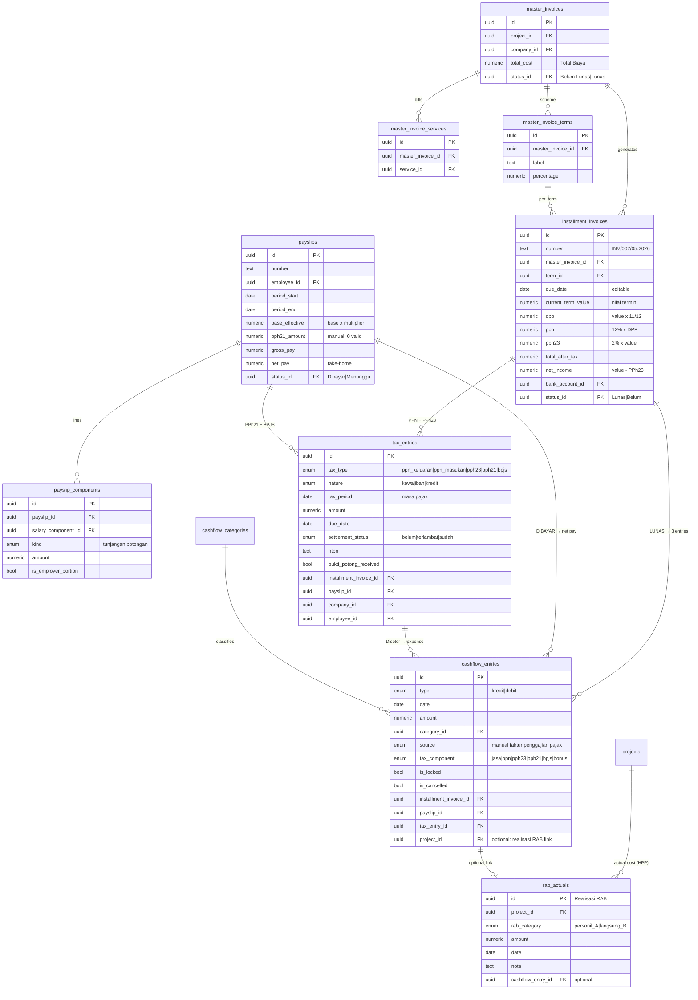
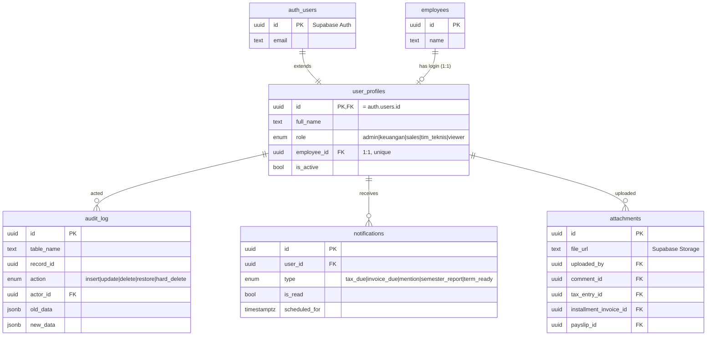

# Sinar Buana ERP — Database Diagram

Human-readable diagrams of the schema in [`src/schema/`](src/schema). Mermaid
renders automatically on GitHub and most Markdown viewers (VS Code: install
"Markdown Preview Mermaid Support").

- [1. Business flow](#1-business-flow-lifecycle--automation) — the lifecycle & automation
- [2. Master data & configuration](#2-master-data--configuration)
- [3. Quotation & Project](#3-quotation-sph--project)
- [4. Financial core](#4-financial-core-billing--payroll--cashflow--tax) — billing, payroll, cashflow, tax
- [5. Identity & cross-cutting](#5-identity--cross-cutting)
- [Legend](#legend)

---

## 1. Business flow (lifecycle & automation)

How a deal moves through the system and which automations fire (Postgres
triggers). Money is split into service / VAT / withholding at each step.

---

## 2. Master data & configuration

The configurable core (PRD Bab 9): dropdowns, workflow statuses, tariffs and
templates are **data**, edited by the client — not hard-coded.

```mermaid
erDiagram
    company_profile {
        bool singleton PK
        text legal_name
        text npwp
        bool is_pkp "drives PPN collection"
    }
    tax_settings {
        bool singleton PK
        numeric ppn_rate "12"
        int ppn_dpp_numerator "11"
        int ppn_dpp_denominator "12"
        numeric pph23_rate "2"
        int invoice_due_days
        enum corp_tax_method "final_0_5|badan_22"
        numeric corp_tax_rate "0.5 or 22"
        numeric umkm_threshold "4.8B/year"
    }
    dashboard_settings {
        bool singleton PK
        numeric project_margin_threshold "e.g. 0.8"
        int forecast_horizon_days "default 90"
        int stalled_project_days "no-activity alert"
    }
    numbering_settings {
        bool singleton PK
        text sph_format "SPH/{seq}/{month}.{year}"
        text inv_format "INV/{seq}/{month}.{year}"
    }
    document_number_sequences {
        uuid id PK
        enum doc_type "SPH|INV"
        smallint year
        smallint month
        int last_number "reset monthly"
    }
    workflow_statuses {
        uuid id PK
        enum entity "penawaran|proyek|faktur|penggajian|milestone"
        text label "client-renamable"
        enum system_role "SELESAI|LUNAS|DIBAYAR|BATAL"
    }
    cashflow_categories {
        uuid id PK
        text label
        enum system_key "FAKTUR|PENGGAJIAN|PAJAK|BPJS|BONUS"
        enum expense_nature "HPP|OPERASIONAL|NON_LABA_RUGI"
        bool is_system "locked"
    }
    message_templates {
        uuid id PK
        enum channel "email|whatsapp"
        enum document_type "sph|invoice|slip_gaji"
    }
    bank_accounts {
        uuid id PK
        text bank_name
        text account_number
        bool is_default
    }

    companies {
        uuid id PK
        text name
        text npwp
        uuid admin_area_id FK
    }
    company_contacts {
        uuid id PK
        uuid company_id FK
        text name
        text phone
    }
    service_catalog {
        uuid id PK
        text name
        uuid document_type_id FK
        uuid authority_id FK
        uuid legal_basis_id FK
        uuid milestone_template_id FK
        numeric standard_price
        bool is_recurring "Laporan Semester"
    }
    employees {
        uuid id PK
        text name
        uuid position_id FK
        uuid employment_status_id FK
        numeric base_salary
        text npwp
    }
    milestone_templates {
        uuid id PK
        text name
    }
    milestone_template_steps {
        uuid id PK
        uuid template_id FK
        text name
        bool triggers_term
    }
    employee_salary_components {
        uuid id PK
        uuid employee_id FK
        uuid salary_component_id FK
    }

    document_types     ||--o{ service_catalog : classifies
    authorities        ||--o{ service_catalog : kewenangan
    legal_bases        ||--o{ service_catalog : dasar_hukum
    milestone_templates ||--o{ service_catalog : default_steps
    milestone_templates ||--o{ milestone_template_steps : has
    admin_areas        ||--o{ companies : located_in
    companies          ||--o{ company_contacts : has_PIC
    positions          ||--o{ employees : holds
    employment_statuses ||--o{ employees : status
    employees          ||--o{ employee_salary_components : default_components
    salary_components   ||--o{ employee_salary_components : applied
```

---

## 3. Quotation (SPH) & Project

The SPH carries line items, a proposed term scheme, internal RAB (margin) and an
activity schedule that becomes the project's milestones & weekly Gantt.

---

## 4. Financial core (billing → payroll → cashflow → tax)

The accounting heart. Installment tax columns are stored snapshots (round
half-up). Auto cashflow/tax rows are `is_locked` and follow their source.

> **Dashboard profitability (computed, no aggregate tables):** the P&L waterfall (Revenue
> ex-PPN → COGS = `rab_actuals` → Gross → Opex via `cashflow_categories.expense_nature` →
> Operating/before-tax → corporate tax via `tax_settings` → Net/after-tax), per-project
> margin (plan RAB vs `rab_actuals`), cash forecast + runway, and the action center are all
> derived **real-time** from the entities above. PPh 23 is a credit/asset — **not** subtracted
> from P&L revenue. See planning specs Bab 8 & 10.4/10.8.

---

## 5. Identity & cross-cutting

Auth, audit, notifications and attachments wrap the whole system.

---

## Legend

| Symbol | Meaning |
| --- | --- |
| `||--o{` | one-to-many (parent → children) |
| `||--o|` | one-to-(zero-or-)one |
| `||--||` | one-to-one |
| `PK` / `FK` | primary key / foreign key |
| `==>` (flow) | trigger-driven automation |
| `-.->` (flow) | suggested / optional link |
| 🔒 locked | auto cashflow/tax rows immune to manual edit (`is_locked`) |

> Diagrams show **representative** columns for readability — every table, column,
> index, trigger and RLS policy lives in [`src/schema/`](src/schema) and
> [`sql/`](sql). Tax math, numbering and the automations above are verified
> end-to-end (see the validation notes in [README.md](README.md)).
