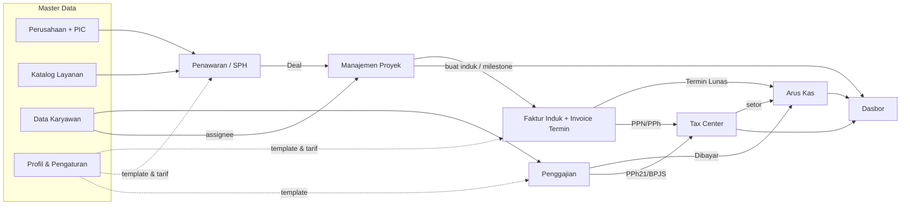

[← Daftar Isi](README.md)

---

## 1. Ringkasan Produk

- **Sistem ERP internal berbasis web** untuk operasional & keuangan harian konsultan lingkungan.
- **Pengguna target:** tim internal — Owner/Direktur, Keuangan, Marketing/Sales, dan Tim
  Teknis/Penyusun (Ketua Tim, Anggota, Document Controller).
- **Platform:** aplikasi web (browser), responsif desktop & tablet.
- **Bahasa:** Bahasa Indonesia. **Mata uang:** IDR (format `Rp 1.000.000`, tanpa desimal).
- **Cakupan modul:** Master Data, Penawaran, Faktur, Penggajian, Manajemen Proyek, Arus Kas,
  Dasbor, dan Konfigurasi.

### 1.1 Peta Modul & Keterkaitan

---
