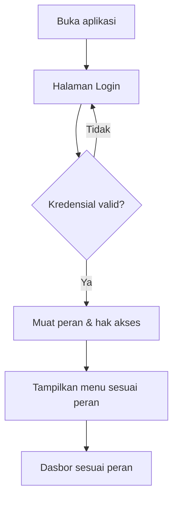

[← Daftar Isi](README.md)

---

## 2. Peran Pengguna & Hak Akses (RBAC)

### 2.1 Peran
| Peran | Deskripsi |
| --- | --- |
| **Admin / Owner** | Akses penuh seluruh modul + konfigurasi sistem. |
| **Keuangan** | Faktur, Penggajian, Arus Kas, Dasbor keuangan, ekspor. |
| **Marketing / Sales** | Perusahaan, Katalog Layanan, Penawaran. |
| **Tim Teknis** | Manajemen Proyek (sesuai assignment) — Ketua Tim, Anggota, Document Controller. |
| **Viewer** | Hanya melihat (read-only) modul yang diizinkan. |

### 2.2 Matriks Hak Akses (ringkas)
Legenda: **C**reate · **R**ead · **U**pdate · **D**elete · **E**xport · **S**end

| Modul | Admin | Keuangan | Sales | Tim Teknis | Viewer |
| --- | --- | --- | --- | --- | --- |
| Perusahaan & PIC | CRUDE | R | CRUE | R | R |
| Katalog Layanan | CRUD | R | CRU | R | R |
| Data Karyawan | CRUD | R | – | R | – |
| Penawaran (SPH) | CRUDES | R | CRUES | R | R |
| Faktur (Induk & Termin) | CRUDES | CRUDES | R | R | – |
| Penggajian / Slip | CRUDES | CRUDES | *slip sendiri* | *slip sendiri* | – |
| Manajemen Proyek | CRUD | R | R | **CRU** (assignment) | R |
| Arus Kas | CRUDE | CRUDE | – | – | R |
| Perpajakan (Tax Center) | CRUDE | CRUDES | – | – | – |
| Dasbor | R | R | R (terbatas) | R (proyek) | R |
| Konfigurasi | CRUD | – | – | – | – |
| Akun Pengguna | CRUD | – | – | – | – |

> **Catatan keamanan:** modul Proyek dapat **diakses semua karyawan** sesuai assignment.
> **Slip gaji bersifat rahasia** — **setiap karyawan (apa pun perannya) dapat melihat &
> mengunduh slip miliknya sendiri**; akses penuh penggajian hanya Keuangan/Admin.

**Hak akses rinci Dasbor** (panel tanpa izin **tidak dirender** — server-side; lihat
[Bab 8.7](08-dasbor.md#87-pusat-komando--dasbor-per-peran)):

| Hak akses | Admin | Keuangan | Sales | Tim Teknis | Viewer |
| --- | :-: | :-: | :-: | :-: | :-: |
| `view_profit` — Laba-Rugi (laba kotor/bersih) | ✓ | ✓ | ✗ | ✗ | ✗ |
| `view_project_cost` — biaya/margin proyek (Realisasi RAB) | ✓ | ✓ | ✗ | ✗ | ✗ |
| `view_forecast` — proyeksi kas & runway | ✓ | ✓ | ✗ | ✗ | ✗ |
| `view_tax_detail` — posisi pajak rinci | ✓ | ✓ | ✗ | ✗ | ✗ |

### 2.3 Userflow — Login & Otentikasi

**Langkah:** 1) Pengguna membuka aplikasi → diarahkan ke Login. 2) Memasukkan email &
kata sandi. 3) Sistem memverifikasi; bila gagal, tampilkan pesan & ulangi. 4) Bila berhasil,
sistem memuat peran dan menyaring menu/aksi sesuai matriks RBAC. 5) Pengguna diarahkan ke
dasbor yang relevan dengan perannya.

### 2.4 Manajemen Akun Pengguna
Dikelola oleh **Admin** (hanya Admin — lihat matriks 2.2).

| Field Akun | Keterangan |
| --- | --- |
| Nama | Nama pengguna |
| **Email (login)** | Identitas masuk, **unik** |
| Peran | Satu peran RBAC ([Bab 2.1](#21-peran)) |
| **Tautan Karyawan** | Relasi **1:1** ke Data Karyawan — **wajib** untuk akses "slip sendiri" & menjadi assignee proyek |
| Status | Aktif / Nonaktif |

- **Kata sandi:** akun baru diaktifkan via **undangan email** (pengguna set sandi sendiri)
  atau diset Admin; **reset password** melalui tautan/token email, atau oleh Admin.
- **Satu karyawan = satu akun** (1:1) agar slip gaji & assignment proyek termonitor.
- Karyawan keluar → akun **dinonaktifkan (bukan dihapus)**; jejak audit tetap (soft delete,
  [Bab 13](13-non-fungsional.md#13-persyaratan-non-fungsional)).
- **Alur:** Admin buat akun → pilih peran + tautkan karyawan → kirim undangan email →
  pengguna set sandi → login.

---
