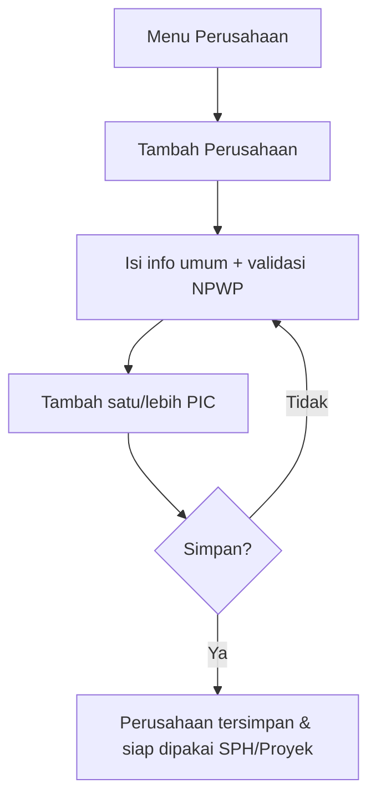

[← Daftar Isi](README.md)

---

## 3. Master Data

### 3.1 Data Perusahaan (Mitra)
**Informasi umum**
| Bidang | Tipe | Status |
| --- | --- | --- |
| Nama Perusahaan | Teks | Wajib |
| Alamat | Area teks | Wajib |
| Kota | Teks / Dropdown | Wajib |
| Kabupaten | Teks / Dropdown | Wajib |
| Area Administrasi / Kawasan Industri | Dropdown (master) | Opsional |
| Negara | Statis: Indonesia | Wajib |
| NPWP | Teks (maks. 16 digit) | Wajib |
| Email Perusahaan | Email | Opsional |
| Status | Aktif / Nonaktif | Wajib (default Aktif) |

> Area Administrasi / Kawasan Industri adalah salah satu daftar "Master Data
> Terkelola" (Bab 9.1) — dropdown-nya baru berisi pilihan setelah modul
> Konfigurasi tersambung ke database sungguhan; sampai saat itu field ini
> tetap opsional/kosong.

**Narahubung / PIC** — mendukung **lebih dari satu** PIC per perusahaan. PIC
pertama pada daftar otomatis menjadi kontak utama.
| Bidang | Tipe | Status |
| --- | --- | --- |
| Nama Narahubung | Teks | Wajib |
| Jabatan Narahubung | Teks | Opsional |
| Nomor HP | Telepon | Wajib |
| Email Narahubung | Email | Opsional |

### 3.2 Katalog Layanan *(baru)*
Daftar jenis layanan sebagai **master data** (bukan teks bebas). Diturunkan dari katalog
"Jenis Layanan" milik klien.
| Bidang | Keterangan |
| --- | --- |
| Nama Layanan | mis. "Penyusunan Pertek Air Limbah" |
| Jenis Dokumen | mis. Rintek B3, Standar Teknis, SPPL, RKL-RPL Rinci, SLO |
| Kewenangan | Provinsi / Kota-Kabupaten / Kawasan Industri |
| Dasar Hukum | mis. Permenlhk No.5 Tahun 2021 |
| Harga Standar (opsional) | Nilai acuan untuk penawaran |
| Tag Berulang | mis. Laporan Semester (memicu pengingat) |
| Template Milestone (opsional) | Langkah default proyek untuk layanan ini |

### 3.3 Data Karyawan *(baru)*
Sumber relasi untuk Penggajian & assignee Proyek.
| Bidang | Keterangan |
| --- | --- |
| Nama Karyawan | Wajib |
| Jabatan / Posisi | Dropdown master (mis. Staff Teknik, Ketua Tim) |
| Status Kepegawaian | Probation / Tetap / Kontrak (master, + pengali) |
| Gaji Pokok | IDR |
| Pengali | mis. Probation = 0,8 (dari status kepegawaian) |
| Tunjangan Default | mis. BPJS Kesehatan (komponen gaji master) |
| Info Bank | Opsional |
| NPWP / PTKP | Untuk perhitungan pajak penggajian |
| Tanggal Masuk | Tanggal |

### 3.4 Profil Perusahaan & Pengaturan
Dipakai pada header/footer & perhitungan dokumen.
- Logo, identitas PT, alamat, kontak (telepon, email, website) → header & footer dokumen.
- **Rekening bank — dikelola pengguna, boleh lebih dari satu** (nama bank, atas nama, nomor
  rekening; mis. **BNI a.n. SINAR BUANA MANDIRI JAYA — 0559332815**); dapat dipilih per faktur.
- Penandatangan default (mis. Direktur).
- **NPWP & Status PKP perusahaan** (menentukan pemungutan PPN di faktur — lihat [Tax Center](10-penanganan-pajak.md#106-modul-perpajakan-tax-center)).
- **Akun email pengirim** (untuk kirim dokumen otomatis) & template pesan email/WhatsApp.
- Format penomoran dokumen (SPH/INV) & tarif pajak default → lihat [Bab 9](09-konfigurasi.md#9-modul-konfigurasi--master-data-terkelola).

### 3.5 Userflow — Kelola Perusahaan + PIC

**Langkah:** 1) Buka menu Perusahaan → Tambah. 2) Isi informasi umum (validasi NPWP ≤16
digit). 3) Tambah satu atau beberapa PIC (nama + HP wajib). 4) Simpan. Perusahaan kini
dapat dipilih di Penawaran, Faktur, dan Proyek. Pola serupa berlaku untuk **Kelola Katalog
Layanan** dan **Kelola Karyawan**.

---
