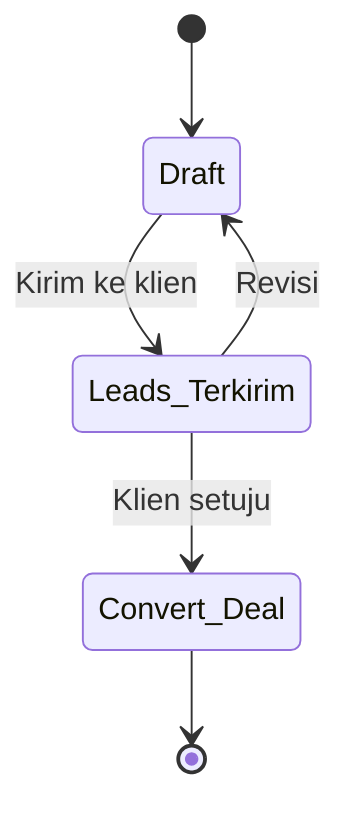
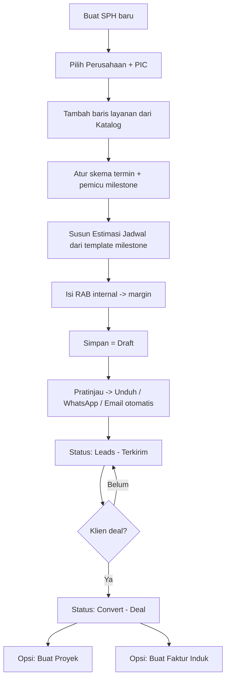

[← Daftar Isi](README.md)

---

## 4. Modul Penawaran (Quotation / SPH)

### 4.1 Daftar Penawaran
Dapat **diedit langsung dari daftar** (inline) + pencarian, filter, urut, paginasi, ekspor.
| Kolom | Tipe | Keterangan |
| --- | --- | --- |
| No SPH | Auto-generate | Format `SPH/001/5.2026` (lihat Bab 9.5) |
| Tanggal | Tanggal | Tanggal pembuatan |
| Nama Perusahaan | Relasi | Dari Master Data Perusahaan |
| Jenis Layanan | Relasi | Satu/lebih item dari Katalog Layanan |
| Status | Pilihan (workflow) | Draft / Leads–Terkirim / Convert–Deal |
| Total Penawaran | IDR | Nilai total |

### 4.2 Isi Dokumen SPH (mengikuti format nyata)
- **Kop & tujuan:** No SPH, tanggal, perihal, kepada (Perusahaan + PIC + alamat / "Di Tempat").
- **Baris layanan** (relasi Katalog Layanan): Uraian, Harga Satuan (Rp), Vol/Paket, Total.
- **Terbilang** otomatis (mis. "Seratus Dua Puluh Lima Juta Rupiah").
- **Masa berlaku** (mis. "berlaku 30 hari kalender").
- **Catatan/Ketentuan** (mis. pengecualian biaya konstruksi fisik IPAL/TPS LB3).
- **Skema Termin** (usulan) dengan **pemicu milestone**, mis.:
  - 40% saat memulai pekerjaan
  - 20% saat Rincian Teknis selesai
  - 20% saat Pertek Air Limbah selesai
  - 20% saat UKL-UPL selesai

  > Skema ini bersifat **usulan di SPH**; saat penagihan, skema dipakai sebagai acuan untuk
  > mengonfigurasi termin pada **Faktur Induk** ([Bab 5.1](05-dokumen-bisnis.md#51-faktur-induk--invoice-termin)).

### 4.3 RAB Internal
Estimasi biaya internal untuk menghitung **margin proyek** (tidak ditampilkan ke klien).
- **Biaya Personil:** peran (Ketua Tim, Anggota, Document Controller), volume (bulan),
  harga satuan → Jumlah A.
- **Biaya Langsung:** tunjangan lapangan, survey, penyusunan, cetak, komunikasi,
  transportasi → Jumlah B.
- **Total RAB = A + B**; **Estimasi Margin (Margin Rencana) = Total Penawaran − Total RAB**.

> **RAB = rencana biaya.** Saat proyek berjalan, biaya aktual dicatat sebagai **Realisasi RAB**
> per proyek ([Bab 6.8](06-manajemen-proyek.md#68-realisasi-rab--profitabilitas-proyek)) sehingga **Margin Rencana** dapat
> dibandingkan dengan **Margin Aktual** di Dasbor ([Bab 8.3](08-dasbor.md#83-profitabilitas-per-proyek)) — margin
> tidak lagi berhenti sebagai estimasi di fase penawaran.

### 4.4 Status & Transisi

> Daftar status di atas adalah **default** dan dikelola via [Workflow Status](09-konfigurasi.md#92-workflow-status-konfigurabel).

### 4.5 Estimasi Jadwal Rencana Kegiatan & Dokumen
- **Estimasi Jadwal Rencana Kegiatan (activity timeline)** — **disusun sejak fase
  penawaran** dan menjadi bagian paket SPH (sesuai file nyata PT MAB / Rintek). Format:
  tabel **kegiatan × minggu**. Daftar kegiatan ditarik dari **template milestone per jenis
  layanan** ([Bab 6.2](06-manajemen-proyek.md#62-milestone--checklist--konfigurabel-per-proyek) /
  [9.4](09-konfigurasi.md#94-template)) lalu dapat disesuaikan — sehingga **konsisten dengan milestone
  proyek** nanti dan tidak perlu diinput ulang.
- **Durasi dapat diatur klien** — jumlah bulan **tidak dikunci 3**; bisa ditambah/dikurangi
  sesuai estimasi proyek (default 4 minggu per bulan, jumlah minggu juga dapat disesuaikan).
- **Penanda minggu per kegiatan** — untuk setiap baris kegiatan, klien dapat **menandai
  (toggle)** kolom minggu yang menjadi rentang waktu kegiatan tersebut. Sel yang ditandai
  **tersorot (kuning)** seperti pada referensi. Layout & contoh di
  [Bab 11.1](11-template-pdf.md#111-detail-template-estimasi-jadwal-rencana-kegiatan).
- **Template PDF (paket penawaran):** SPH + (opsional) RAB internal + **Estimasi Jadwal**,
  dapat dikustomisasi per dokumen.
- **Unduh** ke perangkat lokal.
- **Kirim via WhatsApp:** sistem membuka tautan `wa.me` ke nomor PIC dengan pesan terisi
  otomatis (mis. nama perusahaan + no SPH); pengguna **melampirkan PDF yang sudah diunduh**
  secara manual. Tanpa biaya gateway.
- **Kirim Email (otomatis):** sistem mengirim email ke PIC / email perusahaan dengan **paket
  PDF terlampir**. **Set aksi lengkap** (draf, pratinjau, edit, unduh, WA, email) mengikuti
  standar [Bab 11.2](11-template-pdf.md#112-aksi-dokumen-berlaku-untuk-semua-dokumen).

### 4.6 Keterkaitan
Saat status menjadi **Convert–Deal**, sistem menawarkan:
- **Buat Proyek** — satu proyek membawa **seluruh baris layanan** SPH, **Estimasi Jadwal →
  milestone & Gantt proyek**, dan **Nilai Kontrak** (= Total Penawaran), tanpa input ulang.
- **Buat Faktur Induk** — membuat penagihan di bawah proyek; membawa layanan, Total Biaya,
  & skema termin usulan untuk dikonfigurasi (lihat [Bab 5.1](05-dokumen-bisnis.md#51-faktur-induk--invoice-termin)).

> **Status implementasi:** Penawaran sudah tersambung ke database sungguhan
> (header, baris layanan, RAB internal per baris, Estimasi Jadwal per baris,
> skema termin, status). Perubahan status ke **Convert–Deal** sudah
> memperbarui status penawaran yang sebenarnya, tetapi **Buat Proyek** dan
> **Buat Faktur Induk** di atas masih simulasi (data contoh) — menunggu Proyek
> dan Faktur Induk mendapat giliran tersambung ke database masing-masing.
> Kelengkapan Administrasi (Bab 4 lampiran) juga masih simulasi, menunggu
> modulnya sendiri.

### 4.7 Userflow — Penawaran

**Langkah:** 1) Buat SPH, pilih perusahaan & PIC. 2) Tambah baris layanan dari Katalog
(harga otomatis terisi bila ada). 3) Atur skema termin & kaitkan ke milestone. 4) Susun
**Estimasi Jadwal Rencana Kegiatan** dari template milestone layanan (dapat disesuaikan).
5) Isi RAB internal untuk melihat margin. 6) Simpan sebagai Draft. 7) Pratinjau lalu unduh
paket PDF (SPH + Estimasi Jadwal) / kirim WhatsApp / **kirim email otomatis** → status
*Leads–Terkirim*. 8) Bila klien setuju →
*Convert–Deal* → muncul opsi **Buat Proyek** (Estimasi Jadwal otomatis menjadi milestone &
Gantt proyek) dan **Buat Faktur Induk**.

---
