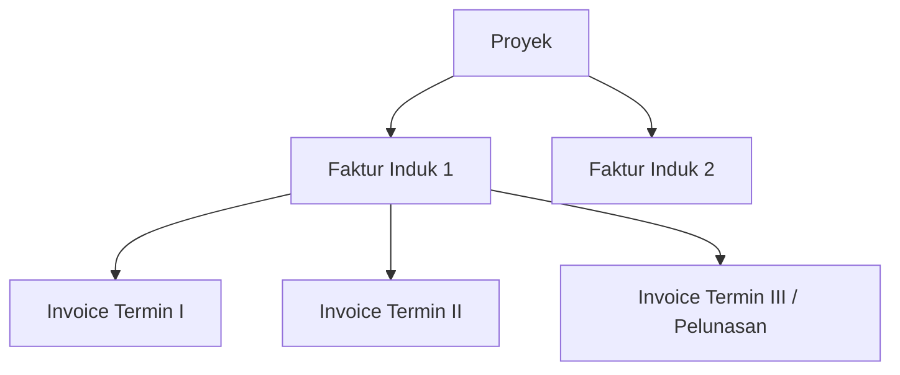
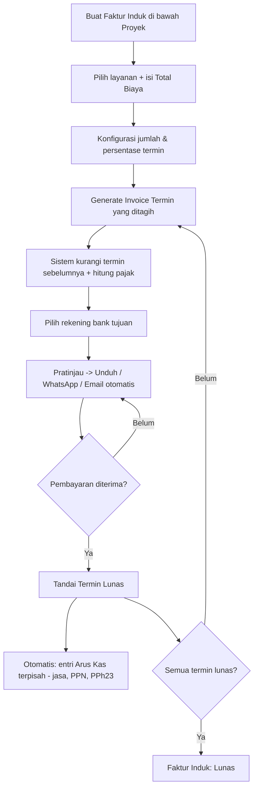
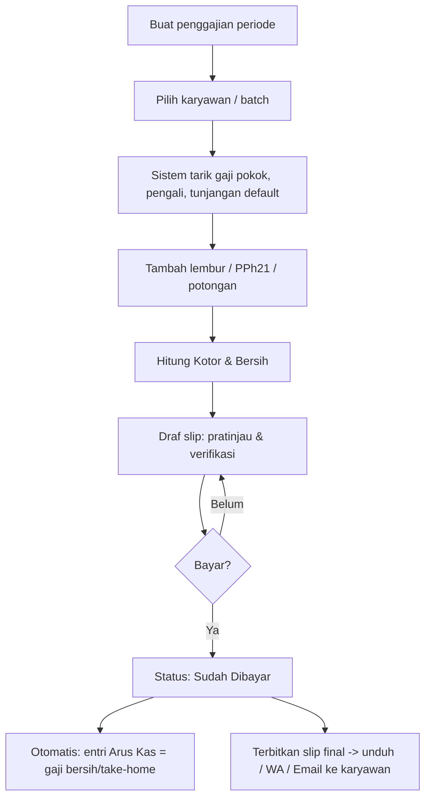

[← Daftar Isi](README.md)

---

## 5. Modul Dokumen Bisnis

### 5.1 Faktur Induk & Invoice Termin

**Hierarki penagihan:** `Proyek → Faktur Induk → Invoice Termin`.
- **Satu proyek dapat memiliki beberapa Faktur Induk** (mis. penagihan terpisah per layanan
  atau per batch pekerjaan).
- **Satu Faktur Induk berisi beberapa Invoice Termin** yang **jumlah & persentasenya
  dikonfigurasi pengguna** (mis. 3 termin 40/40/20 atau 4 termin 40/20/20/20).

#### A. Faktur Induk (Master Invoice)
| Kolom | Keterangan |
| --- | --- |
| ID Faktur Induk | Auto-generate |
| Relasi Proyek/Penawaran | Sumber kontrak |
| Nama Perusahaan | Relasi |
| Layanan yang ditagih | Satu/lebih baris layanan (relasi Katalog Layanan) |
| **Total Biaya** | Nilai total yang ditagih oleh faktur induk ini |
| Skema Termin | Jumlah termin + persentase (**dikonfigurasi pengguna**) |
| Status | Belum Lunas / Lunas (saat semua termin terbayar) |

#### B. Invoice Termin
| Kolom | Keterangan |
| --- | --- |
| No Inv | Auto-generate, mis. `INV/002/05.2026` |
| Label Termin | mis. "TERMIN III (Pelunasan)" |
| Tanggal | Tanggal pembuatan |
| **Jatuh Tempo Pembayaran** | Tanggal tempo klien membayar — **dapat diedit** (default = Tanggal + N hari, N dikonfigurasi di [Bab 9.5](09-konfigurasi.md#95-tarif--penomoran)); dipakai untuk piutang & status terlambat |
| Relasi Faktur Induk | Induk penagihan |
| Pengurang Termin Sebelumnya | Seluruh termin sebelumnya **dalam induk yang sama** |
| Nilai Termin Berjalan | Nilai yang ditagih pada invoice ini |
| Status | Lunas / Belum Lunas (per termin) |
| Pendapatan Kotor | Nilai termin (sebelum pajak) |
| Pendapatan Bersih | Nilai termin − PPh 23 (PPN bersifat titipan, lihat [Bab 10.4](10-penanganan-pajak.md#104-pendapatan-kotor-bersih-laba-rugi--perlakuan-arus-kas)) |

**Mesin pajak (lihat [Bab 10](10-penanganan-pajak.md#10-penanganan-pajak)):** DPP = nilai × 11/12; PPN = 12% ×
DPP; PPh 23 = 2% × nilai (dipotong); **Total Setelah Pajak = Nilai + PPN − PPh 23**.

#### C. Pembuatan & Pengurang Termin
- Dari satu Faktur Induk, pengguna **men-generate Invoice Termin** satu per satu
  (Termin I → II → III/Pelunasan).
- **Setiap Invoice Termin menampilkan seluruh termin sebelumnya (dalam induk yang sama)
  sebagai pengurang** dari **Total Biaya**, hingga diperoleh nilai termin berjalan — persis
  contoh nyata (Invoice Termin III / Pelunasan):

  | Uraian | Rp |
  | --- | --- |
  | Total Biaya (Faktur Induk) | 125.000.000 |
  | − Termin I (40%) | −50.000.000 |
  | − Termin II (40%) | −50.000.000 |
  | **Nilai Termin III (Pelunasan)** | **25.000.000** |

- Sistem **mencegah total seluruh termin melebihi Total Biaya** induk, dan menandai Faktur
  Induk **Lunas** saat seluruh terminnya terbayar. Pajak dihitung atas **nilai termin berjalan**.

#### D. Rekening Bank & Catatan
- **Rekening bank dapat dikonfigurasi sendiri oleh pengguna** (nama bank, atas nama, nomor
  rekening) melalui Pengaturan ([Bab 9](09-konfigurasi.md#91-daftar-pilihan-master-data)). Bila terdapat
  lebih dari satu rekening, **dapat dipilih per faktur**. Penandatangan diambil dari Profil
  Perusahaan.
- **Catatan dokumen:** "Invoice ini berlaku sebagai kwitansi".
- **Template PDF** meniru invoice nyata. **Set aksi lengkap** — draf, pratinjau, edit, unduh,
  **kirim WhatsApp** (tautan `wa.me` + lampir PDF manual), **kirim Email otomatis** (PDF
  terlampir ke PIC/perusahaan) — mengikuti standar [Bab 11.2](11-template-pdf.md#112-aksi-dokumen-berlaku-untuk-semua-dokumen).
- Dapat diedit inline dari daftar. **No Inv tidak berubah saat faktur diedit** (lihat Bab 9.5).

#### E. Userflow — Faktur Induk → Invoice Termin

**Langkah:** 1) Buat **Faktur Induk** di bawah proyek, pilih layanan & isi Total Biaya.
2) Konfigurasi jumlah & persentase termin. 3) Generate **Invoice Termin** yang ditagih →
sistem mengurangi termin sebelumnya & menghitung pajak otomatis. 4) Pilih rekening bank.
5) Pratinjau → unduh/kirim (WA/email). 6) Saat dibayar → tandai **Lunas** → sistem membuat
**entri arus kas terpisah** (pendapatan jasa, PPN titipan, PPh 23) — lihat
[Bab 10.4](10-penanganan-pajak.md#104-pendapatan-kotor-bersih-laba-rugi--perlakuan-arus-kas). 7) Saat seluruh termin lunas,
Faktur Induk menjadi **Lunas**.

### 5.2 Penggajian (Payroll) / Slip Gaji
Mengikuti format slip nyata.
| Kolom | Keterangan |
| --- | --- |
| No / ID | Auto-generate |
| Nama Karyawan | Relasi Data Karyawan |
| Posisi & Status | mis. Staff Teknik — Probation |
| Periode | **Rentang tanggal kustom** (mis. 24 Mar – 24 Apr) |
| Status | Sudah Dibayar / Menunggu Pembayaran |
| Penggajian Kotor | Sebelum potongan pajak |
| Penggajian Bersih | Setelah potongan |

**Komponen perhitungan:**
- **Gaji Pokok × pengali** (mis. Probation ×0,8 → `2.800.000 × 0,8 = 2.240.000`).
- **Tunjangan** (mis. BPJS Kesehatan), **Lembur** (mis. per hari).
- **PPh 21 — input manual** oleh Keuangan per karyawan/periode; **boleh diisi 0 dan tetap
  valid** (mis. gaji di bawah PTKP). Potongan lain (mis. BPJS) sesuai komponen gaji.
- **Penggajian Kotor** = Gaji Pokok efektif (×pengali) + tunjangan + lembur (+ bonus).
- **Penggajian Bersih (take-home)** = Penggajian Kotor − PPh 21 − potongan lain (mis. BPJS
  porsi karyawan). *(Nilai ini = "Jumlah Gaji" pada slip & kas keluar di Arus Kas.)*

- **Siklus slip:** **Draf & pratinjau tersedia sebelum pembayaran** (untuk verifikasi
  Keuangan). **Penerbitan final & pengiriman ke karyawan dilakukan setelah status = Sudah
  Dibayar** — agar slip resmi berfungsi sebagai bukti pembayaran.
- **Slip rahasia** — hanya karyawan ybs + Keuangan/Admin. **Set aksi lengkap** (draf,
  pratinjau, edit, unduh, **kirim WhatsApp** ke nomor karyawan, **kirim Email otomatis** ke
  email karyawan) mengikuti standar [Bab 11.2](11-template-pdf.md#112-aksi-dokumen-berlaku-untuk-semua-dokumen);
  tujuan pengiriman **hanya karyawan bersangkutan**.

#### Userflow — Penggajian

**Langkah:** 1) Buat penggajian untuk satu periode (rentang tanggal). 2) Pilih karyawan
(atau batch). 3) Sistem menarik gaji pokok, pengali status, dan tunjangan default.
4) Tambah lembur/PPh21/potongan. 5) Hitung kotor & bersih. 6) **Draf slip dapat
dipratinjau/diverifikasi** sebelum bayar. 7) Tandai **Sudah Dibayar** → entri **Pengeluaran
(Debit)** kategori **Penggajian** sebesar **gaji bersih (take-home)** di Arus Kas, dan
**terbitkan slip final** + kirim ke karyawan. Potongan PPh 21/BPJS disetor terpisah saat
pelunasan ke kas negara/BPJS — lihat [Bab 10.5](10-penanganan-pajak.md#105-perlakuan-arus-kas-penggajian).

---
