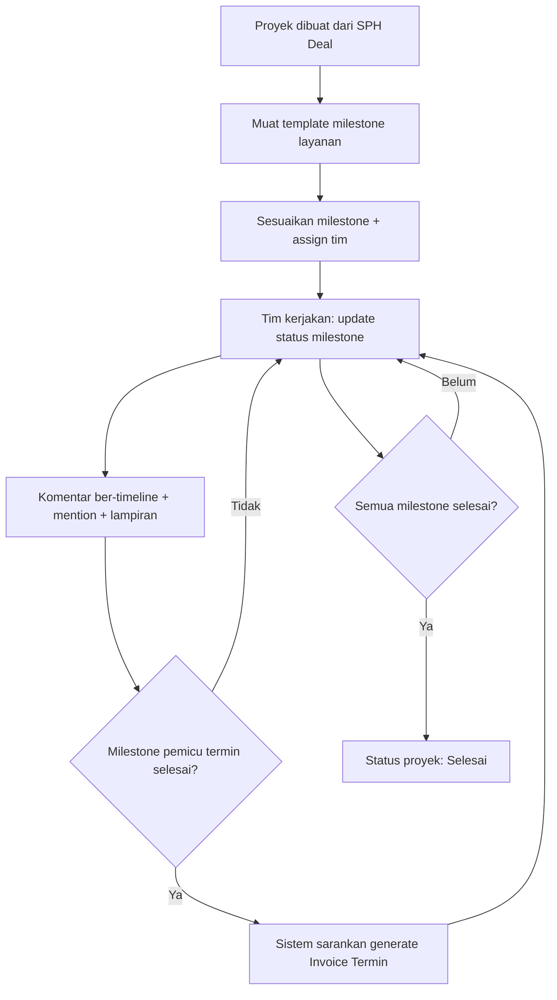

[← Daftar Isi](README.md)

---

## 6. Modul Manajemen Proyek (ClickUp-style)

Diakses **semua karyawan** sesuai assignment. Menggabungkan tracker nyata klien dengan
fitur kolaborasi bergaya ClickUp (assignee + komentar ber-timeline).

### 6.1 Field Proyek
| Field | Keterangan |
| --- | --- |
| Nama Proyek | Teks |
| Perusahaan | Relasi (1 perusahaan bisa banyak proyek) |
| Area Administrasi / Kawasan Industri | mis. KIIC, KITC, Dwipapuri Abadi |
| Tahun Pengerjaan | mis. 2025 / 2026 |
| Layanan (banyak) | **Satu proyek dapat memuat beberapa layanan** (relasi Katalog Layanan), masing-masing dengan jenis dokumennya |
| Status Pekerjaan | Workflow terkelola (lihat di bawah) |
| Nilai Kontrak | IDR (= Total Penawaran SPH; lihat [glosarium](00-ringkasan-eksekutif.md#06-glosarium)) |
| Relasi Penawaran / Faktur | Tautan ke SPH & **Faktur Induk** (beberapa per proyek) |
| Assignee(s) | Ketua Tim, Anggota, Document Controller (dari Data Karyawan) |

**Status default** (dapat diubah/ditambah di [Bab 9.2](09-konfigurasi.md#92-workflow-status-konfigurabel)):
`PO/Kontrak → Collecting Data → Drafting → Tunggu Pengesahan → Pending → Selesai` (+ `Batal`).

### 6.2 Milestone / Checklist — Konfigurabel per Proyek
- Setiap proyek memiliki milestone **sendiri**; jumlah & isi bisa berbeda antar proyek/jenis
  dokumen. Pengguna dapat **tambah / ubah / hapus / urut** milestone.
- Tiap milestone: nama, assignee, target & tanggal aktual, status, dan **(opsional) pemicu
  termin**.
- **Template milestone default per Jenis Layanan** (dikelola di Katalog Layanan/Bab 9.4)
  dapat dimuat saat proyek dibuat, lalu **tetap dapat disesuaikan**. Contoh template 12
  langkah (dari Estimasi Jadwal nyata):
  1. Survey Lokasi 2. Pengumpulan Data & Berkas Administrasi 3. Penyusunan Dokumen
  4. Rapat Internal Awal 5. Penyelesaian Draft & Gambar 6. Asistensi dengan Pihak LH
  7. Revisi Dokumen 8. Finalisasi Dokumen 9. Pengumpulan Dokumen Final ke LH
  10. Pembahasan dengan LH 11. Revisi Akhir 12. Penerbitan Dokumen

### 6.3 Timeline / Gantt
Tampilan Gantt **mingguan** per proyek, meniru format Estimasi Jadwal Rencana Kegiatan.
**Durasi mengikuti Estimasi Jadwal — jumlah bulan tidak dikunci** (lihat
[Bab 4.5](04-penawaran-sph.md#45-estimasi-jadwal-rencana-kegiatan--dokumen) & [11.1](11-template-pdf.md#111-detail-template-estimasi-jadwal-rencana-kegiatan)).
Tiap milestone tergambar pada minggu **rencana vs aktual**. **Diisi otomatis dari Estimasi
Jadwal yang sudah disusun di fase penawaran**, lalu tim memperbarui realisasinya.

### 6.4 Kolaborasi (ClickUp-style)
- **Komentar ber-timeline / activity feed**: komentar bertanggal, **mention** (`@karyawan`),
  **lampiran** file.
- **Log perubahan status** otomatis (audit: siapa mengubah apa & kapan).

### 6.5 Keterkaitan Termin ↔ Milestone
Saat milestone bertanda pemicu termin **selesai**, sistem menyarankan untuk **men-generate
Invoice Termin** terkait pada **Faktur Induk** (mis. "Rincian Teknis selesai" → Termin 20%).
Karena satu proyek bisa punya beberapa layanan & beberapa Faktur Induk, milestone dapat
dikaitkan ke **layanan / Faktur Induk** tertentu.

### 6.6 Laporan Semester Berulang *(value-add)*
Untuk klien dengan layanan ber-tag berulang (Laporan Semester), sistem **otomatis membuat
pengingat/proyek** Laporan Semester I & II per klien per tahun agar kewajiban tidak terlewat.

### 6.7 Userflow — Proyek

**Langkah:** 1) Proyek dibuat otomatis dari SPH yang Deal (atau manual). 2) Sistem memuat
template milestone sesuai jenis layanan. 3) Sesuaikan milestone & assign tim. 4) Tim
mengerjakan & memperbarui status milestone. 5) Berkolaborasi via komentar ber-timeline.
6) Saat milestone pemicu selesai → sistem menyarankan **generate Invoice Termin**. 7) Saat
semua selesai → status proyek **Selesai**.

### 6.8 Realisasi RAB & Profitabilitas Proyek
RAB di SPH ([Bab 4.3](04-penawaran-sph.md#43-rab-internal)) adalah **rencana biaya**. Agar margin tidak berhenti
sebagai estimasi, **biaya aktual dicatat sebagai Realisasi RAB per proyek** (input manual oleh
Keuangan; lightweight, tanpa penandaan tiap transaksi).

| Field Realisasi RAB | Keterangan |
| --- | --- |
| Proyek | Relasi (wajib) |
| Kategori RAB | **Personil (A)** / **Langsung (B)** — selaras struktur RAB |
| Nilai Aktual | IDR |
| Tanggal | Tanggal biaya |
| Catatan | Opsional |
| Tautan Arus Kas | Opsional — bila biaya juga tercatat di Arus Kas (kategori ber-Sifat Beban **HPP**) |

**Profitabilitas proyek** (tampil di proyek & di [Dasbor Bab 8.3](08-dasbor.md#83-profitabilitas-per-proyek)):
- **Margin Rencana** = Nilai Kontrak − Total RAB (rencana).
- **Margin Aktual** = Pendapatan Diakui − Total Realisasi RAB.
- **% Anggaran Terpakai** = Realisasi ÷ RAB; **Kesehatan** 🟢 sesuai · 🟡 margin menipis ·
  🔴 over budget (Realisasi > RAB). Ambang dikonfigurasi di [Bab 9.5](09-konfigurasi.md#95-tarif--penomoran).

> **Akses:** Realisasi RAB & angka biaya/margin bersifat **internal keuangan** — hanya
> Admin & Keuangan (`view_project_cost`, [Bab 2.2](02-peran-rbac.md#22-matriks-hak-akses-ringkas)). Tim Teknis melihat
> progres/jadwal proyek **tanpa** angka biaya/margin.

---
