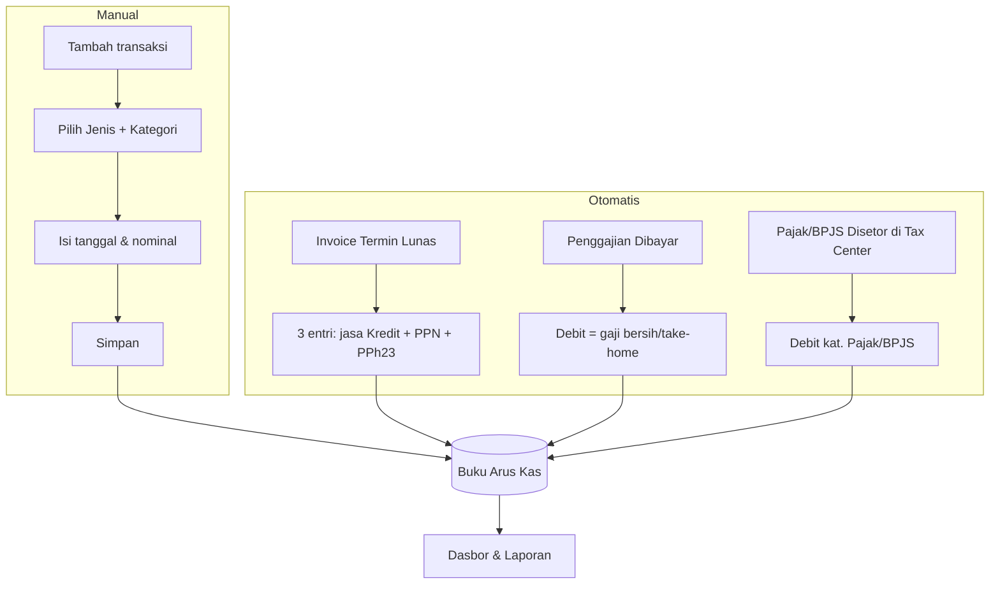

[← Daftar Isi](README.md)

---

## 7. Modul Arus Kas (Cashflow)

### 7.1 Jenis Pencatatan
- **Pemasukan (Kredit)** — semua pemasukan; kategori dapat dikustomisasi.
- **Pengeluaran (Debit)** — semua pengeluaran; kategori dapat dikustomisasi.

### 7.2 Struktur Tabel
| Kolom | Keterangan |
| --- | --- |
| Jenis (C/D) | Pemasukan–Kredit / Pengeluaran–Debit |
| Tanggal | Tanggal transaksi |
| Total | Nilai nominal (IDR) |
| Kategori | Tetap atau kustom |
| Proyek (opsional) | Tautan ke proyek — untuk biaya yang dicatat sebagai **Realisasi RAB** (lihat [Bab 6.8](06-manajemen-proyek.md#68-realisasi-rab--profitabilitas-proyek)) |
| Sumber | Manual / Otomatis (Faktur / Penggajian / Pajak) |

Filter: rentang tanggal, kategori, pengurutan kolom; **ekspor Excel/CSV**.

#### Sifat Beban (Sifat Laba-Rugi) per Kategori
Agar Dasbor dapat menyusun **Laba-Rugi** ([Bab 8.2](08-dasbor.md#82-laba-rugi-profitabilitas--basis-akrual)), tiap
**kategori** arus kas memiliki **Sifat Beban** (dikonfigurasi di [Bab 9.3](09-konfigurasi.md#93-kategori-arus-kas)):

| Sifat Beban | Arti | Contoh |
| --- | --- | --- |
| **HPP** | Biaya langsung pelaksanaan proyek (Harga Pokok) | Realisasi RAB: Personil A, Biaya Langsung B |
| **Operasional** | Beban overhead non-proyek | sewa kantor, listrik, gaji admin |
| **Non-Laba-Rugi** | Bukan beban — penyelesaian kewajiban / titipan / pokok | setoran **PPN** (titipan), **PPh 23** (kredit), pokok pinjaman |

> Sifat Beban **hanya** untuk klasifikasi Laba-Rugi; tidak mengubah pencatatan kas. Item
> **Non-Laba-Rugi** tetap tercatat di kas namun **dikecualikan** dari Laba-Rugi ([BR-14](../user-stories/11-konvensi-global-nfr.md#8-daftar-aturan-bisnis-tidak-boleh-dilanggar-highlight-lintas-epic)).

### 7.3 Otomasi Antar-Modul
**Prinsip:** setiap entri otomatis **memisahkan pendapatan/biaya jasa dari komponen lain**
(pajak, bonus, dll.) agar arus kas mencerminkan nilai usaha & kewajiban secara terpisah
(lihat [Bab 10.4](10-penanganan-pajak.md#104-pendapatan-kotor-bersih-laba-rugi--perlakuan-arus-kas) & [10.5](10-penanganan-pajak.md#105-perlakuan-arus-kas-penggajian)).

| Pemicu | Aksi otomatis (entri terpisah) |
| --- | --- |
| Invoice Termin → **Lunas** | **(1)** Pemasukan (Kredit) = **pendapatan jasa** (nilai termin) → kategori **Faktur**; **(2)** **PPN Keluaran** (titipan ke negara) → kategori **Pajak**; **(3)** **PPh 23 dipotong** (kredit pajak, pengurang kas diterima) → kategori **Pajak** |
| Penggajian → **Dibayar** | Pengeluaran (Debit) = **gaji bersih / take-home** → kategori **Penggajian**; bonus (bila dipisah) → kategori **Bonus** |
| **Setor PPN/PPh/BPJS** (saat ditandai "Sudah Disetor" di [Tax Center](10-penanganan-pajak.md#106-modul-perpajakan-tax-center)) | Pengeluaran (Debit) → kategori **Pajak** / BPJS — bukan saat faktur lunas/gaji dibayar |

> Entri otomatis **terkunci** dari edit/hapus manual dan **mengikuti status sumbernya**
> (mis. faktur dibatalkan → entri ikut dibatalkan). Entri **manual** tetap didukung untuk
> transaksi lain (mis. biaya operasional, realisasi RAB, penyetoran pajak).

### 7.4 Userflow — Arus Kas

---
