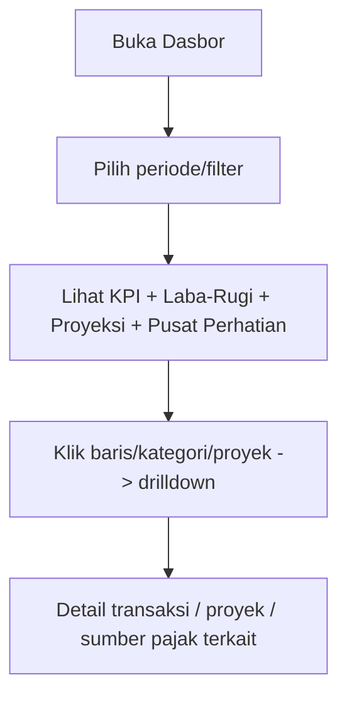

[← Daftar Isi](README.md)

---

## 8. Modul Dasbor (Dashboard)

Dasbor adalah **lapisan komputasi** di atas modul lain — tidak menyimpan nilai sendiri,
selalu **agregasi real-time** dari Arus Kas, Faktur, RAB/Realisasi RAB, Proyek, dan Tax
Center. Selain ringkasan **arus kas** (kas masuk/keluar), Dasbor menyajikan **profitabilitas
(Laba-Rugi basis akrual)**, **proyeksi arus kas & runway**, dan **Pusat Perhatian** —
disusun sebagai **Pusat Komando** untuk Owner + **dasbor per-peran** yang diringkas sesuai
job-desc, semua **disaring per peran (RBAC)**.

> **Arus kas ≠ laba.** Ringkasan arus kas (8.1) mengukur **pergerakan kas**; Laba-Rugi (8.2)
> mengukur **profitabilitas (akrual)**. Keduanya ditampilkan terpisah & tidak dicampur —
> lihat [Bab 10.4](10-penanganan-pajak.md#104-pendapatan-kotor-bersih-laba-rugi--perlakuan-arus-kas).

> **Status implementasi (2026-07-08):** modul ini sudah tersambung penuh ke Postgres,
> termasuk seluruh panel di bawah (8.1–8.6) dan penyaringan per peran (8.7) yang benar-benar
> ditegakkan di server (`view_profit`/`view_project_cost`/`view_forecast`/`view_tax_detail`
> — lihat `docs/architecture.md`). Satu penyederhanaan yang disengaja: Sales belum dibatasi
> ke penawaran/proyek miliknya sendiri secara spesifik (butuh perubahan di modul Penawaran
> di luar cakupan pass ini) — Sales & Tim Teknis & Viewer sama-sama mendapat dasbor yang
> sama minus panel finansial, bukan versi yang dibatasi per-kepemilikan.

### 8.1 Ringkasan Keuangan Bulanan (Arus Kas)
| Metrik | Keterangan |
| --- | --- |
| Total Pemasukan | Pemasukan bulan berjalan |
| Total Pengeluaran | Pengeluaran bulan berjalan |
| Saldo Akhir | Saldo kumulatif keseluruhan |
| Saldo Per Bulan | Selisih bersih kas bulan tersebut (bukan laba — dipengaruhi timing setoran pajak/gaji) |

### 8.2 Laba-Rugi (Profitabilitas) — basis akrual
Laporan Laba-Rugi bertingkat untuk periode terpilih (bulan / kuartal / tahun / kustom).
Menjawab "sebelum vs sesudah pajak" sekaligus. Tiap baris dapat **drilldown** ke sumber.

| Baris | Sumber | Catatan |
| --- | --- | --- |
| **Pendapatan** | Invoice Termin terbit pada periode (nilai jasa, **ex-PPN**) | akrual — saat terbit, bukan saat dibayar |
| − **HPP / Biaya Proyek** | **Realisasi RAB** proyek (Personil A + Langsung B aktual) | kategori arus kas ber-Sifat Beban **HPP** |
| **= Laba Kotor** | | + **Margin Kotor %** |
| − **Beban Operasional** | Kategori arus kas ber-Sifat Beban **Operasional** (overhead non-proyek) | |
| **= Laba Operasional** | | **← "sebelum pajak"** |
| − **PPh Badan (estimasi)** | Konfigurasi pajak: Final 0,5% omzet / 22% atas laba; PPh 23 jadi kredit ([Bab 9.5](09-konfigurasi.md#95-tarif--penomoran)) | selalu berlabel *estimasi* |
| **= Laba Bersih** | | **← "setelah pajak"** + **Margin Bersih %** |

> **Pendapatan Laba-Rugi = nilai jasa penuh (ex-PPN); PPh 23 BUKAN pengurang pendapatan**
> (ia kredit/uang muka pajak). Berbeda dari "Pendapatan Bersih" pada lensa arus kas
> ([Bab 10.4](10-penanganan-pajak.md#104-pendapatan-kotor-bersih-laba-rugi--perlakuan-arus-kas)). Item **Non-Laba-Rugi**
> (setoran PPN titipan, PPh 23, pokok pinjaman) dikecualikan via Sifat Beban kategori.

### 8.3 Profitabilitas Per-Proyek
Satu baris per proyek — membandingkan rencana vs realisasi:

| Kolom | Definisi |
| --- | --- |
| Nilai Kontrak | = Total Penawaran / Faktur Induk |
| Pendapatan Diakui | Invoice termin terbit s/d kini (akrual) |
| RAB Rencana (A+B) | Biaya rencana dari SPH ([Bab 4.3](04-penawaran-sph.md#43-rab-internal)) |
| Realisasi RAB | Biaya aktual s/d kini ([Bab 6.8](06-manajemen-proyek.md#68-realisasi-rab--profitabilitas-proyek)) |
| **Margin Rencana** | Nilai Kontrak − RAB Rencana *(= Estimasi Margin, kini dilacak)* |
| **Margin Aktual** | Pendapatan Diakui − Realisasi RAB |
| % Anggaran Terpakai | Realisasi ÷ RAB Rencana |
| Kesehatan | 🟢 sesuai · 🟡 margin menipis (di bawah ambang) · 🔴 over budget (realisasi > RAB) |

> Ambang margin dikonfigurasi di [Bab 9.5](09-konfigurasi.md#95-tarif--penomoran). Bila belum ada Realisasi RAB,
> tampilkan **Margin Rencana saja**; Margin Aktual = "belum dicatat", kesehatan abu-abu.

### 8.4 Proyeksi Arus Kas & Runway
Pandangan **ke depan** (horizon default 90 hari, dapat dikonfigurasi):
- **Perkiraan kas masuk:** jatuh tempo invoice termin mendatang (jadwal pemicu milestone).
- **Perkiraan kas keluar:** penggajian berulang + setoran pajak/BPJS jatuh tempo (dari Tax
  Center) + pengeluaran terjadwal yang diketahui.
- **Garis proyeksi kas:** saldo berjalan ± kumulatif bersih per minggu.
- **Runway:** "kas saat ini menutup penggajian + kewajiban tetap untuk **N bulan**" — menjawab
  risiko kehabisan kas akibat timing setoran pajak (cash-basis).

### 8.5 Pusat Perhatian (Action Center)
Satu daftar terkonsolidasi & terprioritas; tiap item bertaut ke sumber + tindakan:
- Invoice **jatuh tempo / terlambat** (piutang).
- Pajak / BPJS **jatuh tempo H-3 / terlambat** (dari [Tax Center](10-penanganan-pajak.md#106-modul-perpajakan-tax-center)).
- **Bukti Potong PPh 23 belum diterima** → kredit pajak berisiko hangus.
- Proyek **over budget** / margin di bawah ambang.
- Milestone **mundur** (tanggal aktual > target).
- Proyek **mangkrak** (tanpa aktivitas N hari).

### 8.6 Komponen Visual & Filter
- **Diagram lingkaran:** distribusi pemasukan per kategori & pengeluaran per kategori.
- **Tren waktu:** garis Pendapatan / Laba / Kas antar bulan (MoM).
- **Tabel arus kas** dengan filter (rentang tanggal, kategori, urut).
- **Ringkasan proyek** *(value-add):* jumlah proyek per status, **piutang termin belum
  tertagih** (berdasarkan **jatuh tempo pembayaran** — termasuk yang **terlambat**),
  distribusi proyek per area / jenis dokumen.
- **Ringkasan pajak** *(dari [Tax Center](10-penanganan-pajak.md#106-modul-perpajakan-tax-center)):* kewajiban
  pajak **belum disetor**, **jatuh tempo terdekat / terlambat**, kredit PPh 23 terkumpul.
- **Filter periode global** + **drilldown** di seluruh panel.

### 8.7 Pusat Komando & Dasbor Per-Peran
- **Pusat Komando (Admin/Owner):** satu halaman menyeluruh — strip KPI (Laba Bersih, Margin,
  Kas, Runway, Pendapatan, Piutang, Pajak Jatuh Tempo) → Pusat Perhatian → Laba-Rugi +
  Proyeksi Kas → Profitabilitas Per-Proyek → Tren.
- **Dasbor per-peran** (subset dari engine yang sama, diringkas sesuai job-desc):

  | Peran | Melihat | Tidak melihat |
  | --- | --- | --- |
  | **Keuangan** | Laba-Rugi, proyeksi kas + runway, piutang, posisi pajak, peringatan keuangan | — (hampir penuh) |
  | **Sales** | Penawaran→proyek miliknya, nilai kontrak, status proyek, peringatan deal-nya | Laba-Rugi, biaya/margin, penggajian, pajak |
  | **Tim Teknis** | Proyek yang ditugaskan: kesehatan milestone/jadwal, beban kerja, peringatan delivery | Seluruh data keuangan (pendapatan, biaya, margin, laba, pajak) |
  | **Viewer** | Status proyek tingkat tinggi (read-only) + (opsional) KPI publik | Biaya, margin, laba, penggajian, keuangan rinci |

> Panel yang tidak diizinkan **tidak dirender** untuk peran terkait (hak akses baru:
> `view_profit`, `view_project_cost`, `view_forecast`, `view_tax_detail` — lihat
> [Bab 2.2](02-peran-rbac.md#22-matriks-hak-akses-ringkas)). Penyaringan ditegakkan **server-side**.

### 8.8 Userflow — Dasbor

---
