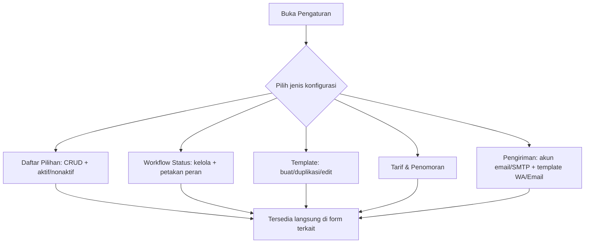

[← Daftar Isi](README.md)

---

## 9. Modul Konfigurasi & Master Data Terkelola
*(pusat fleksibilitas — inti prinsip Configurable & Scalable)*

Satu area **Pengaturan** tempat klien mengelola sendiri seluruh daftar pilihan, workflow,
template, dan tarif — **tanpa developer**. Setiap item mendukung **CRUD + aktif/nonaktif +
urutan**.

### 9.1 Daftar Pilihan (master data)
Jenis Layanan (Katalog Layanan), Jenis Dokumen, Kewenangan, Dasar Hukum, Area
Administrasi/Kawasan Industri, Jabatan, Status Kepegawaian (+ pengali), Komponen Gaji
(tunjangan/potongan + cara hitung), **Rekening Bank** (untuk dipilih di faktur).

### 9.2 Workflow Status (konfigurabel)
Kelola daftar status untuk **Proyek / Penawaran / Faktur / Penggajian**. Setiap status
dipetakan ke **peran sistem** agar otomasi tetap valid saat label diubah:

| Peran sistem | Dipakai otomasi |
| --- | --- |
| `SELESAI` | Menutup proyek/milestone |
| `LUNAS` | Memicu entri Pemasukan di Arus Kas |
| `DIBAYAR` | Memicu entri Pengeluaran di Arus Kas |
| `BATAL` | Membatalkan entri terkait |

Klien bebas menamai ulang label (mis. "Lunas" → "Paid"), menambah status baru, dan
mengatur urutan — selama pemetaan peran tetap ada.

### 9.3 Kategori Arus Kas
4 kategori **tetap terkunci** (Faktur, Penggajian, Pajak, Bonus) karena dipakai otomasi;
kategori **kustom tanpa batas** dapat dibuat/diubah/dihapus dan tersedia di Arus Kas,
Faktur, & Penggajian. Tiap kategori memiliki **Sifat Beban** (**HPP** / **Operasional** /
**Non-Laba-Rugi**) yang menentukan perlakuannya di Laba-Rugi Dasbor
([Bab 7.2](07-arus-kas.md#72-struktur-tabel) & [8.2](08-dasbor.md#82-laba-rugi-profitabilitas--basis-akrual)); default diisi sistem & dapat
disesuaikan (mis. kategori Pajak → Non-Laba-Rugi, kategori biaya proyek → HPP).

### 9.4 Template
Template milestone per jenis layanan, template PDF (SPH/Invoice/Slip), dan skema termin —
semua dapat dibuat, **diduplikasi**, dan diedit.

### 9.5 Tarif & Penomoran
Tarif PPN/PPh, **jatuh tempo pajak (PPN/PPh/BPJS)**, **jatuh tempo pembayaran faktur (N
hari)**, **status PKP perusahaan**, pengali probation, masa berlaku penawaran, dan **format
nomor** SPH/INV
(mis. `SPH/{urut}/{bulan}.{tahun}` → `SPH/001/5.2026`; `INV/{urut}/{bulan}.{tahun}` →
`INV/002/05.2026`).

**Profitabilitas & Dasbor** (dipakai Laba-Rugi/proyeksi di [Bab 8](08-dasbor.md#8-modul-dasbor-dashboard)):
- **PPh Badan:** metode (**Final 0,5% omzet** / **22% atas laba**), tarif, dan **ambang omzet
  Rp 4,8 M/tahun** ([Bab 10.8](10-penanganan-pajak.md#108-pph-badan-pajak-penghasilan-badan)).
- **Ambang kesehatan margin proyek** (mis. 🟡 bila Margin Aktual < 80% Margin Rencana).
- **Horizon Proyeksi Arus Kas** (default 90 hari).
- **Ambang proyek mangkrak** (tanpa aktivitas N hari) untuk Pusat Perhatian.

**Aturan penomoran:**
- **Counter terpisah** untuk SPH dan INV.
- **Reset tiap bulan** — nomor urut kembali ke `001` di awal setiap bulan.
- **Nomor bersifat tetap** — diberikan sekali saat dokumen dibuat dan **tidak berubah saat
  dokumen diedit**.

**Pengiriman dokumen** (dipakai aksi di [Bab 11.2](11-template-pdf.md#112-aksi-dokumen-berlaku-untuk-semua-dokumen)):
- **Email otomatis:** akun pengirim (SMTP / penyedia email) + **template isi email** per
  jenis dokumen (SPH, Invoice, Slip Gaji).
- **WhatsApp (wa.me):** **template pesan** default per jenis dokumen.

### 9.6 Userflow — Konfigurasi

---
