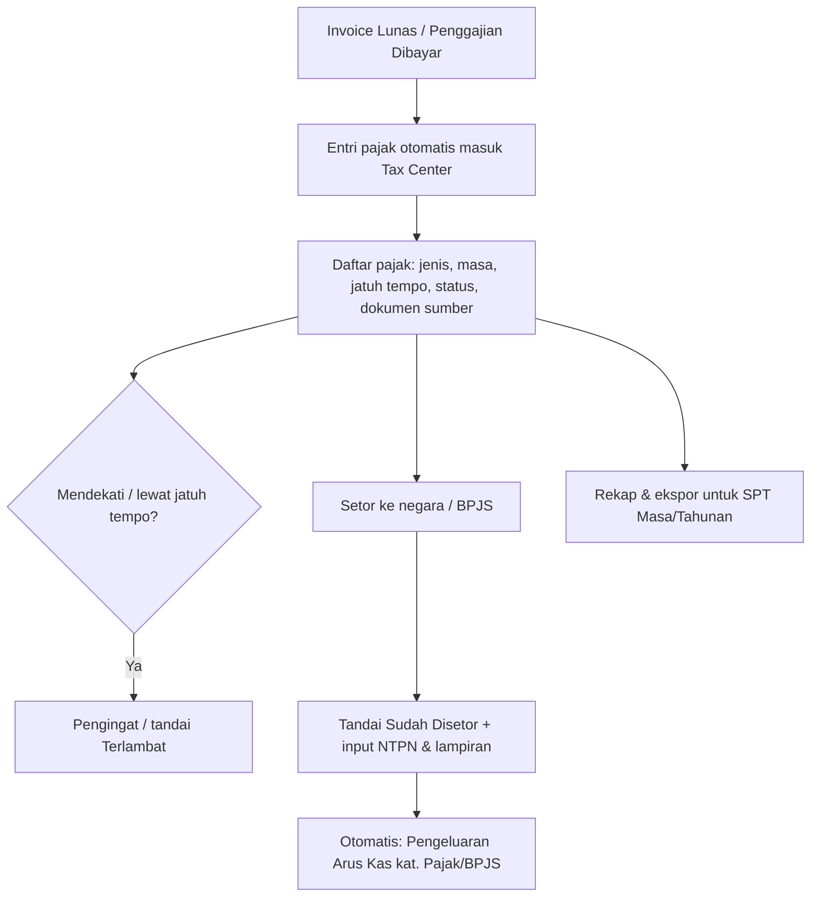

[← Daftar Isi](README.md)

---

## 10. Penanganan Pajak

Diturunkan dari invoice nyata; **tarif dapat dikonfigurasi** di [Bab 9.5](09-konfigurasi.md#95-tarif--penomoran).

> **Status implementasi:** Sebatas **visibilitas baca-saja** ke database
> sungguhan (entri PPN Keluaran/PPh 23 dipotong otomatis dari pelunasan
> Invoice Termin — lihat [Bab 5](05-dokumen-bisnis.md)). Belum tersedia: alur
> penyetoran (upload bukti setor/NTPN, tandai disetor), upload bukti potong,
> dan Tax Center (konfigurasi metode PPh Badan) — semuanya menunggu giliran
> wiring modul Pajak secara penuh. RLS sudah sesuai PRD: hanya Admin/Keuangan
> yang dapat membaca maupun menulis (tidak ada akses Viewer).

### 10.1 Rumus
- **DPP (nilai lain)** = nilai × **11/12**
- **PPN** = **12%** × DPP (≈ 11% efektif terhadap nilai)
- **PPh 23** = **2%** × nilai → **dipotong** (pengurang)
- **Total Setelah Pajak** = nilai + PPN − PPh 23
- **Pembulatan:** DPP & nilai pajak (PPN/PPh) dibulatkan ke **rupiah terdekat** (pembulatan
  setengah ke atas / *round half up*). Contoh: DPP `25.000.000 × 11/12 = 22.916.666,67 →
  22.916.667`.

### 10.2 Contoh Validasi (Invoice Termin III — Pelunasan)
| Komponen | Nilai (Rp) |
| --- | --- |
| Total Biaya (Faktur Induk) | 125.000.000 |
| Termin I (40%) | −50.000.000 |
| Termin II (40%) | −50.000.000 |
| **Nilai termin berjalan (pelunasan)** | **25.000.000** |
| DPP (= 25.000.000 × 11/12) | 22.916.667 |
| PPN (= 12% × DPP) | 2.750.000 |
| PPh 23 (= 2% × 25.000.000) | −500.000 |
| **Total Setelah Pajak** | **27.250.000** |

### 10.3 Penggajian
PPh 21 atas penggajian **diinput manual** oleh Keuangan per karyawan/periode (boleh **0**
dan tetap valid, mis. gaji di bawah PTKP). **Penggajian Bersih = Penggajian Kotor − PPh 21 −
potongan lain** (lihat komponen di [Bab 5.2](05-dokumen-bisnis.md#52-penggajian-payroll--slip-gaji)).

### 10.4 Pendapatan Kotor, Bersih, Laba-Rugi & Perlakuan Arus Kas
**Dua lensa berbeda — jangan dicampur** ([BR-14](../user-stories/11-konvensi-global-nfr.md#8-daftar-aturan-bisnis-tidak-boleh-dilanggar-highlight-lintas-epic)):

1. **Lensa Arus Kas (cash basis)** — entri dibuat saat kas benar-benar bergerak; **komponen
   dipisah** dari nilai jasa. Dipakai di buku Arus Kas & ringkasan kas Dasbor.
2. **Lensa Laba-Rugi (akrual)** — mengukur profitabilitas saat hak/kewajiban timbul (invoice
   terbit), bukan saat kas bergerak. Dipakai di Laba-Rugi Dasbor ([Bab 8.2](08-dasbor.md#82-laba-rugi-profitabilitas--basis-akrual)).

**Lensa Arus Kas:**
- **Pendapatan Kotor** = nilai termin (jasa, sebelum pajak).
- **Pendapatan Bersih (kas)** = nilai termin **− PPh 23** (PPh 23 dipotong klien = **kredit
  pajak / uang muka PPh**). **PPN tidak masuk pendapatan** karena bersifat **titipan** ke negara.

**Lensa Laba-Rugi (akrual):**
- **Pendapatan (Laba-Rugi)** = **nilai jasa penuh, ex-PPN** — diakui saat invoice **terbit**.
- **PPh 23 BUKAN pengurang Pendapatan** di Laba-Rugi (ia kredit/uang muka PPh Badan, bersifat
  aset — bukan pengurang pendapatan). Ini **berbeda** dari "Pendapatan Bersih (kas)" di atas.
- Lanjutan waterfall (HPP/Realisasi RAB → Laba Kotor → Beban Operasional → Laba Operasional →
  **PPh Badan** → Laba Bersih) ada di [Bab 8.2](08-dasbor.md#82-laba-rugi-profitabilitas--basis-akrual) & PPh Badan di [Bab 10.8](#108-pph-badan-pajak-penghasilan-badan).

Saat Invoice Termin **Lunas** (contoh termin Rp 25.000.000):

| Entri Arus Kas | Kategori | Rp |
| --- | --- | --- |
| Pendapatan jasa | Faktur (Kredit) | +25.000.000 |
| PPN Keluaran (titipan ke negara) | Pajak (Kredit) | +2.750.000 |
| PPh 23 dipotong (kredit pajak) | Pajak (pengurang) | −500.000 |
| **= Kas diterima di bank** | | **27.250.000** |

> **PPN Keluaran** wajib **disetor ke negara** → dicatat sebagai **Pengeluaran kategori
> Pajak saat penyetoran**. **PPh 23** yang dipotong menjadi **kredit pajak tahunan**
> perusahaan (bukan biaya).

### 10.5 Perlakuan Arus Kas Penggajian
- Saat gaji **Dibayar**: kas keluar = **gaji bersih / take-home** ke karyawan → Pengeluaran
  kategori **Penggajian**.
- **PPh 21 & BPJS yang dipotong dari karyawan belum keluar kas** saat itu — menjadi
  **kewajiban** (hutang PPh 21 / BPJS).
- Saat **disetor** ke kas negara / BPJS (mis. PPh 21 paling lambat ±tgl 10–15 bulan
  berikutnya): dicatat **Pengeluaran kategori Pajak / BPJS**. Iuran **BPJS porsi perusahaan**
  juga kas keluar saat penyetoran.
- **Bonus**: bila dibayar bersama gaji = bagian take-home; dapat **dipisah ke kategori
  Bonus** untuk pelacakan.
- **Status setor PPh 21/BPJS ditandai & dipantau di [Modul Perpajakan (Tax Center)](#106-modul-perpajakan-tax-center)**.
- Tujuan: **menghindari pencatatan ganda** & mencerminkan **timing kas riil**.

### 10.6 Modul Perpajakan (Tax Center)
Pusat untuk **melacak, memantau beban, dan menandai status setor** seluruh pajak & iuran
yang muncul dari dokumen keuangan, lengkap dengan **tautan ke dokumen sumber**.

**Entri pajak dibuat otomatis dari dokumen:**
| Jenis | Sumber | Sifat | Saat ditandai "Sudah Disetor" |
| --- | --- | --- | --- |
| **PPN Keluaran** | Invoice Termin (Lunas) | Kewajiban (titipan) | Pengeluaran kas kat. **Pajak** |
| **PPh 23 dipotong** | Invoice Termin | **Kredit pajak** (dipotong klien) | Tidak ada kas keluar; dipakai sbg kredit di SPT Tahunan |
| **PPh 21** | Penggajian (Dibayar) | Kewajiban | Pengeluaran kas kat. **Pajak** |
| **BPJS (Kes/TK)** | Penggajian (Dibayar) | Kewajiban (porsi karyawan + perusahaan) | Pengeluaran kas kat. **BPJS** |

**Field tiap entri pajak:**
- Jenis pajak, **Masa Pajak** (periode), Nilai, **Dokumen Sumber** (tautan: No Invoice /
  Penggajian periode + perusahaan/karyawan), **Jatuh Tempo**, **Status setor**
  (Belum/Sudah), Tanggal Setor, **No. Bukti Setor (NTPN)** + lampiran, Catatan.
- Khusus **PPh 23**: **Bukti Potong dari klien** (diterima? + lampiran) — syarat klaim kredit.

**Penandaan status:** 🟡 Belum Disetor · 🔴 Terlambat (lewat jatuh tempo) · 🟢 Sudah Disetor.
Menandai **Sudah Disetor** → otomatis membuat **entri Arus Kas Pengeluaran** (kat. Pajak/BPJS)
+ menyimpan NTPN. (PPh 23 yang bersifat kredit **tidak** memicu kas keluar.)

**PPN Masukan (kredit):** transaksi pembelian/pengeluaran ber-PPN dicatat (input manual atau
dari Arus Kas pengeluaran ber-PPN) sebagai **kredit** untuk mengurangi PPN yang disetor —
**PPN kurang/lebih bayar = PPN Keluaran − PPN Masukan**.

**Monitoring beban pajak:**
- Ringkasan **kewajiban belum disetor** per jenis & per masa; total **kredit PPh 23** terkumpul.
- **Jatuh tempo:** daftar terdekat & **terlambat**, dengan **pengingat aktif (in-app + email)
  H-3 sebelum jatuh tempo** untuk menghindari denda.
- **Panel Rekonsiliasi** per masa: PPN (Keluaran − Masukan = yang disetor), PPh 23 (dipotong
  vs **bukti potong diterima**), PPh 21/BPJS (terutang vs disetor).
- Filter (jenis, masa, status, perusahaan/karyawan).

**Pelaporan SPT:** rekap & **ekspor format siap-impor** (CSV/Excel) untuk **SPT Masa PPN,
PPh 21, PPh 23**, dan **SPT Tahunan** — untuk diunggah ke **Coretax/DJP Online**.

**Jatuh tempo default** (dapat dikonfigurasi, [Bab 9.5](09-konfigurasi.md#95-tarif--penomoran)):
- **PPh 21 & PPh 23:** setor ≤ tgl 10, lapor ≤ tgl 20 bulan berikutnya.
- **PPN:** setor & lapor akhir bulan berikutnya (SPT Masa PPN).
- **BPJS:** iuran ≤ tgl 10 bulan berikutnya.

**Prasyarat — Status PKP:** bila perusahaan **non-PKP**, sistem **tidak memungut PPN**
(PPN Keluaran tidak dibuat). Status PKP diatur di Profil/Pengaturan.

> **Akses:** Modul Perpajakan hanya dapat diakses **Admin & Keuangan** (lihat [RBAC 2.2](02-peran-rbac.md#22-matriks-hak-akses-ringkas)).

### 10.7 Userflow — Perpajakan

### 10.8 PPh Badan (Pajak Penghasilan Badan)
Untuk menghitung **Laba Bersih (setelah pajak)** di Laba-Rugi Dasbor, sistem mengestimasi
**PPh Badan** — pajak penghasilan **perusahaan sendiri** (berbeda dari PPN/PPh 23/PPh 21 yang
bersifat titipan/kredit/pajak karyawan). **Metode & tarif dapat dikonfigurasi** di
[Bab 9.5](09-konfigurasi.md#95-tarif--penomoran):

| Metode | Dasar | Catatan |
| --- | --- | --- |
| **PPh Final UMKM** | **0,5% × omzet (peredaran bruto)** | PP 55/2022; untuk omzet < Rp 4,8 M/tahun. PPh 23 **tidak** dapat dikreditkan terhadap PPh Final |
| **PPh Badan tarif** | **22% × laba kena pajak** | tarif normal; **PPh 23 dikreditkan** mengurangi PPh Badan terutang |

- Nilai PPh Badan di Dasbor **selalu berlabel "estimasi"** (perhitungan SPT Tahunan final tetap
  oleh konsultan pajak/akuntan).
- **Ambang Rp 4,8 M** dapat dikonfigurasi; sistem dapat memberi peringatan saat omzet tahunan
  mendekati/melewati ambang (indikasi perlu pindah metode).
- **Kredit PPh 23** yang terkumpul (dari [Bab 10.6](#106-modul-perpajakan-tax-center)) ditampilkan sebagai pengurang pada
  metode 22%.

---
