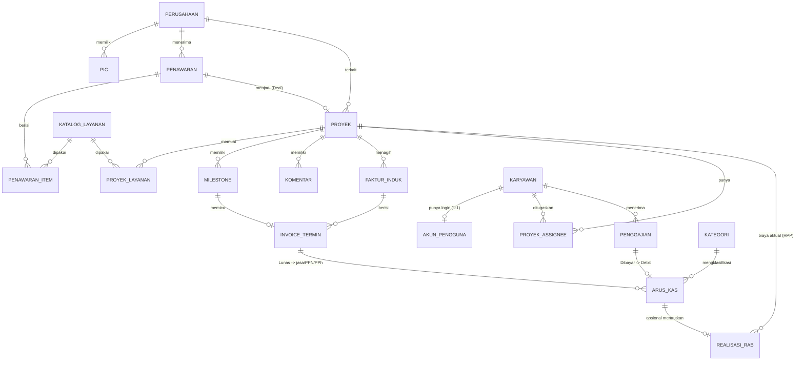

[← Daftar Isi](README.md)

---

## 12. Model Data & Relasi

> **Catatan profitabilitas & Laba-Rugi Dasbor:**
> - **REALISASI_RAB** (`proyek`, `kategori_rab` A/B, `nilai`, `tanggal`, `catatan`,
>   opsional `arus_kas_id`) = sumber **HPP/biaya proyek aktual** → Margin Aktual ([Bab 6.8](06-manajemen-proyek.md#68-realisasi-rab--profitabilitas-proyek)).
> - **KATEGORI** memiliki atribut **`sifat_beban`** (HPP / Operasional / Non-Laba-Rugi) untuk
>   penyusunan Laba-Rugi ([Bab 7.2](07-arus-kas.md#72-struktur-tabel)).
> - **Pengaturan pajak** menyimpan **PPh Badan** (`metode` Final/Badan, `tarif`, `ambang_omzet`)
>   untuk Laba Bersih ([Bab 10.8](10-penanganan-pajak.md#108-pph-badan-pajak-penghasilan-badan)), serta parameter dasbor
>   (ambang margin, horizon proyeksi, ambang mangkrak — [Bab 9.5](09-konfigurasi.md#95-tarif--penomoran)).
> - Dasbor **tidak menambah tabel agregat** — Laba-Rugi, proyeksi, & Pusat Perhatian dihitung
>   real-time dari entitas di atas.

---
