# PRD — Sistem ERP Internal
## PT Sinar Buana Mandiri Jaya (SBMJ) / Buana Eco Solution

| | |
| --- | --- |
| **Dokumen** | Product Requirements Document (PRD) |
| **Produk** | Sistem ERP Internal berbasis web |
| **Klien** | PT Sinar Buana Mandiri Jaya — Konsultan Lingkungan |
| **Bahasa antarmuka** | Bahasa Indonesia |
| **Platform** | Aplikasi web (browser) |
| **Versi PRD** | 1.0 |
| **Tanggal** | 6 Juni 2026 |

---

## Daftar Isi

0. [Ringkasan Eksekutif](#0-ringkasan-eksekutif)
1. [Ringkasan Produk](#1-ringkasan-produk)
2. [Peran Pengguna & Hak Akses (RBAC)](#2-peran-pengguna--hak-akses-rbac)
3. [Master Data](#3-master-data)
4. [Modul Penawaran (Quotation / SPH)](#4-modul-penawaran-quotation--sph)
5. [Modul Dokumen Bisnis (Faktur & Penggajian)](#5-modul-dokumen-bisnis)
6. [Modul Manajemen Proyek (ClickUp-style)](#6-modul-manajemen-proyek-clickup-style)
7. [Modul Arus Kas (Cashflow)](#7-modul-arus-kas-cashflow)
8. [Modul Dasbor (Dashboard)](#8-modul-dasbor-dashboard)
9. [Modul Konfigurasi & Master Data Terkelola](#9-modul-konfigurasi--master-data-terkelola)
10. [Penanganan Pajak & Modul Perpajakan (Tax Center)](#10-penanganan-pajak)
11. [Spesifikasi Template PDF](#11-spesifikasi-template-pdf)
12. [Model Data & Relasi](#12-model-data--relasi)
13. [Persyaratan Non-Fungsional](#13-persyaratan-non-fungsional)
14. [Keputusan Final (sebelumnya Terbuka)](#14-keputusan-final-sebelumnya-terbuka)

---

## 0. Ringkasan Eksekutif

### 0.1 Profil & Konteks
PT Sinar Buana Mandiri Jaya (SBMJ) adalah **konsultan lingkungan** yang mengurus dokumen
perizinan lingkungan untuk perusahaan klien — antara lain Rincian Teknis (Rintek) LB3,
Persetujuan Teknis (Pertek) Air Limbah, Pertek Emisi, Dokumen Lingkungan (UKL-UPL, SPPL,
Amdal, RKL-RPL Rinci), Andalalin, Sertifikat Laik Operasi (SLO), serta **Laporan Semester**
yang berulang. Klien tersebar di berbagai kota/kabupaten dan kawasan industri.

### 0.2 Masalah Saat Ini
Seluruh alur kerja berjalan **manual** melalui spreadsheet dan dokumen Word/PDF terpisah:
katalog layanan, tracker proyek, surat penawaran (SPH) + RAB + jadwal, invoice termin, dan
slip gaji. Akibatnya: data terpencar, sulit melacak progres proyek & penagihan termin, tidak
ada keterkaitan otomatis antara penagihan dan arus kas, serta rawan salah hitung pajak.

### 0.3 Tujuan Produk
Membangun **satu sistem ERP web** yang:
- Mendigitalkan alur kerja yang sudah berjalan (penawaran → proyek → faktur termin →
  arus kas; penggajian → arus kas).
- Memberi visibilitas progres proyek bergaya **ClickUp** (assignee + komentar ber-timeline).
- Mengotomasi pencatatan keuangan & perhitungan pajak.
- **Dapat dikonfigurasi sendiri oleh klien** sehingga skalabel mengikuti pertumbuhan bisnis.

### 0.4 Ruang Lingkup
**Cakupan sistem (dibangun dalam satu fase):** Autentikasi, peran & akun pengguna, Master Data (Perusahaan,
Katalog Layanan, Karyawan, Profil Perusahaan), Penawaran, Faktur (Induk & Termin),
Penggajian, Manajemen Proyek penuh, Arus Kas + otomasi, **Modul Perpajakan (Tax Center)**,
Dasbor **(Pusat Komando: Laba-Rugi akrual, profitabilitas per-proyek, proyeksi kas & runway,
Pusat Perhatian)**, Konfigurasi terkelola, RAB & margin **(rencana vs Realisasi RAB)**, pemicu
faktur dari milestone, pengingat Laporan Semester, penomoran & terbilang otomatis.

**Keputusan operasional (final):** pengiriman dokumen via **WhatsApp** (`wa.me` + lampir PDF
manual) **dan Email otomatis** (PDF terlampir, perlu akun email/SMTP); PPh 21 input manual
(0 valid); penomoran reset bulanan & nomor tetap saat diedit; penghapusan data secara soft
delete + arsip. Rincian di [Bab 14](#14-keputusan-final-sebelumnya-terbuka).

### 0.5 Prinsip Desain Utama — *Configurable & Scalable*
Nilai yang dapat bertumbuh seiring bisnis **tidak di-hardcode**. Daftar pilihan, status
workflow, template, dan tarif dikelola sendiri oleh klien melalui [Modul Konfigurasi](#9-modul-konfigurasi--master-data-terkelola).
Data dari dokumen yang ada (12 langkah jadwal, status tracker, tarif pajak) dipakai sebagai
**nilai default**, bukan daftar permanen. Lihat detail di Bab 9.

### 0.6 Glosarium
| Istilah | Arti |
| --- | --- |
| **Rintek LB3** | Rincian Teknis Penyimpanan Sementara Limbah B3 |
| **Pertek** | Persetujuan Teknis (Air Limbah / Emisi) |
| **UKL-UPL / SPPL** | Dokumen lingkungan sesuai skala usaha |
| **RKL-RPL Rinci** | Dokumen lingkungan untuk kawasan industri |
| **Andalalin** | Analisis Dampak Lalu Lintas |
| **SLO** | Sertifikat Laik Operasi |
| **SPH** | Surat Penawaran Harga |
| **RAB** | Rincian Anggaran Biaya (internal) — rencana biaya proyek |
| **Realisasi RAB** | Biaya **aktual** proyek (Personil A + Langsung B) dicatat per proyek = HPP/biaya proyek |
| **Margin Rencana / Margin Aktual** | Nilai Kontrak − RAB rencana / Pendapatan Diakui − Realisasi RAB |
| **Laba Kotor / Operasional / Bersih** | Pendapatan − HPP / − Beban Operasional (sebelum pajak) / − PPh Badan (setelah pajak) |
| **HPP** | Harga Pokok / biaya langsung pelaksanaan proyek (= Realisasi RAB) |
| **Sifat Beban** | Klasifikasi kategori arus kas untuk Laba-Rugi: HPP / Operasional / Non-Laba-Rugi |
| **DPP** | Dasar Pengenaan Pajak |
| **PPN / PPh 23 / PPh 21** | Pajak Pertambahan Nilai / PPh atas jasa (dipotong klien) / PPh atas gaji |
| **PPh Badan** | Pajak penghasilan **perusahaan** (Final 0,5% omzet / 22% laba) — dasar Laba Bersih setelah pajak |
| **Runway** | Berapa bulan kas saat ini menutup penggajian + kewajiban tetap |
| **PKP** | Pengusaha Kena Pajak — wajib memungut PPN |
| **NTPN** | Nomor Transaksi Penerimaan Negara — bukti pembayaran pajak |
| **Bukti Potong** | Bukti pemotongan PPh 23 dari klien (dasar klaim kredit pajak) |
| **Masa Pajak** | Periode pajak (umumnya bulanan) |
| **Termin** | Tahap pembayaran (cicilan) di bawah satu Faktur Induk |
| **PIC** | Person In Charge (narahubung perusahaan klien) |
| **Total Penawaran / Nilai Kontrak** | **Sinonim** — nilai total proyek dari SPH yang berstatus Deal |
| **Faktur Induk (Master Invoice)** | Pengelompok penagihan di dalam satu proyek; memuat Total Biaya & skema termin. Satu proyek dapat punya beberapa Faktur Induk |
| **Total Biaya** | Nilai yang ditagih oleh **satu Faktur Induk** (bisa = sebagian/seluruh Nilai Kontrak) |
| **Invoice Termin** | Tagihan per tahap di bawah satu Faktur Induk |

---

## 1. Ringkasan Produk

- **Sistem ERP internal berbasis web** untuk operasional & keuangan harian konsultan lingkungan.
- **Pengguna target:** tim internal — Owner/Direktur, Keuangan, Marketing/Sales, dan Tim
  Teknis/Penyusun (Ketua Tim, Anggota, Document Controller).
- **Platform:** aplikasi web (browser), responsif desktop & tablet.
- **Bahasa:** Bahasa Indonesia. **Mata uang:** IDR (format `Rp 1.000.000`, tanpa desimal).
- **Cakupan modul:** Master Data, Penawaran, Faktur, Penggajian, Manajemen Proyek, Arus Kas,
  Dasbor, dan Konfigurasi.

### 1.1 Peta Modul & Keterkaitan

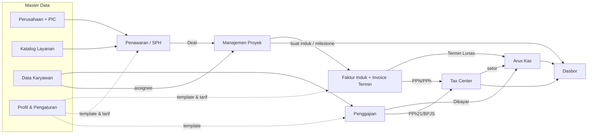

---

## 2. Peran Pengguna & Hak Akses (RBAC)

### 2.1 Peran
| Peran | Deskripsi |
| --- | --- |
| **Admin / Owner** | Akses penuh seluruh modul + konfigurasi sistem. |
| **Keuangan** | Faktur, Penggajian, Arus Kas, Dasbor keuangan, ekspor. |
| **Marketing / Sales** | Perusahaan, Katalog Layanan, Penawaran. |
| **Tim Teknis** | Manajemen Proyek (sesuai assignment) — Ketua Tim, Anggota, Document Controller. |
| **Viewer** | Hanya melihat (read-only) modul yang diizinkan. |

### 2.2 Matriks Hak Akses (ringkas)
Legenda: **C**reate · **R**ead · **U**pdate · **D**elete · **E**xport · **S**end

| Modul | Admin | Keuangan | Sales | Tim Teknis | Viewer |
| --- | --- | --- | --- | --- | --- |
| Perusahaan & PIC | CRUDE | R | CRUE | R | R |
| Katalog Layanan | CRUD | R | CRU | R | R |
| Data Karyawan | CRUD | R | – | R | – |
| Penawaran (SPH) | CRUDES | R | CRUES | R | R |
| Faktur (Induk & Termin) | CRUDES | CRUDES | R | R | – |
| Penggajian / Slip | CRUDES | CRUDES | *slip sendiri* | *slip sendiri* | – |
| Manajemen Proyek | CRUD | R | R | **CRU** (assignment) | R |
| Arus Kas | CRUDE | CRUDE | – | – | R |
| Perpajakan (Tax Center) | CRUDE | CRUDES | – | – | – |
| Dasbor | R | R | R (terbatas) | R (proyek) | R |
| Konfigurasi | CRUD | – | – | – | – |
| Akun Pengguna | CRUD | – | – | – | – |

> **Catatan keamanan:** modul Proyek dapat **diakses semua karyawan** sesuai assignment.
> **Slip gaji bersifat rahasia** — **setiap karyawan (apa pun perannya) dapat melihat &
> mengunduh slip miliknya sendiri**; akses penuh penggajian hanya Keuangan/Admin.

**Hak akses rinci Dasbor** (panel tanpa izin **tidak dirender** — server-side; lihat
[Bab 8.7](#87-pusat-komando--dasbor-per-peran)):

| Hak akses | Admin | Keuangan | Sales | Tim Teknis | Viewer |
| --- | :-: | :-: | :-: | :-: | :-: |
| `view_profit` — Laba-Rugi (laba kotor/bersih) | ✓ | ✓ | ✗ | ✗ | ✗ |
| `view_project_cost` — biaya/margin proyek (Realisasi RAB) | ✓ | ✓ | ✗ | ✗ | ✗ |
| `view_forecast` — proyeksi kas & runway | ✓ | ✓ | ✗ | ✗ | ✗ |
| `view_tax_detail` — posisi pajak rinci | ✓ | ✓ | ✗ | ✗ | ✗ |

### 2.3 Userflow — Login & Otentikasi

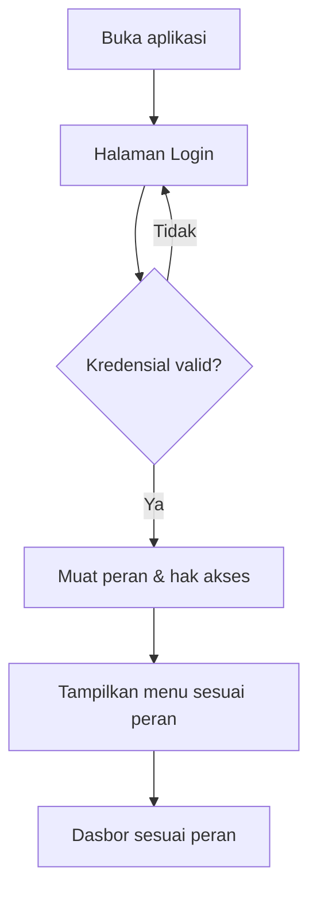

**Langkah:** 1) Pengguna membuka aplikasi → diarahkan ke Login. 2) Memasukkan email &
kata sandi. 3) Sistem memverifikasi; bila gagal, tampilkan pesan & ulangi. 4) Bila berhasil,
sistem memuat peran dan menyaring menu/aksi sesuai matriks RBAC. 5) Pengguna diarahkan ke
dasbor yang relevan dengan perannya.

### 2.4 Manajemen Akun Pengguna
Dikelola oleh **Admin** (hanya Admin — lihat matriks 2.2).

| Field Akun | Keterangan |
| --- | --- |
| Nama | Nama pengguna |
| **Email (login)** | Identitas masuk, **unik** |
| Peran | Satu peran RBAC ([Bab 2.1](#21-peran)) |
| **Tautan Karyawan** | Relasi **1:1** ke Data Karyawan — **wajib** untuk akses "slip sendiri" & menjadi assignee proyek |
| Status | Aktif / Nonaktif |

- **Kata sandi:** akun baru diaktifkan via **undangan email** (pengguna set sandi sendiri)
  atau diset Admin; **reset password** melalui tautan/token email, atau oleh Admin.
- **Satu karyawan = satu akun** (1:1) agar slip gaji & assignment proyek termonitor.
- Karyawan keluar → akun **dinonaktifkan (bukan dihapus)**; jejak audit tetap (soft delete,
  [Bab 13](#13-persyaratan-non-fungsional)).
- **Alur:** Admin buat akun → pilih peran + tautkan karyawan → kirim undangan email →
  pengguna set sandi → login.

---

## 3. Master Data

### 3.1 Data Perusahaan (Mitra)
**Informasi umum**
| Bidang | Tipe | Status |
| --- | --- | --- |
| Nama Perusahaan | Teks | Wajib |
| Alamat | Area teks | Wajib |
| Kota | Teks / Dropdown | Wajib |
| Kabupaten | Teks / Dropdown | Wajib |
| Area Administrasi / Kawasan Industri | Dropdown (master) | Opsional |
| Negara | Statis: Indonesia | Wajib |
| NPWP | Teks (maks. 16 digit) | Wajib |
| Email Perusahaan | Email | Opsional |

**Narahubung / PIC** — mendukung **lebih dari satu** PIC per perusahaan.
| Bidang | Tipe | Status |
| --- | --- | --- |
| Nama Narahubung | Teks | Wajib |
| Nomor HP | Telepon | Wajib |
| Email Narahubung | Email | Opsional |

### 3.2 Katalog Layanan *(baru)*
Daftar jenis layanan sebagai **master data** (bukan teks bebas). Diturunkan dari katalog
"Jenis Layanan" milik klien.
| Bidang | Keterangan |
| --- | --- |
| Nama Layanan | mis. "Penyusunan Pertek Air Limbah" |
| Jenis Dokumen | mis. Rintek B3, Standar Teknis, SPPL, RKL-RPL Rinci, SLO |
| Kewenangan | Provinsi / Kota-Kabupaten / Kawasan Industri |
| Dasar Hukum | mis. Permenlhk No.5 Tahun 2021 |
| Harga Standar (opsional) | Nilai acuan untuk penawaran |
| Tag Berulang | mis. Laporan Semester (memicu pengingat) |
| Template Milestone (opsional) | Langkah default proyek untuk layanan ini |

### 3.3 Data Karyawan *(baru)*
Sumber relasi untuk Penggajian & assignee Proyek.
| Bidang | Keterangan |
| --- | --- |
| Nama Karyawan | Wajib |
| Jabatan / Posisi | Dropdown master (mis. Staff Teknik, Ketua Tim) |
| Status Kepegawaian | Probation / Tetap / Kontrak (master, + pengali) |
| Gaji Pokok | IDR |
| Pengali | mis. Probation = 0,8 (dari status kepegawaian) |
| Tunjangan Default | mis. BPJS Kesehatan (komponen gaji master) |
| Info Bank | Opsional |
| NPWP / PTKP | Untuk perhitungan pajak penggajian |
| Tanggal Masuk | Tanggal |

### 3.4 Profil Perusahaan & Pengaturan
Dipakai pada header/footer & perhitungan dokumen.
- Logo, identitas PT, alamat, kontak (telepon, email, website) → header & footer dokumen.
- **Rekening bank — dikelola pengguna, boleh lebih dari satu** (nama bank, atas nama, nomor
  rekening; mis. **BNI a.n. SINAR BUANA MANDIRI JAYA — 0559332815**); dapat dipilih per faktur.
- Penandatangan default (mis. Direktur).
- **NPWP & Status PKP perusahaan** (menentukan pemungutan PPN di faktur — lihat [Tax Center](#106-modul-perpajakan-tax-center)).
- **Akun email pengirim** (untuk kirim dokumen otomatis) & template pesan email/WhatsApp.
- Format penomoran dokumen (SPH/INV) & tarif pajak default → lihat [Bab 9](#9-modul-konfigurasi--master-data-terkelola).

### 3.5 Userflow — Kelola Perusahaan + PIC

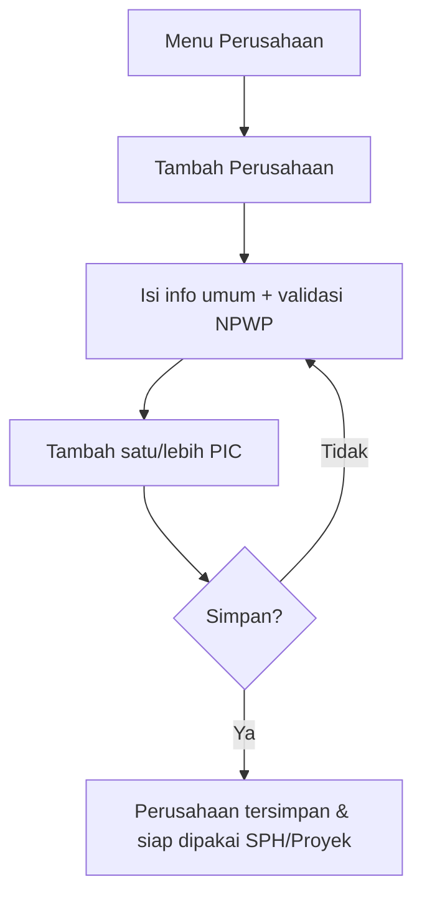

**Langkah:** 1) Buka menu Perusahaan → Tambah. 2) Isi informasi umum (validasi NPWP ≤16
digit). 3) Tambah satu atau beberapa PIC (nama + HP wajib). 4) Simpan. Perusahaan kini
dapat dipilih di Penawaran, Faktur, dan Proyek. Pola serupa berlaku untuk **Kelola Katalog
Layanan** dan **Kelola Karyawan**.

---

## 4. Modul Penawaran (Quotation / SPH)

### 4.1 Daftar Penawaran
Dapat **diedit langsung dari daftar** (inline) + pencarian, filter, urut, paginasi, ekspor.
| Kolom | Tipe | Keterangan |
| --- | --- | --- |
| No SPH | Auto-generate | Format `SPH/001/5.2026` (lihat Bab 9.5) |
| Tanggal | Tanggal | Tanggal pembuatan |
| Nama Perusahaan | Relasi | Dari Master Data Perusahaan |
| Jenis Layanan | Relasi | Satu/lebih item dari Katalog Layanan |
| Status | Pilihan (workflow) | Draft / Leads–Terkirim / Convert–Deal |
| Total Penawaran | IDR | Nilai total |

### 4.2 Isi Dokumen SPH (mengikuti format nyata)
- **Kop & tujuan:** No SPH, tanggal, perihal, kepada (Perusahaan + PIC + alamat / "Di Tempat").
- **Baris layanan** (relasi Katalog Layanan): Uraian, Harga Satuan (Rp), Vol/Paket, Total.
- **Terbilang** otomatis (mis. "Seratus Dua Puluh Lima Juta Rupiah").
- **Masa berlaku** (mis. "berlaku 30 hari kalender").
- **Catatan/Ketentuan** (mis. pengecualian biaya konstruksi fisik IPAL/TPS LB3).
- **Skema Termin** (usulan) dengan **pemicu milestone**, mis.:
  - 40% saat memulai pekerjaan
  - 20% saat Rincian Teknis selesai
  - 20% saat Pertek Air Limbah selesai
  - 20% saat UKL-UPL selesai

  > Skema ini bersifat **usulan di SPH**; saat penagihan, skema dipakai sebagai acuan untuk
  > mengonfigurasi termin pada **Faktur Induk** ([Bab 5.1](#51-faktur-induk--invoice-termin)).

### 4.3 RAB Internal
Estimasi biaya internal untuk menghitung **margin proyek** (tidak ditampilkan ke klien).
- **Biaya Personil:** peran (Ketua Tim, Anggota, Document Controller), volume (bulan),
  harga satuan → Jumlah A.
- **Biaya Langsung:** tunjangan lapangan, survey, penyusunan, cetak, komunikasi,
  transportasi → Jumlah B.
- **Total RAB = A + B**; **Estimasi Margin (Margin Rencana) = Total Penawaran − Total RAB**.

> **RAB = rencana biaya.** Saat proyek berjalan, biaya aktual dicatat sebagai **Realisasi RAB**
> per proyek ([Bab 6.8](#68-realisasi-rab--profitabilitas-proyek)) sehingga **Margin Rencana** dapat
> dibandingkan dengan **Margin Aktual** di Dasbor ([Bab 8.3](#83-profitabilitas-per-proyek)) — margin
> tidak lagi berhenti sebagai estimasi di fase penawaran.

### 4.4 Status & Transisi
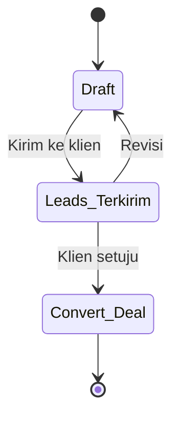
> Daftar status di atas adalah **default** dan dikelola via [Workflow Status](#92-workflow-status-konfigurabel).

### 4.5 Estimasi Jadwal Rencana Kegiatan & Dokumen
- **Estimasi Jadwal Rencana Kegiatan (activity timeline)** — **disusun sejak fase
  penawaran** dan menjadi bagian paket SPH (sesuai file nyata PT MAB / Rintek). Format:
  tabel **kegiatan × minggu**. Daftar kegiatan ditarik dari **template milestone per jenis
  layanan** ([Bab 6.2](#62-milestone--checklist--konfigurabel-per-proyek) /
  [9.4](#94-template)) lalu dapat disesuaikan — sehingga **konsisten dengan milestone
  proyek** nanti dan tidak perlu diinput ulang.
- **Durasi dapat diatur klien** — jumlah bulan **tidak dikunci 3**; bisa ditambah/dikurangi
  sesuai estimasi proyek (default 4 minggu per bulan, jumlah minggu juga dapat disesuaikan).
- **Penanda minggu per kegiatan** — untuk setiap baris kegiatan, klien dapat **menandai
  (toggle)** kolom minggu yang menjadi rentang waktu kegiatan tersebut. Sel yang ditandai
  **tersorot (kuning)** seperti pada referensi. Layout & contoh di
  [Bab 11.1](#111-detail-template-estimasi-jadwal-rencana-kegiatan).
- **Template PDF (paket penawaran):** SPH + (opsional) RAB internal + **Estimasi Jadwal**,
  dapat dikustomisasi per dokumen.
- **Unduh** ke perangkat lokal.
- **Kirim via WhatsApp:** sistem membuka tautan `wa.me` ke nomor PIC dengan pesan terisi
  otomatis (mis. nama perusahaan + no SPH); pengguna **melampirkan PDF yang sudah diunduh**
  secara manual. Tanpa biaya gateway.
- **Kirim Email (otomatis):** sistem mengirim email ke PIC / email perusahaan dengan **paket
  PDF terlampir**. **Set aksi lengkap** (draf, pratinjau, edit, unduh, WA, email) mengikuti
  standar [Bab 11.2](#112-aksi-dokumen-berlaku-untuk-semua-dokumen).

### 4.6 Keterkaitan
Saat status menjadi **Convert–Deal**, sistem menawarkan:
- **Buat Proyek** — satu proyek membawa **seluruh baris layanan** SPH, **Estimasi Jadwal →
  milestone & Gantt proyek**, dan **Nilai Kontrak** (= Total Penawaran), tanpa input ulang.
- **Buat Faktur Induk** — membuat penagihan di bawah proyek; membawa layanan, Total Biaya,
  & skema termin usulan untuk dikonfigurasi (lihat [Bab 5.1](#51-faktur-induk--invoice-termin)).

### 4.7 Userflow — Penawaran

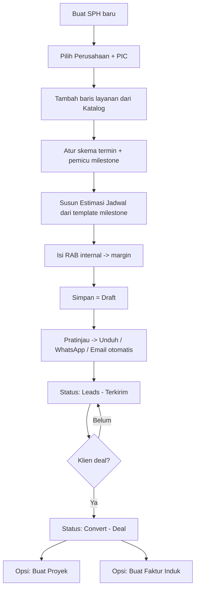

**Langkah:** 1) Buat SPH, pilih perusahaan & PIC. 2) Tambah baris layanan dari Katalog
(harga otomatis terisi bila ada). 3) Atur skema termin & kaitkan ke milestone. 4) Susun
**Estimasi Jadwal Rencana Kegiatan** dari template milestone layanan (dapat disesuaikan).
5) Isi RAB internal untuk melihat margin. 6) Simpan sebagai Draft. 7) Pratinjau lalu unduh
paket PDF (SPH + Estimasi Jadwal) / kirim WhatsApp / **kirim email otomatis** → status
*Leads–Terkirim*. 8) Bila klien setuju →
*Convert–Deal* → muncul opsi **Buat Proyek** (Estimasi Jadwal otomatis menjadi milestone &
Gantt proyek) dan **Buat Faktur Induk**.

---

## 5. Modul Dokumen Bisnis

### 5.1 Faktur Induk & Invoice Termin

**Hierarki penagihan:** `Proyek → Faktur Induk → Invoice Termin`.
- **Satu proyek dapat memiliki beberapa Faktur Induk** (mis. penagihan terpisah per layanan
  atau per batch pekerjaan).
- **Satu Faktur Induk berisi beberapa Invoice Termin** yang **jumlah & persentasenya
  dikonfigurasi pengguna** (mis. 3 termin 40/40/20 atau 4 termin 40/20/20/20).

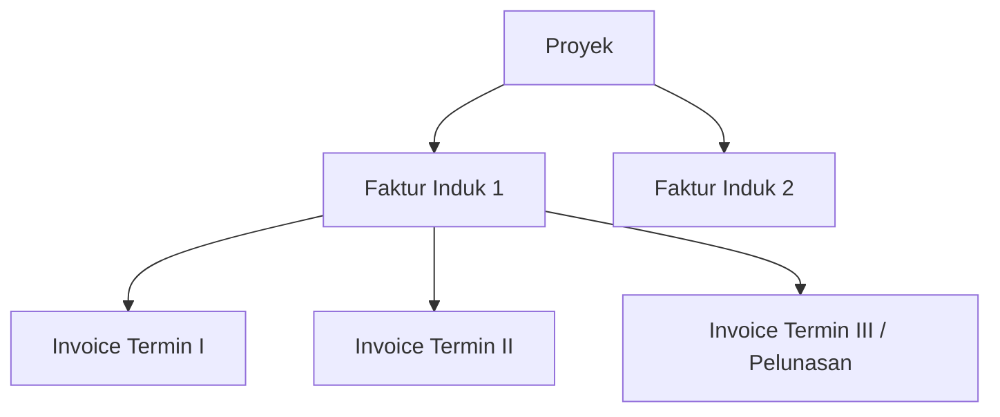

#### A. Faktur Induk (Master Invoice)
| Kolom | Keterangan |
| --- | --- |
| ID Faktur Induk | Auto-generate |
| Relasi Proyek/Penawaran | Sumber kontrak |
| Nama Perusahaan | Relasi |
| Layanan yang ditagih | Satu/lebih baris layanan (relasi Katalog Layanan) |
| **Total Biaya** | Nilai total yang ditagih oleh faktur induk ini |
| Skema Termin | Jumlah termin + persentase (**dikonfigurasi pengguna**) |
| Status | Belum Lunas / Lunas (saat semua termin terbayar) |

#### B. Invoice Termin
| Kolom | Keterangan |
| --- | --- |
| No Inv | Auto-generate, mis. `INV/002/05.2026` |
| Label Termin | mis. "TERMIN III (Pelunasan)" |
| Tanggal | Tanggal pembuatan |
| **Jatuh Tempo Pembayaran** | Tanggal tempo klien membayar — **dapat diedit** (default = Tanggal + N hari, N dikonfigurasi di [Bab 9.5](#95-tarif--penomoran)); dipakai untuk piutang & status terlambat |
| Relasi Faktur Induk | Induk penagihan |
| Pengurang Termin Sebelumnya | Seluruh termin sebelumnya **dalam induk yang sama** |
| Nilai Termin Berjalan | Nilai yang ditagih pada invoice ini |
| Status | Lunas / Belum Lunas (per termin) |
| Pendapatan Kotor | Nilai termin (sebelum pajak) |
| Pendapatan Bersih | Nilai termin − PPh 23 (PPN bersifat titipan, lihat [Bab 10.4](#104-pendapatan-kotor-bersih-laba-rugi--perlakuan-arus-kas)) |

**Mesin pajak (lihat [Bab 10](#10-penanganan-pajak)):** DPP = nilai × 11/12; PPN = 12% ×
DPP; PPh 23 = 2% × nilai (dipotong); **Total Setelah Pajak = Nilai + PPN − PPh 23**.

#### C. Pembuatan & Pengurang Termin
- Dari satu Faktur Induk, pengguna **men-generate Invoice Termin** satu per satu
  (Termin I → II → III/Pelunasan).
- **Setiap Invoice Termin menampilkan seluruh termin sebelumnya (dalam induk yang sama)
  sebagai pengurang** dari **Total Biaya**, hingga diperoleh nilai termin berjalan — persis
  contoh nyata (Invoice Termin III / Pelunasan):

  | Uraian | Rp |
  | --- | --- |
  | Total Biaya (Faktur Induk) | 125.000.000 |
  | − Termin I (40%) | −50.000.000 |
  | − Termin II (40%) | −50.000.000 |
  | **Nilai Termin III (Pelunasan)** | **25.000.000** |

- Sistem **mencegah total seluruh termin melebihi Total Biaya** induk, dan menandai Faktur
  Induk **Lunas** saat seluruh terminnya terbayar. Pajak dihitung atas **nilai termin berjalan**.

#### D. Rekening Bank & Catatan
- **Rekening bank dapat dikonfigurasi sendiri oleh pengguna** (nama bank, atas nama, nomor
  rekening) melalui Pengaturan ([Bab 9](#91-daftar-pilihan-master-data)). Bila terdapat
  lebih dari satu rekening, **dapat dipilih per faktur**. Penandatangan diambil dari Profil
  Perusahaan.
- **Catatan dokumen:** "Invoice ini berlaku sebagai kwitansi".
- **Template PDF** meniru invoice nyata. **Set aksi lengkap** — draf, pratinjau, edit, unduh,
  **kirim WhatsApp** (tautan `wa.me` + lampir PDF manual), **kirim Email otomatis** (PDF
  terlampir ke PIC/perusahaan) — mengikuti standar [Bab 11.2](#112-aksi-dokumen-berlaku-untuk-semua-dokumen).
- Dapat diedit inline dari daftar. **No Inv tidak berubah saat faktur diedit** (lihat Bab 9.5).

#### E. Userflow — Faktur Induk → Invoice Termin
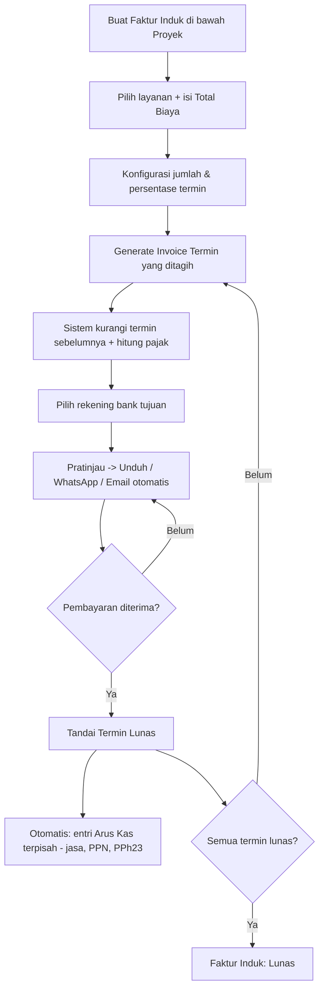

**Langkah:** 1) Buat **Faktur Induk** di bawah proyek, pilih layanan & isi Total Biaya.
2) Konfigurasi jumlah & persentase termin. 3) Generate **Invoice Termin** yang ditagih →
sistem mengurangi termin sebelumnya & menghitung pajak otomatis. 4) Pilih rekening bank.
5) Pratinjau → unduh/kirim (WA/email). 6) Saat dibayar → tandai **Lunas** → sistem membuat
**entri arus kas terpisah** (pendapatan jasa, PPN titipan, PPh 23) — lihat
[Bab 10.4](#104-pendapatan-kotor-bersih-laba-rugi--perlakuan-arus-kas). 7) Saat seluruh termin lunas,
Faktur Induk menjadi **Lunas**.

### 5.2 Penggajian (Payroll) / Slip Gaji
Mengikuti format slip nyata.
| Kolom | Keterangan |
| --- | --- |
| No / ID | Auto-generate |
| Nama Karyawan | Relasi Data Karyawan |
| Posisi & Status | mis. Staff Teknik — Probation |
| Periode | **Rentang tanggal kustom** (mis. 24 Mar – 24 Apr) |
| Status | Sudah Dibayar / Menunggu Pembayaran |
| Penggajian Kotor | Sebelum potongan pajak |
| Penggajian Bersih | Setelah potongan |

**Komponen perhitungan:**
- **Gaji Pokok × pengali** (mis. Probation ×0,8 → `2.800.000 × 0,8 = 2.240.000`).
- **Tunjangan** (mis. BPJS Kesehatan), **Lembur** (mis. per hari).
- **PPh 21 — input manual** oleh Keuangan per karyawan/periode; **boleh diisi 0 dan tetap
  valid** (mis. gaji di bawah PTKP). Potongan lain (mis. BPJS) sesuai komponen gaji.
- **Penggajian Kotor** = Gaji Pokok efektif (×pengali) + tunjangan + lembur (+ bonus).
- **Penggajian Bersih (take-home)** = Penggajian Kotor − PPh 21 − potongan lain (mis. BPJS
  porsi karyawan). *(Nilai ini = "Jumlah Gaji" pada slip & kas keluar di Arus Kas.)*

- **Siklus slip:** **Draf & pratinjau tersedia sebelum pembayaran** (untuk verifikasi
  Keuangan). **Penerbitan final & pengiriman ke karyawan dilakukan setelah status = Sudah
  Dibayar** — agar slip resmi berfungsi sebagai bukti pembayaran.
- **Slip rahasia** — hanya karyawan ybs + Keuangan/Admin. **Set aksi lengkap** (draf,
  pratinjau, edit, unduh, **kirim WhatsApp** ke nomor karyawan, **kirim Email otomatis** ke
  email karyawan) mengikuti standar [Bab 11.2](#112-aksi-dokumen-berlaku-untuk-semua-dokumen);
  tujuan pengiriman **hanya karyawan bersangkutan**.

#### Userflow — Penggajian
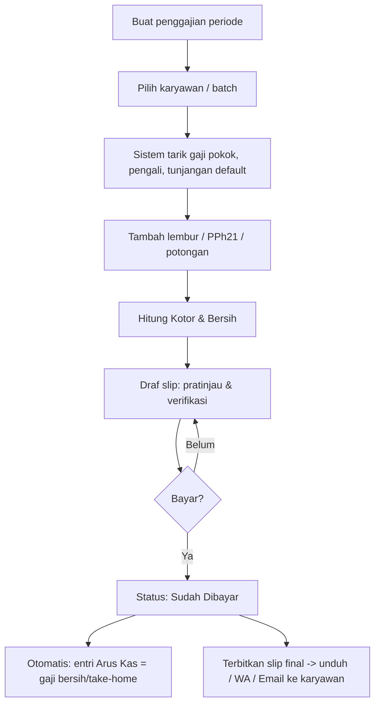

**Langkah:** 1) Buat penggajian untuk satu periode (rentang tanggal). 2) Pilih karyawan
(atau batch). 3) Sistem menarik gaji pokok, pengali status, dan tunjangan default.
4) Tambah lembur/PPh21/potongan. 5) Hitung kotor & bersih. 6) **Draf slip dapat
dipratinjau/diverifikasi** sebelum bayar. 7) Tandai **Sudah Dibayar** → entri **Pengeluaran
(Debit)** kategori **Penggajian** sebesar **gaji bersih (take-home)** di Arus Kas, dan
**terbitkan slip final** + kirim ke karyawan. Potongan PPh 21/BPJS disetor terpisah saat
pelunasan ke kas negara/BPJS — lihat [Bab 10.5](#105-perlakuan-arus-kas-penggajian).

---

## 6. Modul Manajemen Proyek (ClickUp-style)

Diakses **semua karyawan** sesuai assignment. Menggabungkan tracker nyata klien dengan
fitur kolaborasi bergaya ClickUp (assignee + komentar ber-timeline).

### 6.1 Field Proyek
| Field | Keterangan |
| --- | --- |
| Nama Proyek | Teks |
| Perusahaan | Relasi (1 perusahaan bisa banyak proyek) |
| Area Administrasi / Kawasan Industri | mis. KIIC, KITC, Dwipapuri Abadi |
| Tahun Pengerjaan | mis. 2025 / 2026 |
| Layanan (banyak) | **Satu proyek dapat memuat beberapa layanan** (relasi Katalog Layanan), masing-masing dengan jenis dokumennya |
| Status Pekerjaan | Workflow terkelola (lihat di bawah) |
| Nilai Kontrak | IDR (= Total Penawaran SPH; lihat [glosarium](#06-glosarium)) |
| Relasi Penawaran / Faktur | Tautan ke SPH & **Faktur Induk** (beberapa per proyek) |
| Assignee(s) | Ketua Tim, Anggota, Document Controller (dari Data Karyawan) |

**Status default** (dapat diubah/ditambah di [Bab 9.2](#92-workflow-status-konfigurabel)):
`PO/Kontrak → Collecting Data → Drafting → Tunggu Pengesahan → Pending → Selesai` (+ `Batal`).

### 6.2 Milestone / Checklist — Konfigurabel per Proyek
- Setiap proyek memiliki milestone **sendiri**; jumlah & isi bisa berbeda antar proyek/jenis
  dokumen. Pengguna dapat **tambah / ubah / hapus / urut** milestone.
- Tiap milestone: nama, assignee, target & tanggal aktual, status, dan **(opsional) pemicu
  termin**.
- **Template milestone default per Jenis Layanan** (dikelola di Katalog Layanan/Bab 9.4)
  dapat dimuat saat proyek dibuat, lalu **tetap dapat disesuaikan**. Contoh template 12
  langkah (dari Estimasi Jadwal nyata):
  1. Survey Lokasi 2. Pengumpulan Data & Berkas Administrasi 3. Penyusunan Dokumen
  4. Rapat Internal Awal 5. Penyelesaian Draft & Gambar 6. Asistensi dengan Pihak LH
  7. Revisi Dokumen 8. Finalisasi Dokumen 9. Pengumpulan Dokumen Final ke LH
  10. Pembahasan dengan LH 11. Revisi Akhir 12. Penerbitan Dokumen

### 6.3 Timeline / Gantt
Tampilan Gantt **mingguan** per proyek, meniru format Estimasi Jadwal Rencana Kegiatan.
**Durasi mengikuti Estimasi Jadwal — jumlah bulan tidak dikunci** (lihat
[Bab 4.5](#45-estimasi-jadwal-rencana-kegiatan--dokumen) & [11.1](#111-detail-template-estimasi-jadwal-rencana-kegiatan)).
Tiap milestone tergambar pada minggu **rencana vs aktual**. **Diisi otomatis dari Estimasi
Jadwal yang sudah disusun di fase penawaran**, lalu tim memperbarui realisasinya.

### 6.4 Kolaborasi (ClickUp-style)
- **Komentar ber-timeline / activity feed**: komentar bertanggal, **mention** (`@karyawan`),
  **lampiran** file.
- **Log perubahan status** otomatis (audit: siapa mengubah apa & kapan).

### 6.5 Keterkaitan Termin ↔ Milestone
Saat milestone bertanda pemicu termin **selesai**, sistem menyarankan untuk **men-generate
Invoice Termin** terkait pada **Faktur Induk** (mis. "Rincian Teknis selesai" → Termin 20%).
Karena satu proyek bisa punya beberapa layanan & beberapa Faktur Induk, milestone dapat
dikaitkan ke **layanan / Faktur Induk** tertentu.

### 6.6 Laporan Semester Berulang *(value-add)*
Untuk klien dengan layanan ber-tag berulang (Laporan Semester), sistem **otomatis membuat
pengingat/proyek** Laporan Semester I & II per klien per tahun agar kewajiban tidak terlewat.

### 6.7 Userflow — Proyek

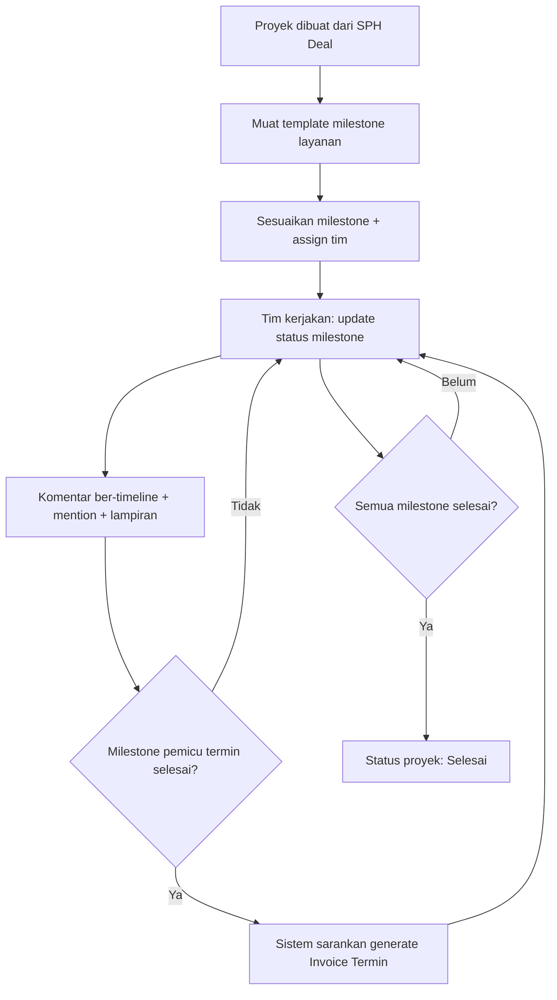

**Langkah:** 1) Proyek dibuat otomatis dari SPH yang Deal (atau manual). 2) Sistem memuat
template milestone sesuai jenis layanan. 3) Sesuaikan milestone & assign tim. 4) Tim
mengerjakan & memperbarui status milestone. 5) Berkolaborasi via komentar ber-timeline.
6) Saat milestone pemicu selesai → sistem menyarankan **generate Invoice Termin**. 7) Saat
semua selesai → status proyek **Selesai**.

### 6.8 Realisasi RAB & Profitabilitas Proyek
RAB di SPH ([Bab 4.3](#43-rab-internal)) adalah **rencana biaya**. Agar margin tidak berhenti
sebagai estimasi, **biaya aktual dicatat sebagai Realisasi RAB per proyek** (input manual oleh
Keuangan; lightweight, tanpa penandaan tiap transaksi).

| Field Realisasi RAB | Keterangan |
| --- | --- |
| Proyek | Relasi (wajib) |
| Kategori RAB | **Personil (A)** / **Langsung (B)** — selaras struktur RAB |
| Nilai Aktual | IDR |
| Tanggal | Tanggal biaya |
| Catatan | Opsional |
| Tautan Arus Kas | Opsional — bila biaya juga tercatat di Arus Kas (kategori ber-Sifat Beban **HPP**) |

**Profitabilitas proyek** (tampil di proyek & di [Dasbor Bab 8.3](#83-profitabilitas-per-proyek)):
- **Margin Rencana** = Nilai Kontrak − Total RAB (rencana).
- **Margin Aktual** = Pendapatan Diakui − Total Realisasi RAB.
- **% Anggaran Terpakai** = Realisasi ÷ RAB; **Kesehatan** 🟢 sesuai · 🟡 margin menipis ·
  🔴 over budget (Realisasi > RAB). Ambang dikonfigurasi di [Bab 9.5](#95-tarif--penomoran).

> **Akses:** Realisasi RAB & angka biaya/margin bersifat **internal keuangan** — hanya
> Admin & Keuangan (`view_project_cost`, [Bab 2.2](#22-matriks-hak-akses-ringkas)). Tim Teknis melihat
> progres/jadwal proyek **tanpa** angka biaya/margin.

---

## 7. Modul Arus Kas (Cashflow)

### 7.1 Jenis Pencatatan
- **Pemasukan (Kredit)** — semua pemasukan; kategori dapat dikustomisasi.
- **Pengeluaran (Debit)** — semua pengeluaran; kategori dapat dikustomisasi.

### 7.2 Struktur Tabel
| Kolom | Keterangan |
| --- | --- |
| Jenis (C/D) | Pemasukan–Kredit / Pengeluaran–Debit |
| Tanggal | Tanggal transaksi |
| Total | Nilai nominal (IDR) |
| Kategori | Tetap atau kustom |
| Proyek (opsional) | Tautan ke proyek — untuk biaya yang dicatat sebagai **Realisasi RAB** (lihat [Bab 6.8](#68-realisasi-rab--profitabilitas-proyek)) |
| Sumber | Manual / Otomatis (Faktur / Penggajian / Pajak) |

Filter: rentang tanggal, kategori, pengurutan kolom; **ekspor Excel/CSV**.

#### Sifat Beban (Sifat Laba-Rugi) per Kategori
Agar Dasbor dapat menyusun **Laba-Rugi** ([Bab 8.2](#82-laba-rugi-profitabilitas--basis-akrual)), tiap
**kategori** arus kas memiliki **Sifat Beban** (dikonfigurasi di [Bab 9.3](#93-kategori-arus-kas)):

| Sifat Beban | Arti | Contoh |
| --- | --- | --- |
| **HPP** | Biaya langsung pelaksanaan proyek (Harga Pokok) | Realisasi RAB: Personil A, Biaya Langsung B |
| **Operasional** | Beban overhead non-proyek | sewa kantor, listrik, gaji admin |
| **Non-Laba-Rugi** | Bukan beban — penyelesaian kewajiban / titipan / pokok | setoran **PPN** (titipan), **PPh 23** (kredit), pokok pinjaman |

> Sifat Beban **hanya** untuk klasifikasi Laba-Rugi; tidak mengubah pencatatan kas. Item
> **Non-Laba-Rugi** tetap tercatat di kas namun **dikecualikan** dari Laba-Rugi (BR-14).

### 7.3 Otomasi Antar-Modul
**Prinsip:** setiap entri otomatis **memisahkan pendapatan/biaya jasa dari komponen lain**
(pajak, bonus, dll.) agar arus kas mencerminkan nilai usaha & kewajiban secara terpisah
(lihat [Bab 10.4](#104-pendapatan-kotor-bersih-laba-rugi--perlakuan-arus-kas) & [10.5](#105-perlakuan-arus-kas-penggajian)).

| Pemicu | Aksi otomatis (entri terpisah) |
| --- | --- |
| Invoice Termin → **Lunas** | **(1)** Pemasukan (Kredit) = **pendapatan jasa** (nilai termin) → kategori **Faktur**; **(2)** **PPN Keluaran** (titipan ke negara) → kategori **Pajak**; **(3)** **PPh 23 dipotong** (kredit pajak, pengurang kas diterima) → kategori **Pajak** |
| Penggajian → **Dibayar** | Pengeluaran (Debit) = **gaji bersih / take-home** → kategori **Penggajian**; bonus (bila dipisah) → kategori **Bonus** |
| **Setor PPN/PPh/BPJS** (saat ditandai "Sudah Disetor" di [Tax Center](#106-modul-perpajakan-tax-center)) | Pengeluaran (Debit) → kategori **Pajak** / BPJS — bukan saat faktur lunas/gaji dibayar |

> Entri otomatis **terkunci** dari edit/hapus manual dan **mengikuti status sumbernya**
> (mis. faktur dibatalkan → entri ikut dibatalkan). Entri **manual** tetap didukung untuk
> transaksi lain (mis. biaya operasional, realisasi RAB, penyetoran pajak).

### 7.4 Userflow — Arus Kas
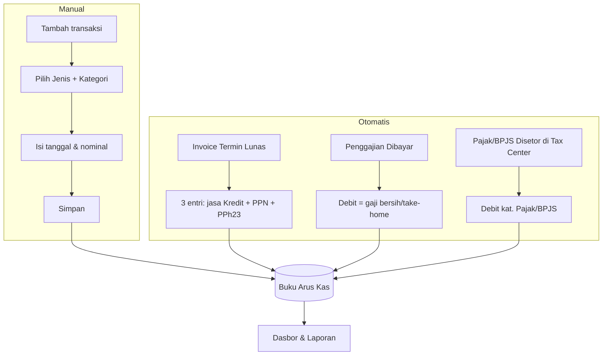

---

## 8. Modul Dasbor (Dashboard)

Dasbor adalah **lapisan komputasi** di atas modul lain — tidak menyimpan nilai sendiri,
selalu **agregasi real-time** dari Arus Kas, Faktur, RAB/Realisasi RAB, Proyek, dan Tax
Center. Selain ringkasan **arus kas** (kas masuk/keluar), Dasbor menyajikan **profitabilitas
(Laba-Rugi basis akrual)**, **proyeksi arus kas & runway**, dan **Pusat Perhatian** —
disusun sebagai **Pusat Komando** untuk Owner + **dasbor per-peran** yang diringkas sesuai
job-desc, semua **disaring per peran (RBAC)**.

> **Arus kas ≠ laba.** Ringkasan arus kas (8.1) mengukur **pergerakan kas**; Laba-Rugi (8.2)
> mengukur **profitabilitas (akrual)**. Keduanya ditampilkan terpisah & tidak dicampur —
> lihat [Bab 10.4](#104-pendapatan-kotor-bersih-laba-rugi--perlakuan-arus-kas).

### 8.1 Ringkasan Keuangan Bulanan (Arus Kas)
| Metrik | Keterangan |
| --- | --- |
| Total Pemasukan | Pemasukan bulan berjalan |
| Total Pengeluaran | Pengeluaran bulan berjalan |
| Saldo Akhir | Saldo kumulatif keseluruhan |
| Saldo Per Bulan | Selisih bersih kas bulan tersebut (bukan laba — dipengaruhi timing setoran pajak/gaji) |

### 8.2 Laba-Rugi (Profitabilitas) — basis akrual
Laporan Laba-Rugi bertingkat untuk periode terpilih (bulan / kuartal / tahun / kustom).
Menjawab "sebelum vs sesudah pajak" sekaligus. Tiap baris dapat **drilldown** ke sumber.

| Baris | Sumber | Catatan |
| --- | --- | --- |
| **Pendapatan** | Invoice Termin terbit pada periode (nilai jasa, **ex-PPN**) | akrual — saat terbit, bukan saat dibayar |
| − **HPP / Biaya Proyek** | **Realisasi RAB** proyek (Personil A + Langsung B aktual) | kategori arus kas ber-Sifat Beban **HPP** |
| **= Laba Kotor** | | + **Margin Kotor %** |
| − **Beban Operasional** | Kategori arus kas ber-Sifat Beban **Operasional** (overhead non-proyek) | |
| **= Laba Operasional** | | **← "sebelum pajak"** |
| − **PPh Badan (estimasi)** | Konfigurasi pajak: Final 0,5% omzet / 22% atas laba; PPh 23 jadi kredit ([Bab 9.5](#95-tarif--penomoran)) | selalu berlabel *estimasi* |
| **= Laba Bersih** | | **← "setelah pajak"** + **Margin Bersih %** |

> **Pendapatan Laba-Rugi = nilai jasa penuh (ex-PPN); PPh 23 BUKAN pengurang pendapatan**
> (ia kredit/uang muka pajak). Berbeda dari "Pendapatan Bersih" pada lensa arus kas
> ([Bab 10.4](#104-pendapatan-kotor-bersih-laba-rugi--perlakuan-arus-kas)). Item **Non-Laba-Rugi**
> (setoran PPN titipan, PPh 23, pokok pinjaman) dikecualikan via Sifat Beban kategori.

### 8.3 Profitabilitas Per-Proyek
Satu baris per proyek — membandingkan rencana vs realisasi:

| Kolom | Definisi |
| --- | --- |
| Nilai Kontrak | = Total Penawaran / Faktur Induk |
| Pendapatan Diakui | Invoice termin terbit s/d kini (akrual) |
| RAB Rencana (A+B) | Biaya rencana dari SPH ([Bab 4.3](#43-rab-internal)) |
| Realisasi RAB | Biaya aktual s/d kini ([Bab 6.8](#68-realisasi-rab--profitabilitas-proyek)) |
| **Margin Rencana** | Nilai Kontrak − RAB Rencana *(= Estimasi Margin, kini dilacak)* |
| **Margin Aktual** | Pendapatan Diakui − Realisasi RAB |
| % Anggaran Terpakai | Realisasi ÷ RAB Rencana |
| Kesehatan | 🟢 sesuai · 🟡 margin menipis (di bawah ambang) · 🔴 over budget (realisasi > RAB) |

> Ambang margin dikonfigurasi di [Bab 9.5](#95-tarif--penomoran). Bila belum ada Realisasi RAB,
> tampilkan **Margin Rencana saja**; Margin Aktual = "belum dicatat", kesehatan abu-abu.

### 8.4 Proyeksi Arus Kas & Runway
Pandangan **ke depan** (horizon default 90 hari, dapat dikonfigurasi):
- **Perkiraan kas masuk:** jatuh tempo invoice termin mendatang (jadwal pemicu milestone).
- **Perkiraan kas keluar:** penggajian berulang + setoran pajak/BPJS jatuh tempo (dari Tax
  Center) + pengeluaran terjadwal yang diketahui.
- **Garis proyeksi kas:** saldo berjalan ± kumulatif bersih per minggu.
- **Runway:** "kas saat ini menutup penggajian + kewajiban tetap untuk **N bulan**" — menjawab
  risiko kehabisan kas akibat timing setoran pajak (cash-basis).

### 8.5 Pusat Perhatian (Action Center)
Satu daftar terkonsolidasi & terprioritas; tiap item bertaut ke sumber + tindakan:
- Invoice **jatuh tempo / terlambat** (piutang).
- Pajak / BPJS **jatuh tempo H-3 / terlambat** (dari [Tax Center](#106-modul-perpajakan-tax-center)).
- **Bukti Potong PPh 23 belum diterima** → kredit pajak berisiko hangus.
- Proyek **over budget** / margin di bawah ambang.
- Milestone **mundur** (tanggal aktual > target).
- Proyek **mangkrak** (tanpa aktivitas N hari).

### 8.6 Komponen Visual & Filter
- **Diagram lingkaran:** distribusi pemasukan per kategori & pengeluaran per kategori.
- **Tren waktu:** garis Pendapatan / Laba / Kas antar bulan (MoM).
- **Tabel arus kas** dengan filter (rentang tanggal, kategori, urut).
- **Ringkasan proyek** *(value-add):* jumlah proyek per status, **piutang termin belum
  tertagih** (berdasarkan **jatuh tempo pembayaran** — termasuk yang **terlambat**),
  distribusi proyek per area / jenis dokumen.
- **Ringkasan pajak** *(dari [Tax Center](#106-modul-perpajakan-tax-center)):* kewajiban
  pajak **belum disetor**, **jatuh tempo terdekat / terlambat**, kredit PPh 23 terkumpul.
- **Filter periode global** + **drilldown** di seluruh panel.

### 8.7 Pusat Komando & Dasbor Per-Peran
- **Pusat Komando (Admin/Owner):** satu halaman menyeluruh — strip KPI (Laba Bersih, Margin,
  Kas, Runway, Pendapatan, Piutang, Pajak Jatuh Tempo) → Pusat Perhatian → Laba-Rugi +
  Proyeksi Kas → Profitabilitas Per-Proyek → Tren.
- **Dasbor per-peran** (subset dari engine yang sama, diringkas sesuai job-desc):

  | Peran | Melihat | Tidak melihat |
  | --- | --- | --- |
  | **Keuangan** | Laba-Rugi, proyeksi kas + runway, piutang, posisi pajak, peringatan keuangan | — (hampir penuh) |
  | **Sales** | Penawaran→proyek miliknya, nilai kontrak, status proyek, peringatan deal-nya | Laba-Rugi, biaya/margin, penggajian, pajak |
  | **Tim Teknis** | Proyek yang ditugaskan: kesehatan milestone/jadwal, beban kerja, peringatan delivery | Seluruh data keuangan (pendapatan, biaya, margin, laba, pajak) |
  | **Viewer** | Status proyek tingkat tinggi (read-only) + (opsional) KPI publik | Biaya, margin, laba, penggajian, keuangan rinci |

> Panel yang tidak diizinkan **tidak dirender** untuk peran terkait (hak akses baru:
> `view_profit`, `view_project_cost`, `view_forecast`, `view_tax_detail` — lihat
> [Bab 2.2](#22-matriks-hak-akses-ringkas)). Penyaringan ditegakkan **server-side**.

### 8.8 Userflow — Dasbor
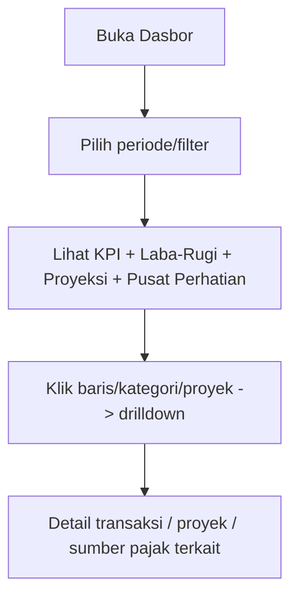

---

## 9. Modul Konfigurasi & Master Data Terkelola
*(pusat fleksibilitas — inti prinsip Configurable & Scalable)*

Satu area **Pengaturan** tempat klien mengelola sendiri seluruh daftar pilihan, workflow,
template, dan tarif — **tanpa developer**. Setiap item mendukung **CRUD + aktif/nonaktif +
urutan**.

### 9.1 Daftar Pilihan (master data)
Jenis Layanan (Katalog Layanan), Jenis Dokumen, Kewenangan, Dasar Hukum, Area
Administrasi/Kawasan Industri, Jabatan, Status Kepegawaian (+ pengali), Komponen Gaji
(tunjangan/potongan + cara hitung), **Rekening Bank** (untuk dipilih di faktur).

### 9.2 Workflow Status (konfigurabel)
Kelola daftar status untuk **Proyek / Penawaran / Faktur / Penggajian**. Setiap status
dipetakan ke **peran sistem** agar otomasi tetap valid saat label diubah:

| Peran sistem | Dipakai otomasi |
| --- | --- |
| `SELESAI` | Menutup proyek/milestone |
| `LUNAS` | Memicu entri Pemasukan di Arus Kas |
| `DIBAYAR` | Memicu entri Pengeluaran di Arus Kas |
| `BATAL` | Membatalkan entri terkait |

Klien bebas menamai ulang label (mis. "Lunas" → "Paid"), menambah status baru, dan
mengatur urutan — selama pemetaan peran tetap ada.

### 9.3 Kategori Arus Kas
4 kategori **tetap terkunci** (Faktur, Penggajian, Pajak, Bonus) karena dipakai otomasi;
kategori **kustom tanpa batas** dapat dibuat/diubah/dihapus dan tersedia di Arus Kas,
Faktur, & Penggajian. Tiap kategori memiliki **Sifat Beban** (**HPP** / **Operasional** /
**Non-Laba-Rugi**) yang menentukan perlakuannya di Laba-Rugi Dasbor
([Bab 7.2](#72-struktur-tabel) & [8.2](#82-laba-rugi-profitabilitas--basis-akrual)); default diisi sistem & dapat
disesuaikan (mis. kategori Pajak → Non-Laba-Rugi, kategori biaya proyek → HPP).

### 9.4 Template
Template milestone per jenis layanan, template PDF (SPH/Invoice/Slip), dan skema termin —
semua dapat dibuat, **diduplikasi**, dan diedit.

### 9.5 Tarif & Penomoran
Tarif PPN/PPh, **jatuh tempo pajak (PPN/PPh/BPJS)**, **jatuh tempo pembayaran faktur (N
hari)**, **status PKP perusahaan**, pengali probation, masa berlaku penawaran, dan **format
nomor** SPH/INV
(mis. `SPH/{urut}/{bulan}.{tahun}` → `SPH/001/5.2026`; `INV/{urut}/{bulan}.{tahun}` →
`INV/002/05.2026`).

**Profitabilitas & Dasbor** (dipakai Laba-Rugi/proyeksi di [Bab 8](#8-modul-dasbor-dashboard)):
- **PPh Badan:** metode (**Final 0,5% omzet** / **22% atas laba**), tarif, dan **ambang omzet
  Rp 4,8 M/tahun** ([Bab 10.8](#108-pph-badan-pajak-penghasilan-badan)).
- **Ambang kesehatan margin proyek** (mis. 🟡 bila Margin Aktual < 80% Margin Rencana).
- **Horizon Proyeksi Arus Kas** (default 90 hari).
- **Ambang proyek mangkrak** (tanpa aktivitas N hari) untuk Pusat Perhatian.

**Aturan penomoran:**
- **Counter terpisah** untuk SPH dan INV.
- **Reset tiap bulan** — nomor urut kembali ke `001` di awal setiap bulan.
- **Nomor bersifat tetap** — diberikan sekali saat dokumen dibuat dan **tidak berubah saat
  dokumen diedit**.

**Pengiriman dokumen** (dipakai aksi di [Bab 11.2](#112-aksi-dokumen-berlaku-untuk-semua-dokumen)):
- **Email otomatis:** akun pengirim (SMTP / penyedia email) + **template isi email** per
  jenis dokumen (SPH, Invoice, Slip Gaji).
- **WhatsApp (wa.me):** **template pesan** default per jenis dokumen.

### 9.6 Userflow — Konfigurasi
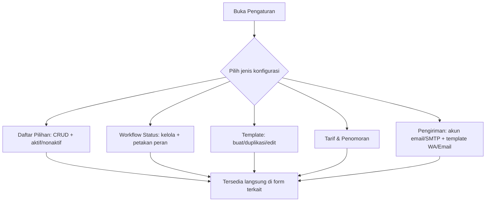

---

## 10. Penanganan Pajak

Diturunkan dari invoice nyata; **tarif dapat dikonfigurasi** di [Bab 9.5](#95-tarif--penomoran).

### 10.1 Rumus
- **DPP (nilai lain)** = nilai × **11/12**
- **PPN** = **12%** × DPP (≈ 11% efektif terhadap nilai)
- **PPh 23** = **2%** × nilai → **dipotong** (pengurang)
- **Total Setelah Pajak** = nilai + PPN − PPh 23
- **Pembulatan:** DPP & nilai pajak (PPN/PPh) dibulatkan ke **rupiah terdekat** (pembulatan
  setengah ke atas / *round half up*). Contoh: DPP `25.000.000 × 11/12 = 22.916.666,67 →
  22.916.667`.

### 10.2 Contoh Validasi (Invoice Termin III — Pelunasan)
| Komponen | Nilai (Rp) |
| --- | --- |
| Total Biaya (Faktur Induk) | 125.000.000 |
| Termin I (40%) | −50.000.000 |
| Termin II (40%) | −50.000.000 |
| **Nilai termin berjalan (pelunasan)** | **25.000.000** |
| DPP (= 25.000.000 × 11/12) | 22.916.667 |
| PPN (= 12% × DPP) | 2.750.000 |
| PPh 23 (= 2% × 25.000.000) | −500.000 |
| **Total Setelah Pajak** | **27.250.000** |

### 10.3 Penggajian
PPh 21 atas penggajian **diinput manual** oleh Keuangan per karyawan/periode (boleh **0**
dan tetap valid, mis. gaji di bawah PTKP). **Penggajian Bersih = Penggajian Kotor − PPh 21 −
potongan lain** (lihat komponen di [Bab 5.2](#52-penggajian-payroll--slip-gaji)).

### 10.4 Pendapatan Kotor, Bersih, Laba-Rugi & Perlakuan Arus Kas
**Dua lensa berbeda — jangan dicampur** (BR-14):

1. **Lensa Arus Kas (cash basis)** — entri dibuat saat kas benar-benar bergerak; **komponen
   dipisah** dari nilai jasa. Dipakai di buku Arus Kas & ringkasan kas Dasbor.
2. **Lensa Laba-Rugi (akrual)** — mengukur profitabilitas saat hak/kewajiban timbul (invoice
   terbit), bukan saat kas bergerak. Dipakai di Laba-Rugi Dasbor ([Bab 8.2](#82-laba-rugi-profitabilitas--basis-akrual)).

**Lensa Arus Kas:**
- **Pendapatan Kotor** = nilai termin (jasa, sebelum pajak).
- **Pendapatan Bersih (kas)** = nilai termin **− PPh 23** (PPh 23 dipotong klien = **kredit
  pajak / uang muka PPh**). **PPN tidak masuk pendapatan** karena bersifat **titipan** ke negara.

**Lensa Laba-Rugi (akrual):**
- **Pendapatan (Laba-Rugi)** = **nilai jasa penuh, ex-PPN** — diakui saat invoice **terbit**.
- **PPh 23 BUKAN pengurang Pendapatan** di Laba-Rugi (ia kredit/uang muka PPh Badan, bersifat
  aset — bukan pengurang pendapatan). Ini **berbeda** dari "Pendapatan Bersih (kas)" di atas.
- Lanjutan waterfall (HPP/Realisasi RAB → Laba Kotor → Beban Operasional → Laba Operasional →
  **PPh Badan** → Laba Bersih) ada di [Bab 8.2](#82-laba-rugi-profitabilitas--basis-akrual) & PPh Badan di [Bab 10.8](#108-pph-badan-pajak-penghasilan-badan).

Saat Invoice Termin **Lunas** (contoh termin Rp 25.000.000):

| Entri Arus Kas | Kategori | Rp |
| --- | --- | --- |
| Pendapatan jasa | Faktur (Kredit) | +25.000.000 |
| PPN Keluaran (titipan ke negara) | Pajak (Kredit) | +2.750.000 |
| PPh 23 dipotong (kredit pajak) | Pajak (pengurang) | −500.000 |
| **= Kas diterima di bank** | | **27.250.000** |

> **PPN Keluaran** wajib **disetor ke negara** → dicatat sebagai **Pengeluaran kategori
> Pajak saat penyetoran**. **PPh 23** yang dipotong menjadi **kredit pajak tahunan**
> perusahaan (bukan biaya).

### 10.5 Perlakuan Arus Kas Penggajian
- Saat gaji **Dibayar**: kas keluar = **gaji bersih / take-home** ke karyawan → Pengeluaran
  kategori **Penggajian**.
- **PPh 21 & BPJS yang dipotong dari karyawan belum keluar kas** saat itu — menjadi
  **kewajiban** (hutang PPh 21 / BPJS).
- Saat **disetor** ke kas negara / BPJS (mis. PPh 21 paling lambat ±tgl 10–15 bulan
  berikutnya): dicatat **Pengeluaran kategori Pajak / BPJS**. Iuran **BPJS porsi perusahaan**
  juga kas keluar saat penyetoran.
- **Bonus**: bila dibayar bersama gaji = bagian take-home; dapat **dipisah ke kategori
  Bonus** untuk pelacakan.
- **Status setor PPh 21/BPJS ditandai & dipantau di [Modul Perpajakan (Tax Center)](#106-modul-perpajakan-tax-center)**.
- Tujuan: **menghindari pencatatan ganda** & mencerminkan **timing kas riil**.

### 10.6 Modul Perpajakan (Tax Center)
Pusat untuk **melacak, memantau beban, dan menandai status setor** seluruh pajak & iuran
yang muncul dari dokumen keuangan, lengkap dengan **tautan ke dokumen sumber**.

**Entri pajak dibuat otomatis dari dokumen:**
| Jenis | Sumber | Sifat | Saat ditandai "Sudah Disetor" |
| --- | --- | --- | --- |
| **PPN Keluaran** | Invoice Termin (Lunas) | Kewajiban (titipan) | Pengeluaran kas kat. **Pajak** |
| **PPh 23 dipotong** | Invoice Termin | **Kredit pajak** (dipotong klien) | Tidak ada kas keluar; dipakai sbg kredit di SPT Tahunan |
| **PPh 21** | Penggajian (Dibayar) | Kewajiban | Pengeluaran kas kat. **Pajak** |
| **BPJS (Kes/TK)** | Penggajian (Dibayar) | Kewajiban (porsi karyawan + perusahaan) | Pengeluaran kas kat. **BPJS** |

**Field tiap entri pajak:**
- Jenis pajak, **Masa Pajak** (periode), Nilai, **Dokumen Sumber** (tautan: No Invoice /
  Penggajian periode + perusahaan/karyawan), **Jatuh Tempo**, **Status setor**
  (Belum/Sudah), Tanggal Setor, **No. Bukti Setor (NTPN)** + lampiran, Catatan.
- Khusus **PPh 23**: **Bukti Potong dari klien** (diterima? + lampiran) — syarat klaim kredit.

**Penandaan status:** 🟡 Belum Disetor · 🔴 Terlambat (lewat jatuh tempo) · 🟢 Sudah Disetor.
Menandai **Sudah Disetor** → otomatis membuat **entri Arus Kas Pengeluaran** (kat. Pajak/BPJS)
+ menyimpan NTPN. (PPh 23 yang bersifat kredit **tidak** memicu kas keluar.)

**PPN Masukan (kredit):** transaksi pembelian/pengeluaran ber-PPN dicatat (input manual atau
dari Arus Kas pengeluaran ber-PPN) sebagai **kredit** untuk mengurangi PPN yang disetor —
**PPN kurang/lebih bayar = PPN Keluaran − PPN Masukan**.

**Monitoring beban pajak:**
- Ringkasan **kewajiban belum disetor** per jenis & per masa; total **kredit PPh 23** terkumpul.
- **Jatuh tempo:** daftar terdekat & **terlambat**, dengan **pengingat aktif (in-app + email)
  H-3 sebelum jatuh tempo** untuk menghindari denda.
- **Panel Rekonsiliasi** per masa: PPN (Keluaran − Masukan = yang disetor), PPh 23 (dipotong
  vs **bukti potong diterima**), PPh 21/BPJS (terutang vs disetor).
- Filter (jenis, masa, status, perusahaan/karyawan).

**Pelaporan SPT:** rekap & **ekspor format siap-impor** (CSV/Excel) untuk **SPT Masa PPN,
PPh 21, PPh 23**, dan **SPT Tahunan** — untuk diunggah ke **Coretax/DJP Online**.

**Jatuh tempo default** (dapat dikonfigurasi, [Bab 9.5](#95-tarif--penomoran)):
- **PPh 21 & PPh 23:** setor ≤ tgl 10, lapor ≤ tgl 20 bulan berikutnya.
- **PPN:** setor & lapor akhir bulan berikutnya (SPT Masa PPN).
- **BPJS:** iuran ≤ tgl 10 bulan berikutnya.

**Prasyarat — Status PKP:** bila perusahaan **non-PKP**, sistem **tidak memungut PPN**
(PPN Keluaran tidak dibuat). Status PKP diatur di Profil/Pengaturan.

> **Akses:** Modul Perpajakan hanya dapat diakses **Admin & Keuangan** (lihat [RBAC 2.2](#22-matriks-hak-akses-ringkas)).

### 10.7 Userflow — Perpajakan
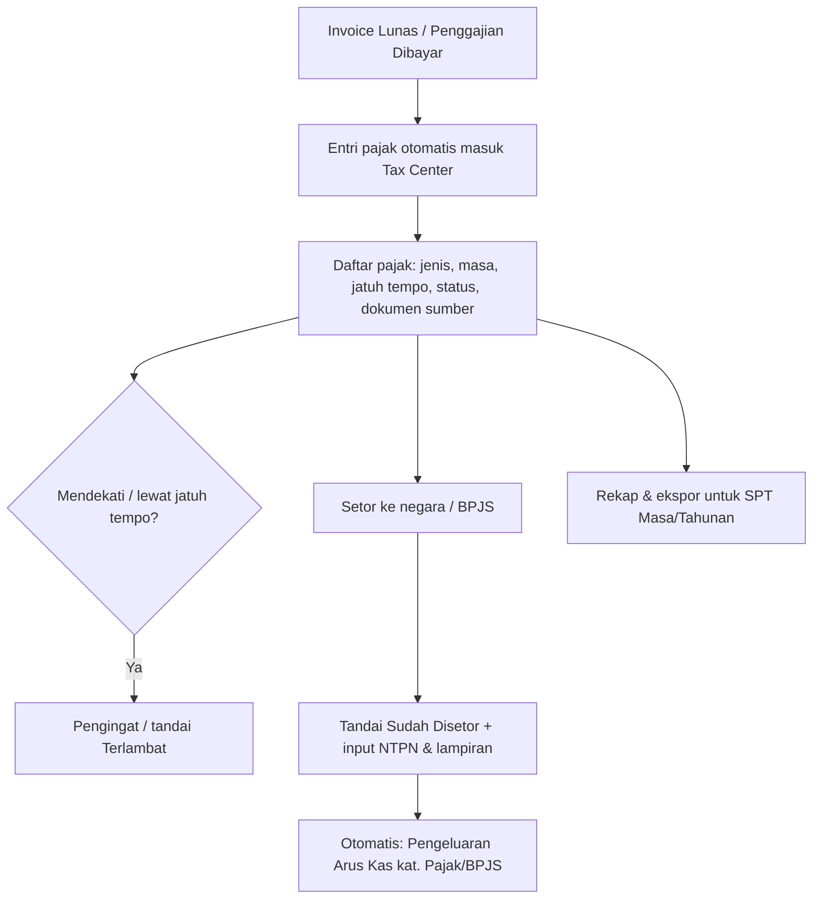

### 10.8 PPh Badan (Pajak Penghasilan Badan)
Untuk menghitung **Laba Bersih (setelah pajak)** di Laba-Rugi Dasbor, sistem mengestimasi
**PPh Badan** — pajak penghasilan **perusahaan sendiri** (berbeda dari PPN/PPh 23/PPh 21 yang
bersifat titipan/kredit/pajak karyawan). **Metode & tarif dapat dikonfigurasi** di
[Bab 9.5](#95-tarif--penomoran):

| Metode | Dasar | Catatan |
| --- | --- | --- |
| **PPh Final UMKM** | **0,5% × omzet (peredaran bruto)** | PP 55/2022; untuk omzet < Rp 4,8 M/tahun. PPh 23 **tidak** dapat dikreditkan terhadap PPh Final |
| **PPh Badan tarif** | **22% × laba kena pajak** | tarif normal; **PPh 23 dikreditkan** mengurangi PPh Badan terutang |

- Nilai PPh Badan di Dasbor **selalu berlabel "estimasi"** (perhitungan SPT Tahunan final tetap
  oleh konsultan pajak/akuntan).
- **Ambang Rp 4,8 M** dapat dikonfigurasi; sistem dapat memberi peringatan saat omzet tahunan
  mendekati/melewati ambang (indikasi perlu pindah metode).
- **Kredit PPh 23** yang terkumpul (dari [Bab 10.6](#106-modul-perpajakan-tax-center)) ditampilkan sebagai pengurang pada
  metode 22%.

---

## 11. Spesifikasi Template PDF

Semua template memakai **header** (logo + identitas PT) dan **footer** (kontak: telp, email,
website, alamat) dari Profil Perusahaan, serta blok **penandatangan** (mis. Direktur).

| Template | Elemen utama |
| --- | --- |
| **SPH (Penawaran)** | No SPH, tanggal, perihal, tujuan (Perusahaan+PIC), tabel layanan (Uraian/Harga Satuan/Vol/Total), Total Biaya, **Terbilang**, catatan (masa berlaku, skema termin), TTD |
| **RAB (internal)** | Rincian Biaya Personil (A), Biaya Langsung (B), Total Biaya; tidak dikirim ke klien |
| **Estimasi Jadwal** | Tabel kegiatan × minggu (**jumlah bulan dapat diatur**), penanda minggu per kegiatan (lihat [Bab 11.1](#111-detail-template-estimasi-jadwal-rencana-kegiatan)) |
| **Invoice Termin** | No Inv, tanggal, **jatuh tempo pembayaran**, label termin, tujuan, tabel uraian, Total Biaya, **pengurang seluruh termin sebelumnya**, DPP/PPN/PPh, Total Setelah Pajak, **rekening bank terpilih**, "berlaku sebagai kwitansi", TTD |
| **Slip Gaji** | Nama, Periode, Posisi, Status, komponen pendapatan (Gaji Pokok×pengali, tunjangan, lembur), Jumlah Gaji, catatan rahasia |

> Semua template **dapat dikustomisasi & diduplikasi** via [Bab 9.4](#94-template).

### 11.1 Detail Template: Estimasi Jadwal Rencana Kegiatan

Tabel matriks **kegiatan (baris) × minggu (kolom)**, dikelompokkan per bulan. Mengikuti
format nyata (file PT MAB / Rintek) namun **fleksibel**.

**Struktur kolom**
| Kolom | Keterangan |
| --- | --- |
| No | Nomor urut kegiatan |
| Kegiatan | Nama langkah (default dari template milestone layanan, dapat diedit) |
| Bulan ke-_n_ → Minggu 1..4 | Grup kolom per bulan; tiap bulan berisi kolom minggu |

**Aturan fleksibilitas (dapat diatur klien)**
- **Jumlah bulan tidak dikunci** — tambah/kurangi bulan sesuai durasi proyek (mis. 1, 3, 6 bulan).
- **Jumlah minggu per bulan** default 4, dapat disesuaikan.
- **Tambah/ubah/hapus/urut baris kegiatan**.
- **Penanda sel:** tiap sel minggu dapat **di-toggle** untuk menandai bahwa kegiatan pada
  baris itu berlangsung di minggu tersebut. Sel yang ditandai **disorot kuning** (di UI &
  PDF). Satu kegiatan dapat menandai beberapa minggu berurutan (rentang) atau terpisah.
- *(Di modul Proyek/[Bab 6.3](#63-timeline--gantt))* grid yang sama menyimpan **rencana vs
  aktual** — penanda kuning = rencana, dan realisasi diperbarui tim.

**Contoh layout** — legenda: `█` = minggu ditandai (kuning), kosong = tidak.

| No | Kegiatan | B1·1 | B1·2 | B1·3 | B1·4 | B2·1 | B2·2 | B2·3 | B2·4 | B3·1 | B3·2 | B3·3 | B3·4 |
|---|---|---|---|---|---|---|---|---|---|---|---|---|---|
| 1 | Survey Lokasi | █ | | | | | | | | | | | |
| 2 | Pengumpulan Data & Berkas | | █ | | | | | | | | | | |
| 3 | Penyusunan Dokumen | | | █ | █ | | | | | | | | |
| 4 | Rapat Internal Awal | | | | | █ | | | | | | | |
| 5 | Penyelesaian Draft & Gambar | | | | | | █ | | | | | | |
| 6 | Asistensi dengan Pihak LH | | | | | | | █ | █ | | | | |
| 7 | Revisi Dokumen | | | | | | | | | █ | | | |
| 8 | Finalisasi Dokumen | | | | | | | | | █ | | | |
| 9 | Pengumpulan Dokumen Final ke LH | | | | | | | | | █ | | | |
| 10 | Pembahasan dengan LH | | | | | | | | | | █ | | |
| 11 | Revisi Akhir | | | | | | | | | | | █ | |
| 12 | Penerbitan Dokumen | | | | | | | | | | | | █ |

> Header `B{bulan}·{minggu}` hanya untuk keringkasan dokumen ini; di aplikasi ditampilkan
> sebagai grup **"BULAN-1 / MINGGU 1 2 3 4"** seperti format asli.

### 11.2 Aksi Dokumen (berlaku untuk semua dokumen)

Setiap dokumen yang dihasilkan sistem memiliki **set aksi standar** yang konsisten:

| Aksi | Keterangan |
| --- | --- |
| **Draf** | Simpan sebagai draf (belum final); dapat dilanjutkan/diubah kapan saja. |
| **Pratinjau (Preview)** | Lihat hasil PDF sebelum finalisasi/kirim. |
| **Edit** | Ubah isi via form/inline. Nomor dokumen (SPH/INV) **tetap** saat diedit ([Bab 9.5](#95-tarif--penomoran)). |
| **Unduh (Download)** | Unduh PDF ke perangkat. |
| **Kirim WhatsApp** | Buka tautan `wa.me` ke nomor tujuan dengan pesan template terisi; **lampir PDF manual**. |
| **Kirim Email (otomatis)** | Sistem mengirim email **otomatis** ke alamat tujuan dengan **PDF terlampir** + isi email dari template. Perlu akun email pengirim ([Bab 9.5](#95-tarif--penomoran)). |

**Matriks per dokumen** (✓ tersedia · ✗ tidak)

| Dokumen | Draf | Preview | Edit | Unduh | WA | Email | Tujuan |
| --- | :-: | :-: | :-: | :-: | :-: | :-: | --- |
| SPH (Penawaran) | ✓ | ✓ | ✓ | ✓ | ✓ | ✓ | PIC / email perusahaan |
| Estimasi Jadwal | ✓ | ✓ | ✓ | ✓ | ✓ | ✓ | ikut paket SPH |
| RAB (internal) | ✓ | ✓ | ✓ | ✓ | ✗ | ✗ | **internal — tidak dikirim ke klien** |
| Invoice Termin | ✓ | ✓ | ✓ | ✓ | ✓ | ✓ | PIC / email perusahaan |
| Slip Gaji | ✓ | ✓ | ✓ | ✓ | ✓ | ✓ | **karyawan ybs (rahasia)** |

> WhatsApp = tautan `wa.me` + lampir PDF manual (tanpa biaya gateway). Email = terkirim
> **otomatis** dengan lampiran. **RAB bersifat internal** sehingga tanpa opsi kirim ke klien.

---

## 12. Model Data & Relasi

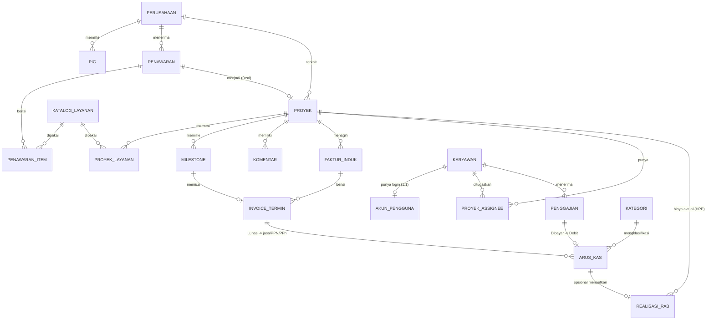

> **Catatan profitabilitas & Laba-Rugi Dasbor:**
> - **REALISASI_RAB** (`proyek`, `kategori_rab` A/B, `nilai`, `tanggal`, `catatan`,
>   opsional `arus_kas_id`) = sumber **HPP/biaya proyek aktual** → Margin Aktual ([Bab 6.8](#68-realisasi-rab--profitabilitas-proyek)).
> - **KATEGORI** memiliki atribut **`sifat_beban`** (HPP / Operasional / Non-Laba-Rugi) untuk
>   penyusunan Laba-Rugi ([Bab 7.2](#72-struktur-tabel)).
> - **Pengaturan pajak** menyimpan **PPh Badan** (`metode` Final/Badan, `tarif`, `ambang_omzet`)
>   untuk Laba Bersih ([Bab 10.8](#108-pph-badan-pajak-penghasilan-badan)), serta parameter dasbor
>   (ambang margin, horizon proyeksi, ambang mangkrak — [Bab 9.5](#95-tarif--penomoran)).
> - Dasbor **tidak menambah tabel agregat** — Laba-Rugi, proyeksi, & Pusat Perhatian dihitung
>   real-time dari entitas di atas.

---

## 13. Persyaratan Non-Fungsional

- **Platform:** web responsif (desktop & tablet), Bahasa Indonesia.
- **Format & validasi:** IDR tanpa desimal; validasi NPWP (≤16 digit, numerik); validasi
  field wajib.
- **Audit log:** mencatat siapa membuat/mengubah/menghapus data & kapan (terutama Faktur,
  Penggajian, status Proyek, Konfigurasi).
- **Penghapusan data — soft delete + arsip:** data tidak dihapus permanen, melainkan
  ditandai terhapus/diarsipkan, **dapat dipulihkan**, dan jejak audit tetap tersimpan
  (penting untuk dokumen keuangan).
- **Notifikasi & pengingat:** in-app + email untuk **jatuh tempo pajak (H-3)**, mention di
  proyek, dokumen jatuh tempo, dan **Pusat Perhatian Dasbor** (proyek over budget, milestone
  mundur, proyek mangkrak, bukti potong PPh 23 belum diterima).
- **Keamanan & kerahasiaan:** RBAC ditegakkan di server; **slip gaji rahasia**.
- **Ekspor:** Excel/CSV untuk tabel utama (Penawaran, Faktur, Penggajian, Arus Kas, Proyek,
  Perpajakan).
- **Konsistensi:** terminologi Pemasukan=Kredit, Pengeluaran=Debit di seluruh sistem.
- **Backup:** pencadangan berkala basis data.

---

## 14. Keputusan Final (sebelumnya Terbuka)

Seluruh item yang sebelumnya TBD telah dikonfirmasi klien:

| # | Item | Keputusan |
| --- | --- | --- |
| 1 | **Pengiriman dokumen** | **WhatsApp** = tautan `wa.me` (pesan terisi + lampir PDF manual, tanpa gateway/biaya) **dan Email otomatis** (PDF terlampir, perlu akun email/SMTP). (Bab 4.5, 5.1, 5.2, 9.5, 11.2) |
| 2 | **PPh 21 Penggajian** | **Input manual** per karyawan/periode; **nilai 0 valid** (mis. di bawah PTKP). (Bab 5.2, 10.3) |
| 3 | **Penomoran SPH/INV** | Counter **terpisah**, **reset tiap bulan**, dan **nomor tetap (tidak berubah saat diedit)**. (Bab 9.5) |
| 4 | **Penghapusan data** | **Soft delete + arsip** — dapat dipulihkan, jejak audit tersimpan. (Bab 13) |
| 5 | **Pajak default** | PPN 12% via DPP 11/12 & PPh 23 2% sebagai default; dapat diubah di Pengaturan. (Bab 10) |

> Tidak ada item terbuka tersisa. Perubahan ke depan dilakukan melalui Modul Konfigurasi
> (Bab 9) tanpa mengubah PRD.

---

*Dokumen ini adalah PRD acuan. Nilai contoh (status, langkah milestone, tarif) bersifat
default dan dapat dikelola sendiri oleh klien melalui Modul Konfigurasi (Bab 9).*
