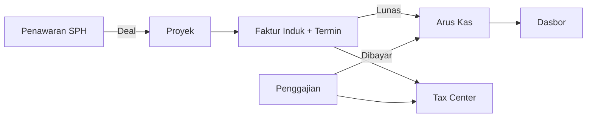

# Sistem ERP Internal — PT Sinar Buana Mandiri Jaya
### Ringkasan Eksekutif (1 Halaman) · Untuk Klien & Stakeholder · Juni 2026

---

**Apa ini?** Satu aplikasi web internal (Bahasa Indonesia) yang menyatukan operasional &
keuangan SBMJ — dari penawaran, proyek perizinan, penagihan termin, penggajian, arus kas,
hingga perpajakan — menggantikan spreadsheet & dokumen terpisah.

### Masalah → Solusi
| Saat ini (manual) | Dengan sistem |
| --- | --- |
| Data tersebar di spreadsheet & Word/PDF | Satu sumber data terpusat |
| Progres proyek & penagihan termin sulit dilacak | Manajemen proyek gaya ClickUp + status real-time |
| Penagihan tidak terhubung ke arus kas | Otomatis: faktur lunas → arus kas |
| Pajak rawan salah hitung & telat setor | Hitung otomatis + Tax Center dengan pengingat |
| Tidak tahu untung/rugi riil per proyek & perusahaan | Laba-Rugi (sebelum & sesudah pajak) + margin aktual per proyek |
| Kaget kehabisan kas akibat timing setoran pajak | Proyeksi arus kas + runway ("kas cukup N bulan") |

### Modul Utama
**Master Data** (Perusahaan & PIC, Katalog Layanan, Karyawan, Profil) · **Penawaran (SPH)**
+ RAB & Estimasi Jadwal · **Faktur Induk & Invoice Termin** · **Penggajian / Slip Gaji** ·
**Manajemen Proyek** (assignee, milestone, Gantt, komentar, **Realisasi RAB**) · **Arus Kas** ·
**Tax Center** · **Dasbor** (Pusat Komando: **Laba-Rugi, profitabilitas per-proyek, proyeksi
kas & runway, Pusat Perhatian**) · **Konfigurasi mandiri**.

### Alur Inti

### Nilai Utama
- **Hemat waktu & rapi** — dokumen (SPH, invoice, slip) dibuat dari template, kirim via
  WhatsApp/Email, penomoran & terbilang otomatis.
- **Visibilitas penuh** — progres proyek, piutang termin (berdasarkan jatuh tempo), beban
  pajak, **laba kotor/bersih (sebelum & sesudah pajak)**, **margin aktual per proyek**, dan
  **proyeksi kas + runway** terpantau di dasbor.
- **Keuangan akurat** — arus kas otomatis & terpisah (jasa/PPN/PPh), perhitungan pajak
  tervalidasi dengan dokumen nyata.
- **Tumbuh bersama bisnis** — daftar layanan, status, template, & tarif **dikelola sendiri
  oleh tim** tanpa developer.

### Cakupan & Keputusan Kunci
- **Dibangun dalam satu fase** mencakup seluruh modul di atas.
- Pengiriman dokumen: **WhatsApp (wa.me) + Email otomatis**.
- Pajak: **PPN & PPh otomatis** (dapat dikonfigurasi), **PPh 21 input manual**.
- Keamanan: **hak akses per peran (RBAC)**, slip gaji rahasia, data tidak terhapus permanen.

### Status
PRD lengkap & konsisten — **siap masuk tahap pembangunan**.
Detail teknis: lihat dokumen PRD ([`../prd/`](../prd/README.md) — per modul, atau berkas lengkap [`../prd/prd.md`](../prd/prd.md)).
