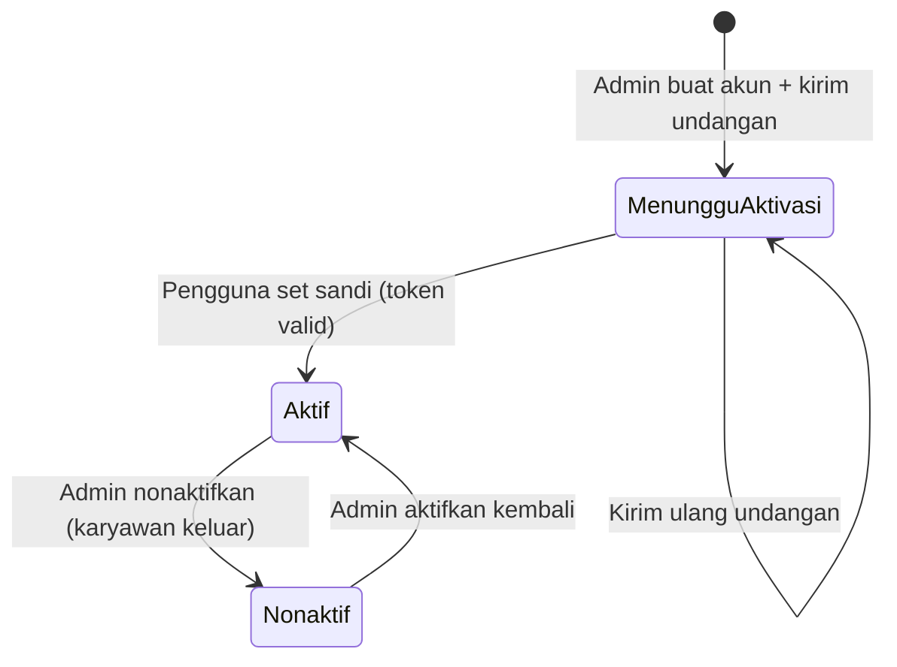

[← Daftar Isi](README.md)

---

# EP-01 — Autentikasi & Manajemen Akun

> **Sumber PRD:** [Bab 2](../prd/02-peran-rbac.md) · **Aktor utama:** Admin (kelola akun), semua pengguna (login)
> **Dependencies:** [EP-00 Konfigurasi](00-konfigurasi-sistem.md) (akun email/SMTP untuk undangan & reset)
> **Diturunkan ke:** seluruh epic (penegakan RBAC), [EP-06 Penggajian](06-penggajian.md) (tautan 1:1 akun↔karyawan)

---

## 1. Tujuan & Konteks

Mengatur **siapa boleh masuk dan melakukan apa**. Akun dibuat oleh Admin, diaktifkan via
**undangan email** (pengguna set sandi sendiri = alur "sign up"), lalu login memuat peran &
menyaring menu/aksi sesuai RBAC. Setiap akun **wajib tertaut 1:1 ke Data Karyawan** agar dapat
melihat slip gaji sendiri dan menjadi assignee proyek.

---

## 2. Functional Requirements

| ID | Requirement | Prioritas |
| --- | --- | --- |
| FR-01.1 | Admin membuat akun: Nama, **Email (login, unik)**, Peran (satu peran RBAC), **Tautan Karyawan (1:1)**, Status (Aktif/Nonaktif). | M |
| FR-01.2 | Akun baru diaktifkan via **undangan email** (pengguna set sandi sendiri) atau sandi diset Admin. | M |
| FR-01.3 | Login dengan email + sandi; gagal → pesan error & ulangi. | M |
| FR-01.4 | Setelah login, sistem **memuat peran** & menyaring menu/aksi sesuai [matriks RBAC](README.md#5-role--permission-matrix--global-rbac). | M |
| FR-01.5 | **Reset password** via tautan/token email, atau oleh Admin. | M |
| FR-01.6 | Karyawan keluar → akun **dinonaktifkan (bukan dihapus)**; jejak audit tetap. | M |
| FR-01.7 | Satu karyawan = **satu akun (1:1)**. | M |
| FR-01.8 | Penegakan RBAC **server-side** pada setiap endpoint ([GC-12](11-konvensi-global-nfr.md#5-keamanan--rbac-gc-12)). | M |
| FR-01.9 | Akun nonaktif tidak dapat login. | M |

---

## 3. Role / Permission Matrix

| Aksi | Admin/Owner | Keuangan | Sales | Tim Teknis | Viewer |
| --- | :-: | :-: | :-: | :-: | :-: |
| Kelola Akun Pengguna | CRUD | – | – | – | – |
| Login / logout | ✓ | ✓ | ✓ | ✓ | ✓ |
| Reset sandi sendiri | ✓ | ✓ | ✓ | ✓ | ✓ |

---

## 4. User Stories + Acceptance Criteria

### US-01.1 — Admin membuat akun & mengirim undangan
**As an** Admin, **I want** membuat akun dan menautkannya ke karyawan, **so that** pegawai dapat
mengakses sistem sesuai perannya. · **Prioritas: M**

```gherkin
Scenario: Buat akun valid + undangan
  Given Admin membuka Akun Pengguna > Tambah
  And akun email/SMTP sudah dikonfigurasi (EP-00)
  When Admin mengisi Nama, Email unik, memilih Peran, menautkan Karyawan, lalu menyimpan
  Then akun tersimpan berstatus "Menunggu Aktivasi"
  And email undangan berisi tautan set-sandi terkirim ke pengguna

Scenario: Email sudah dipakai
  Given email "budi@sbmj.co.id" sudah terdaftar
  When Admin membuat akun dengan email yang sama
  Then sistem menolak dengan "Email sudah terdaftar."

Scenario: Tautan karyawan wajib unik (1:1)
  Given karyawan "Budi" sudah tertaut ke satu akun
  When Admin mencoba menautkan "Budi" ke akun kedua
  Then sistem menolak dengan "Karyawan ini sudah memiliki akun."
```

### US-01.2 — Pengguna mengaktifkan akun (set sandi / sign up)
**As a** pengguna baru, **I want** menyetel sandi via tautan undangan, **so that** saya dapat
login pertama kali. · **Prioritas: M**

```gherkin
Scenario: Aktivasi via undangan
  Given pengguna menerima email undangan dengan token valid
  When pengguna membuka tautan & menetapkan sandi yang memenuhi kebijakan
  Then akun menjadi "Aktif"
  And pengguna diarahkan ke halaman login (atau langsung masuk)

Scenario: Token kedaluwarsa
  Given token undangan sudah kedaluwarsa
  When pengguna membuka tautan
  Then sistem menampilkan "Tautan tidak berlaku" & opsi minta undangan ulang
```

### US-01.3 — Login
**As a** pengguna terdaftar, **I want** masuk dengan email & sandi, **so that** saya mengakses
modul sesuai peran. · **Prioritas: M**

```gherkin
Scenario: Kredensial valid
  Given akun "Aktif" dengan sandi benar
  When pengguna submit form login
  Then sistem memuat peran & hak akses
  And menampilkan menu sesuai peran
  And mengarahkan ke dasbor yang relevan dengan perannya

Scenario: Kredensial salah
  Given sandi yang dimasukkan salah
  When pengguna submit
  Then sistem menampilkan pesan error dan tetap di halaman login
  And tidak membocorkan apakah email atau sandi yang salah

Scenario: Akun nonaktif
  Given akun berstatus "Nonaktif"
  When pengguna mencoba login dengan kredensial benar
  Then sistem menolak dengan "Akun nonaktif, hubungi Admin."
```

### US-01.4 — Reset password
**As a** pengguna, **I want** mereset sandi via email, **so that** saya tetap bisa masuk saat lupa
sandi. · **Prioritas: M**

```gherkin
Scenario: Minta reset
  Given pengguna menekan "Lupa sandi" dan memasukkan email terdaftar
  When permintaan dikirim
  Then email berisi tautan/token reset terkirim
  And tautan hanya berlaku sekali & memiliki masa kedaluwarsa

Scenario: Admin reset paksa
  Given seorang pengguna tidak dapat mengakses emailnya
  When Admin memicu reset/penetapan sandi untuk akun tersebut
  Then pengguna dapat login dengan sandi baru & diminta menggantinya
```

### US-01.5 — Nonaktifkan akun (karyawan keluar)
**As an** Admin, **I want** menonaktifkan akun alih-alih menghapus, **so that** jejak audit & relasi
historis tetap utuh. · **Prioritas: M**

```gherkin
Scenario: Nonaktifkan akun
  Given karyawan keluar dari perusahaan
  When Admin mengubah status akun menjadi "Nonaktif"
  Then pengguna tidak dapat login lagi
  And data & jejak audit yang ditautkan akun tetap ada (soft, tidak terhapus)
  And assignment proyek historis tetap menampilkan nama yang bersangkutan
```

### US-01.6 — Penegakan RBAC saat memakai sistem
**As the** sistem, **I want** menegakkan hak akses per peran di server, **so that** pengguna hanya
melakukan aksi yang diizinkan. · **Prioritas: M**

```gherkin
Scenario: Sembunyikan menu tak berhak
  Given pengguna peran "Tim Teknis"
  When ia masuk
  Then menu Penggajian penuh & Konfigurasi tidak ditampilkan

Scenario: Tolak akses langsung (server-side)
  Given pengguna "Sales" tidak berhak modul Arus Kas
  When ia memanggil endpoint Arus Kas langsung
  Then server menolak (403) tanpa mengembalikan data

Scenario: Slip gaji sendiri tetap dapat diakses semua peran
  Given pengguna "Tim Teknis" tertaut ke Data Karyawan
  When ia membuka "Slip Saya"
  Then ia dapat melihat & mengunduh slip miliknya sendiri saja
```

---

## 5. Field Validation

| ID | Field | Tipe | Wajib | Aturan | Pesan error |
| --- | --- | --- | --- | --- | --- |
| VR-01.1 | Nama | Teks | Ya | — | "Nama wajib diisi." |
| VR-01.2 | Email (login) | Email | Ya | Format valid + **unik** | "Email sudah terdaftar." / "Format email tidak valid." |
| VR-01.3 | Peran | Pilihan | Ya | Satu dari peran RBAC | "Peran wajib dipilih." |
| VR-01.4 | Tautan Karyawan | Relasi 1:1 | Ya | Karyawan belum tertaut akun lain | "Karyawan ini sudah memiliki akun." |
| VR-01.5 | Sandi | Password | Ya (saat aktivasi/ganti) | Kebijakan kekuatan sandi (mis. min 8, kombinasi) | "Sandi belum memenuhi syarat keamanan." |
| VR-01.6 | Status | Pilihan | Ya | Aktif / Nonaktif | — |
| VR-01.7 | Token undangan/reset | Token | — | Belum dipakai & belum kedaluwarsa | "Tautan tidak berlaku atau kedaluwarsa." |

---

## 6. State & Transition — Status Akun



| Dari | Ke | Pemicu | Catatan |
| --- | --- | --- | --- |
| — | Menunggu Aktivasi | Admin buat akun | Undangan terkirim |
| Menunggu Aktivasi | Aktif | Set sandi via token | Token sekali pakai |
| Aktif | Nonaktif | Admin | Tidak bisa login; data utuh |
| Nonaktif | Aktif | Admin | Reaktivasi |

---

## 7. Edge Cases & Catatan Penting

- **Tanpa email/SMTP terkonfigurasi** ([EP-00](00-konfigurasi-sistem.md)), undangan & reset tidak dapat dikirim — UI harus memberi tahu Admin untuk menyetel email dulu, atau sediakan jalur set-sandi oleh Admin.
- **Login tidak boleh membocorkan** apakah email atau sandi yang salah (anti enumerasi).
- **Tautan 1:1 wajib** untuk fitur "slip sendiri" & assignee — akun tanpa tautan karyawan tidak dapat menjadi assignee/menerima slip.
- **Hard delete dilarang** — selalu nonaktifkan ([BR-13](11-konvensi-global-nfr.md#8-daftar-aturan-bisnis-tidak-boleh-dilanggar-highlight-lintas-epic)).
- **Token reset/undangan** harus sekali pakai + kedaluwarsa; pertimbangkan rate-limit pada percobaan login & permintaan reset.
- **Audit:** pembuatan, perubahan peran, nonaktivasi akun tercatat ([GC-10](11-konvensi-global-nfr.md#3-audit-log-gc-10)).

---

## 8. Dependencies & Keterkaitan

- **Prasyarat:** [EP-00](00-konfigurasi-sistem.md) (akun email/SMTP).
- **Mengandalkan:** [EP-02 Master Data → Data Karyawan](02-master-data.md) untuk tautan 1:1.
- **Diandalkan oleh:** seluruh epic (RBAC), [EP-04](04-manajemen-proyek.md) (assignee), [EP-06](06-penggajian.md) (slip sendiri).
