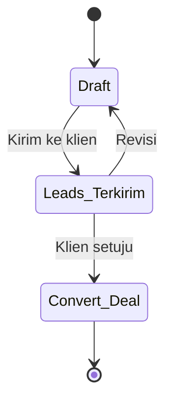

[← Daftar Isi](README.md)

---

# EP-03 — Penawaran (Quotation / SPH)

> **Sumber PRD:** [Bab 4](../prd/04-penawaran-sph.md) · **Aktor utama:** Sales/Marketing
> **Dependencies:** [EP-00](00-konfigurasi-sistem.md) (penomoran, masa berlaku, template), [EP-02](02-master-data.md) (perusahaan, PIC, katalog)
> **Diturunkan ke:** [EP-04 Proyek](04-manajemen-proyek.md) & [EP-05 Faktur](05-faktur-termin.md) saat status Deal

---

## 1. Tujuan & Konteks

Membuat **Surat Penawaran Harga (SPH)** mengikuti format nyata, lengkap dengan **baris layanan**,
**skema termin usulan**, **RAB internal** (untuk margin), dan **Estimasi Jadwal Rencana Kegiatan**.
Saat klien setuju (**Convert–Deal**), SPH menurunkan **Proyek** & **Faktur Induk** tanpa input ulang.

---

## 2. Functional Requirements

| ID | Requirement | Prioritas |
| --- | --- | --- |
| FR-03.1 | Daftar Penawaran dengan **edit inline**, pencarian, filter, urut, paginasi, ekspor. | M |
| FR-03.2 | No SPH **auto-generate** sesuai format [EP-00](00-konfigurasi-sistem.md) (mis. `SPH/001/5.2026`); **tetap saat diedit** ([BR-1](11-konvensi-global-nfr.md#8-daftar-aturan-bisnis-tidak-boleh-dilanggar-highlight-lintas-epic)). | M |
| FR-03.3 | Isi SPH: kop & tujuan (Perusahaan+PIC+alamat), baris layanan (relasi katalog), **terbilang otomatis**, masa berlaku, catatan/ketentuan. | M |
| FR-03.4 | **Skema Termin usulan** dengan pemicu milestone (mis. 40/20/20/20). | M |
| FR-03.5 | **RAB internal** (Biaya Personil A + Biaya Langsung B) → Total RAB; **Estimasi Margin (Margin Rencana) = Total Penawaran − Total RAB** (tidak ditampilkan ke klien); dibandingkan dengan **Realisasi RAB / Margin Aktual** saat proyek berjalan ([EP-04](04-manajemen-proyek.md), [EP-09](09-dasbor.md)). | M |
| FR-03.6 | **Estimasi Jadwal Rencana Kegiatan**: tabel kegiatan × minggu, durasi & jumlah minggu dapat diatur, penanda sel (toggle, sorot kuning); kegiatan ditarik dari template milestone layanan. | M |
| FR-03.7 | Status workflow: Draft → Leads–Terkirim → Convert–Deal (dapat dikonfigurasi via [EP-00](00-konfigurasi-sistem.md)). | M |
| FR-03.8 | Aksi dokumen (Draf/Preview/Edit/Unduh/WA/Email) sesuai [EP-10](10-pengiriman-dokumen.md). | M |
| FR-03.9 | Saat **Convert–Deal**, tawarkan **Buat Proyek** (Estimasi Jadwal → milestone & Gantt; Nilai Kontrak = Total Penawaran) & **Buat Faktur Induk**. | M |

---

## 3. Role / Permission Matrix

| Aksi | Admin | Keuangan | Sales | Tim Teknis | Viewer |
| --- | :-: | :-: | :-: | :-: | :-: |
| Penawaran (SPH) | CRUDES | R | CRUES | R | R |

> Sales & Admin dapat Create/Update/Delete/Export/**Send**. Keuangan/Tim Teknis/Viewer hanya baca.

---

## 4. User Stories + Acceptance Criteria

### US-03.1 — Buat SPH dari katalog
**As a** Sales, **I want** membuat SPH memilih perusahaan/PIC & baris layanan dari katalog, **so that**
penawaran konsisten & cepat. · **Prioritas: M**

```gherkin
Scenario: Buat SPH baru
  Given Sales membuka Penawaran > Buat
  When memilih Perusahaan + PIC, menambah baris layanan dari Katalog (harga terisi bila ada),
       dan menyimpan
  Then SPH tersimpan sebagai "Draft" dengan No SPH auto sesuai format & bulan berjalan
  And nilai "Terbilang" terisi otomatis dari Total Penawaran

Scenario: Nomor tetap saat diedit
  Given SPH "SPH/003/5.2026" sudah dibuat
  When Sales mengedit isi SPH
  Then No SPH tetap "SPH/003/5.2026" (tidak berubah)
```

### US-03.2 — Atur skema termin usulan + pemicu milestone
**As a** Sales, **I want** menyusun skema termin & mengaitkannya ke milestone, **so that** penagihan
nanti mengacu skema ini. · **Prioritas: M**

```gherkin
Scenario: Skema termin 40/20/20/20
  When Sales menambahkan termin 40% (mulai), 20% (Rintek selesai), 20% (Pertek selesai), 20% (UKL-UPL selesai)
  Then total persentase termin = 100%
  And tiap termin tertaut ke milestone pemicunya

Scenario: Total persentase tidak 100%
  When total persentase termin ≠ 100%
  Then sistem memperingatkan sebelum finalisasi
```

### US-03.3 — Isi RAB internal & lihat margin
**As a** Sales, **I want** mengisi RAB internal, **so that** saya tahu estimasi margin sebelum
menawarkan. · **Prioritas: S**

```gherkin
Scenario: Hitung margin
  Given Total Penawaran = Rp 125.000.000
  When Sales mengisi Biaya Personil (A) + Biaya Langsung (B) = Total RAB Rp 80.000.000
  Then Estimasi Margin terhitung = Rp 45.000.000
  And RAB tidak ikut terkirim ke klien (internal)
```

### US-03.4 — Susun Estimasi Jadwal Rencana Kegiatan
**As a** Sales, **I want** menyusun jadwal kegiatan × minggu dari template milestone, **so that**
jadwal konsisten dengan milestone proyek nanti. · **Prioritas: M**

```gherkin
Scenario: Muat dari template & tandai minggu
  Given layanan memiliki template milestone (mis. 12 langkah)
  When Sales memuat template ke Estimasi Jadwal dan menandai (toggle) sel minggu per kegiatan
  Then sel yang ditandai tersorot kuning (UI & PDF)
  And jadwal menjadi bagian paket SPH

Scenario: Durasi fleksibel
  When Sales menambah/mengurangi jumlah bulan atau minggu per bulan
  Then tabel menyesuaikan kolom tanpa mengunci di angka tertentu (mis. tidak dikunci 3 bulan)
```
> Detail layout: [PRD Bab 11.1](../prd/11-template-pdf.md#111-detail-template-estimasi-jadwal-rencana-kegiatan).

### US-03.5 — Kirim SPH & ubah status
**As a** Sales, **I want** mengirim paket SPH lalu menandai terkirim, **so that** progres penawaran
terpantau. · **Prioritas: M**

```gherkin
Scenario: Kirim & status Leads-Terkirim
  Given SPH berstatus Draft
  When Sales mengirim via Email otomatis / WhatsApp / Unduh (EP-10)
  Then status berubah menjadi "Leads - Terkirim"

Scenario: Revisi kembali ke Draft
  Given SPH "Leads - Terkirim"
  When klien minta revisi
  Then Sales dapat mengembalikan status ke "Draft" untuk diperbarui
```

### US-03.6 — Convert ke Deal & turunkan Proyek/Faktur
**As a** Sales, **I want** mengonversi SPH menjadi Deal, **so that** proyek & penagihan terbentuk
tanpa input ulang. · **Prioritas: M**

```gherkin
Scenario: Convert-Deal menawarkan turunan
  Given SPH "Leads - Terkirim" disetujui klien
  When Sales mengubah status menjadi "Convert - Deal"
  Then sistem menawarkan "Buat Proyek" dan "Buat Faktur Induk"

Scenario: Buat Proyek membawa data SPH
  When Sales memilih "Buat Proyek"
  Then proyek baru memuat seluruh baris layanan SPH
  And Estimasi Jadwal otomatis menjadi milestone & Gantt proyek (BR-11)
  And Nilai Kontrak = Total Penawaran
```

---

## 5. Field Validation

| ID | Field | Tipe | Wajib | Aturan | Pesan error |
| --- | --- | --- | --- | --- | --- |
| VR-03.1 | No SPH | Auto | Ya (sistem) | Sesuai format EP-00; unik; tetap saat edit | — |
| VR-03.2 | Tanggal | Tanggal | Ya | — | "Tanggal wajib diisi." |
| VR-03.3 | Perusahaan + PIC | Relasi | Ya | Dari EP-02 | "Perusahaan & PIC wajib dipilih." |
| VR-03.4 | Baris layanan | Relasi katalog | Ya (≥1) | Harga satuan ≥ 0, vol ≥ 1 | "Tambahkan minimal satu layanan." |
| VR-03.5 | Total Penawaran | IDR | Ya (terhitung) | = Σ(harga×vol) | — |
| VR-03.6 | Skema termin | % | S | Σ% = 100 | "Total persentase termin harus 100%." |
| VR-03.7 | Masa berlaku | Integer hari | S | > 0 (default dari EP-00) | "Masa berlaku harus > 0 hari." |
| VR-03.8 | Estimasi Jadwal | Matriks | S | Min 1 kegiatan bila disertakan | — |
| VR-03.9 | RAB | IDR | Tidak | Internal, ≥ 0 | — |

---

## 6. State & Transition — Status SPH



| Dari | Ke | Pemicu | Efek |
| --- | --- | --- | --- |
| Draft | Leads–Terkirim | Kirim (WA/Email/Unduh) | Mulai dipantau sebagai lead |
| Leads–Terkirim | Draft | Revisi | Edit ulang; nomor tetap |
| Leads–Terkirim | Convert–Deal | Klien setuju | Tawarkan Buat Proyek & Faktur Induk |

> Label status dapat diubah klien via [EP-00](00-konfigurasi-sistem.md#us-002--kelola-workflow-status--pemetaan-peran-sistem).

---

## 7. Edge Cases & Catatan Penting

- **Estimasi Jadwal → milestone/Gantt tanpa input ulang** ([BR-11](11-konvensi-global-nfr.md#8-daftar-aturan-bisnis-tidak-boleh-dilanggar-highlight-lintas-epic)) — ini pembeda utama; pastikan pemetaan kegiatan→milestone konsisten.
- **RAB internal** tidak boleh bocor ke klien — tidak ada opsi WA/Email untuk RAB ([EP-10](10-pengiriman-dokumen.md)).
- **RAB = rencana** (Margin Rencana); biaya aktual dilacak via **Realisasi RAB** di proyek ([EP-04](04-manajemen-proyek.md)) → Margin Aktual di Dasbor ([EP-09](09-dasbor.md)).
- **Nomor tetap saat edit** & **reset bulanan** ([BR-1, BR-2](11-konvensi-global-nfr.md#8-daftar-aturan-bisnis-tidak-boleh-dilanggar-highlight-lintas-epic)).
- **Skema termin usulan** di SPH adalah acuan; konfigurasi final dilakukan di [Faktur Induk](05-faktur-termin.md).
- **Durasi jadwal tidak dikunci** — uji penambahan/pengurangan bulan & minggu.
- **Satu SPH → bisa banyak Faktur Induk** lewat proyek (lihat [EP-05](05-faktur-termin.md)).

---

## 8. Dependencies & Keterkaitan

- **Prasyarat:** [EP-00](00-konfigurasi-sistem.md), [EP-02](02-master-data.md).
- **Diandalkan oleh:** [EP-04 Proyek](04-manajemen-proyek.md) (milestone/Gantt dari Estimasi Jadwal), [EP-05 Faktur](05-faktur-termin.md) (skema termin, nilai kontrak).
- **Memakai:** [EP-10 Aksi Dokumen](10-pengiriman-dokumen.md).
