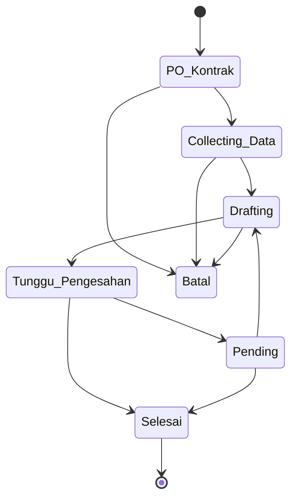

[← Daftar Isi](README.md)

---

# EP-04 — Manajemen Proyek (ClickUp-style)

> **Sumber PRD:** [Bab 6](../prd/06-manajemen-proyek.md) · **Aktor utama:** Tim Teknis (assignment), Admin
> **Dependencies:** [EP-03 SPH](03-penawaran-sph.md) (sumber proyek & Estimasi Jadwal), [EP-02](02-master-data.md) (assignee, template milestone)
> **Diturunkan ke:** [EP-05 Faktur/Termin](05-faktur-termin.md) (pemicu termin dari milestone)

---

## 1. Tujuan & Konteks

Mengelola eksekusi proyek perizinan bergaya **ClickUp**: assignee, milestone/checklist
konfigurabel, **Gantt mingguan**, komentar ber-timeline. Diakses **semua karyawan sesuai
assignment**. Milestone yang bertanda pemicu termin menyarankan pembuatan Invoice Termin.

---

## 2. Functional Requirements

| ID | Requirement | Prioritas |
| --- | --- | --- |
| FR-04.1 | Proyek memuat: nama, perusahaan, area/kawasan, tahun, **banyak layanan**, status (workflow EP-00), Nilai Kontrak, relasi SPH & Faktur Induk, **assignee(s)**. | M |
| FR-04.2 | **Milestone konfigurabel per proyek** (tambah/ubah/hapus/urut); tiap milestone: nama, assignee, target & aktual, status, **(opsional) pemicu termin**. | M |
| FR-04.3 | **Template milestone per jenis layanan** dapat dimuat saat buat proyek lalu disesuaikan. | M |
| FR-04.4 | **Gantt mingguan** per proyek (rencana vs aktual), terisi otomatis dari Estimasi Jadwal SPH ([BR-11](11-konvensi-global-nfr.md#8-daftar-aturan-bisnis-tidak-boleh-dilanggar-highlight-lintas-epic)). | M |
| FR-04.5 | **Kolaborasi**: komentar ber-timeline, **mention `@karyawan`**, lampiran file. | M |
| FR-04.6 | **Log perubahan status** otomatis (audit). | M |
| FR-04.7 | Milestone pemicu termin **selesai** → sistem **menyarankan generate Invoice Termin** di Faktur Induk terkait. | M |
| FR-04.8 | **Laporan Semester berulang**: layanan ber-tag berulang → buat pengingat/proyek Laporan Semester I & II per klien per tahun. | S |
| FR-04.9 | Status default `PO/Kontrak → Collecting Data → Drafting → Tunggu Pengesahan → Pending → Selesai` (+ Batal), dapat dikonfigurasi. | M |
| FR-04.10 | **Realisasi RAB per proyek**: catat biaya aktual (kategori Personil A / Langsung B, nilai, tanggal, catatan, opsional tautan Arus Kas) — input manual Keuangan. | S |
| FR-04.11 | **Profitabilitas proyek**: Margin Rencana (Nilai Kontrak − RAB), **Margin Aktual** (Pendapatan Diakui − Realisasi RAB), % anggaran terpakai, **kesehatan** 🟢/🟡/🔴 (ambang [EP-00](00-konfigurasi-sistem.md)). Hanya Admin/Keuangan (`view_project_cost`). | S |

---

## 3. Role / Permission Matrix

| Aksi | Admin | Keuangan | Sales | Tim Teknis | Viewer |
| --- | :-: | :-: | :-: | :-: | :-: |
| Proyek (umum) | CRUD | R | R | **CRU** (sesuai assignment) | R |
| Milestone & status | CRUD | R | R | **CRU** (assignment) | R |
| Komentar/mention/lampiran | ✓ | ✓ | ✓ | ✓ (assignment) | – |
| Realisasi RAB & biaya/margin proyek (`view_project_cost`) | CRU | CRU | – | – | – |

> Tim Teknis dapat Create/Read/Update sesuai assignment; tidak menghapus proyek.
> **Biaya/margin proyek hanya Admin & Keuangan** — Tim Teknis melihat progres/jadwal **tanpa** angka biaya.

---

## 4. User Stories + Acceptance Criteria

### US-04.1 — Proyek terbentuk dari SPH Deal
**As a** sistem/Sales, **I want** proyek terbentuk otomatis dari SPH Deal, **so that** tidak perlu
input ulang data. · **Prioritas: M**

```gherkin
Scenario: Proyek dari SPH Deal
  Given SPH berstatus "Convert - Deal" dengan Estimasi Jadwal & layanan
  When pengguna memilih "Buat Proyek"
  Then proyek memuat semua layanan, Nilai Kontrak (= Total Penawaran)
  And milestone & Gantt mingguan terisi otomatis dari Estimasi Jadwal
  And relasi ke SPH tersimpan
```

### US-04.2 — Kelola milestone konfigurabel
**As a** Tim Teknis, **I want** menyesuaikan milestone proyek, **so that** sesuai kebutuhan dokumen
spesifik. · **Prioritas: M**

```gherkin
Scenario: Muat template lalu sesuaikan
  Given proyek memakai layanan dengan template milestone (12 langkah)
  When Tim memuat template & menambah/menghapus/mengurutkan langkah
  Then milestone proyek tersimpan terpisah dari template (tidak mengubah master)

Scenario: Tandai milestone sebagai pemicu termin
  When Tim menandai milestone "Rincian Teknis selesai" sebagai pemicu termin & mengaitkan ke Faktur Induk + termin 20%
  Then saat milestone itu selesai, sistem menyarankan generate Invoice Termin 20%
```

### US-04.3 — Perbarui status & lihat Gantt rencana vs aktual
**As a** Tim Teknis, **I want** memperbarui status milestone, **so that** progres terlihat di Gantt.
· **Prioritas: M**

```gherkin
Scenario: Update aktual di Gantt
  Given Gantt memiliki rencana (sorot kuning) dari Estimasi Jadwal
  When Tim memperbarui tanggal aktual milestone
  Then Gantt menampilkan rencana vs aktual berdampingan
  And perubahan status tercatat di log (audit)
```

### US-04.4 — Kolaborasi (komentar, mention, lampiran)
**As a** anggota tim, **I want** berkomentar & mention rekan, **so that** koordinasi terdokumentasi.
· **Prioritas: M**

```gherkin
Scenario: Mention memicu notifikasi
  When pengguna menulis komentar "@Budi tolong cek draft" dengan lampiran
  Then Budi menerima notifikasi in-app + email (GC-11)
  And komentar tampil di activity feed dengan tanggal & penulis
```

### US-04.5 — Milestone pemicu termin selesai → sarankan invoice
**As a** Keuangan, **I want** disarankan membuat Invoice Termin saat milestone pemicu selesai,
**so that** penagihan tepat waktu. · **Prioritas: M**

```gherkin
Scenario: Saran generate termin
  Given milestone "Pertek Air Limbah selesai" bertanda pemicu termin 20% pada Faktur Induk FI-1
  When milestone ditandai "Selesai"
  Then sistem menyarankan generate Invoice Termin 20% pada FI-1 (lihat EP-05)
```

### US-04.7 — Catat Realisasi RAB & lihat margin aktual
**As a** Keuangan, **I want** mencatat biaya aktual per proyek, **so that** margin aktual proyek
terlihat dibanding rencana. · **Prioritas: S**

```gherkin
Scenario: Catat realisasi & hitung margin aktual
  Given proyek dengan RAB Rencana Rp 80.000.000 & Pendapatan Diakui Rp 75.000.000
  When Keuangan mencatat Realisasi RAB (Personil A + Langsung B) total Rp 60.000.000
  Then Margin Aktual = Rp 15.000.000 ditampilkan
  And % anggaran terpakai = 75% (kesehatan 🟢/🟡 sesuai ambang)

Scenario: Over budget ditandai merah
  Given Realisasi RAB Rp 85.000.000 melebihi RAB Rencana Rp 80.000.000
  Then kesehatan proyek ditandai 🔴 (over budget)

Scenario: Tim Teknis tidak melihat biaya
  Given pengguna peran "Tim Teknis" pada proyek yang ditugaskan
  When ia membuka proyek
  Then ia melihat progres & jadwal, tetapi TIDAK melihat Realisasi RAB / margin (server-side)
```

### US-04.6 — Laporan Semester berulang otomatis
**As a** Admin, **I want** pengingat Laporan Semester dibuat otomatis, **so that** kewajiban berulang
klien tidak terlewat. · **Prioritas: S**

```gherkin
Scenario: Buat pengingat berulang
  Given klien X memiliki layanan ber-tag "Laporan Semester" tahun 2026
  Then sistem membuat pengingat/proyek Laporan Semester I & II untuk klien X tahun 2026
```

---

## 5. Field Validation

| ID | Field | Tipe | Wajib | Aturan | Pesan error |
| --- | --- | --- | --- | --- | --- |
| VR-04.1 | Nama Proyek | Teks | Ya | — | "Nama proyek wajib diisi." |
| VR-04.2 | Perusahaan | Relasi | Ya | Dari EP-02 | "Perusahaan wajib dipilih." |
| VR-04.3 | Layanan | Relasi (≥1) | Ya | Dari katalog | "Tambahkan minimal satu layanan." |
| VR-04.4 | Nilai Kontrak | IDR | Ya | = Total Penawaran bila dari SPH | — |
| VR-04.5 | Assignee | Relasi karyawan | S | Karyawan aktif & tertaut akun | "Assignee harus karyawan dengan akun." |
| VR-04.6 | Milestone target/aktual | Tanggal | S | Aktual ≥ target tidak dipaksa (boleh lebih cepat/lambat) | — |
| VR-04.7 | Status proyek | Workflow | Ya | Dari daftar status EP-00 | "Status tidak valid." |
| VR-04.8 | Realisasi RAB — kategori | Pilihan | Ya | Personil (A) / Langsung (B) | "Kategori RAB wajib." |
| VR-04.9 | Realisasi RAB — nilai | IDR | Ya | > 0 | "Nilai realisasi harus > 0." |

---

## 6. State & Transition — Status Proyek (default)



| Peran sistem | Status yang memetakan | Efek |
| --- | --- | --- |
| `SELESAI` | Selesai | Menutup proyek/milestone |
| `BATAL` | Batal | Membatalkan entri terkait |

> Label & urutan dapat diubah klien via [EP-00](00-konfigurasi-sistem.md#us-002--kelola-workflow-status--pemetaan-peran-sistem); pemetaan peran sistem dipertahankan ([BR-12](11-konvensi-global-nfr.md#8-daftar-aturan-bisnis-tidak-boleh-dilanggar-highlight-lintas-epic)).

---

## 7. Edge Cases & Catatan Penting

- **Satu proyek = banyak layanan & banyak Faktur Induk**; milestone dapat dikaitkan ke layanan/Faktur Induk tertentu ([EP-05](05-faktur-termin.md)).
- **Gantt terisi dari Estimasi Jadwal** ([BR-11](11-konvensi-global-nfr.md#8-daftar-aturan-bisnis-tidak-boleh-dilanggar-highlight-lintas-epic)) — jangan minta input ulang; rencana (kuning) vs aktual.
- **Akses per assignment** — Tim Teknis hanya mengedit proyek tempat ia ditugaskan; baca penuh untuk Admin.
- **Saran generate termin** bersifat saran, bukan otomatis menagih — Keuangan tetap mengonfirmasi di [EP-05](05-faktur-termin.md).
- **Mention** hanya untuk karyawan dengan akun ([EP-01](01-autentikasi-akun.md)).
- **Durasi proyek tidak dikunci** — mengikuti jadwal yang fleksibel.
- **Audit status** wajib ([GC-10](11-konvensi-global-nfr.md#3-audit-log-gc-10)).
- **Realisasi RAB = sumber biaya aktual** untuk Margin Aktual & Laba-Rugi ([BR-15](11-konvensi-global-nfr.md#8-daftar-aturan-bisnis-tidak-boleh-dilanggar-highlight-lintas-epic)); belum ada realisasi → tampilkan Margin Rencana saja (kesehatan abu-abu).
- **Biaya/margin proyek rahasia** dari Tim Teknis/Sales/Viewer (`view_project_cost`, server-side).

---

## 8. Dependencies & Keterkaitan

- **Prasyarat:** [EP-03 SPH](03-penawaran-sph.md), [EP-02](02-master-data.md), [EP-00](00-konfigurasi-sistem.md).
- **Diandalkan oleh:** [EP-05 Faktur/Termin](05-faktur-termin.md) (pemicu milestone), [EP-09 Dasbor](09-dasbor.md) (ringkasan proyek).
