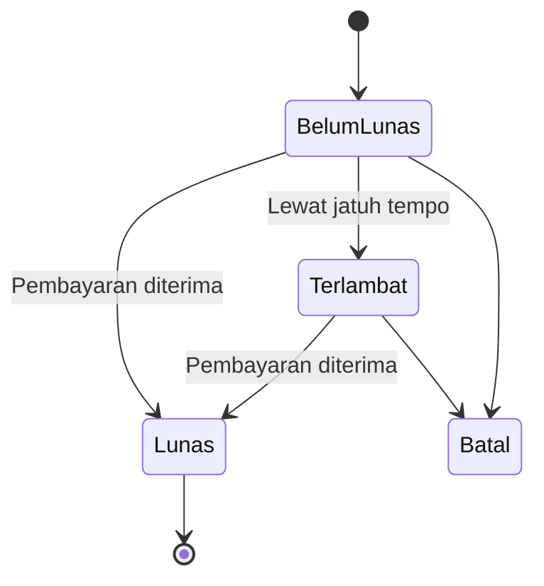

[← Daftar Isi](README.md)

---

# EP-05 — Faktur Induk & Invoice Termin

> **Sumber PRD:** [Bab 5.1](../prd/05-dokumen-bisnis.md#51-faktur-induk--invoice-termin) · **Aktor utama:** Keuangan
> **Dependencies:** [EP-00](00-konfigurasi-sistem.md) (penomoran, tarif, jatuh tempo, PKP), [EP-03](03-penawaran-sph.md)/[EP-04](04-manajemen-proyek.md) (sumber kontrak & pemicu)
> **Diturunkan ke:** [EP-07 Arus Kas](07-arus-kas.md) (entri saat Lunas), [EP-08 Tax Center](08-tax-center.md) (PPN/PPh23)

---

## 1. Tujuan & Konteks

Mengelola penagihan berhierarki **Proyek → Faktur Induk → Invoice Termin**. Satu proyek dapat
punya beberapa Faktur Induk; satu Faktur Induk berisi beberapa Invoice Termin dengan
**jumlah & persentase yang dikonfigurasi pengguna**. Tiap termin memotong termin sebelumnya
dan menghitung pajak otomatis.

---

## 2. Functional Requirements

| ID | Requirement | Prioritas |
| --- | --- | --- |
| FR-05.1 | Buat **Faktur Induk** di bawah proyek: relasi proyek/SPH, perusahaan, layanan ditagih, **Total Biaya**, skema termin (jumlah + %). | M |
| FR-05.2 | Generate **Invoice Termin** satu per satu (I → II → III/Pelunasan). | M |
| FR-05.3 | Tiap termin menampilkan **seluruh termin sebelumnya dalam induk yang sama sebagai pengurang** dari Total Biaya. | M |
| FR-05.4 | **Mesin pajak:** DPP = nilai×11/12; PPN = 12%×DPP; PPh 23 = 2%×nilai (dipotong); Total Setelah Pajak = Nilai + PPN − PPh 23 ([BR-4](11-konvensi-global-nfr.md#8-daftar-aturan-bisnis-tidak-boleh-dilanggar-highlight-lintas-epic)). | M |
| FR-05.5 | **Cegah total termin > Total Biaya** induk ([BR-8](11-konvensi-global-nfr.md#8-daftar-aturan-bisnis-tidak-boleh-dilanggar-highlight-lintas-epic)); tandai induk **Lunas** saat semua termin terbayar. | M |
| FR-05.6 | **Jatuh Tempo Pembayaran** per termin (default = tanggal + N hari dari EP-00, **dapat diedit**); dipakai piutang & status terlambat. | M |
| FR-05.7 | Pilih **rekening bank** per faktur (dari Profil, bila >1). | M |
| FR-05.8 | No Inv auto-generate (mis. `INV/002/05.2026`); **tetap saat diedit** ([BR-1](11-konvensi-global-nfr.md#8-daftar-aturan-bisnis-tidak-boleh-dilanggar-highlight-lintas-epic)). | M |
| FR-05.9 | Saat termin **Lunas** → buat **entri Arus Kas terpisah** (jasa, PPN, PPh23) di [EP-07](07-arus-kas.md) & entri pajak di [EP-08](08-tax-center.md). | M |
| FR-05.10 | **Non-PKP → PPN tidak dipungut** ([BR-5](11-konvensi-global-nfr.md#8-daftar-aturan-bisnis-tidak-boleh-dilanggar-highlight-lintas-epic)). | M |
| FR-05.11 | Aksi dokumen + "berlaku sebagai kwitansi"; edit inline dari daftar. | M |

---

## 3. Role / Permission Matrix

| Aksi | Admin | Keuangan | Sales | Tim Teknis | Viewer |
| --- | :-: | :-: | :-: | :-: | :-: |
| Faktur Induk & Invoice Termin | CRUDES | CRUDES | R | R | – |

> Hanya Admin & Keuangan yang membuat/mengubah/mengirim faktur.

---

## 4. User Stories + Acceptance Criteria

### US-05.1 — Buat Faktur Induk
**As a** Keuangan, **I want** membuat Faktur Induk di bawah proyek, **so that** penagihan terkelompok
& terkonfigurasi. · **Prioritas: M**

```gherkin
Scenario: Buat Faktur Induk dengan skema termin
  Given proyek dengan Nilai Kontrak Rp 125.000.000
  When Keuangan membuat Faktur Induk, memilih layanan, mengisi Total Biaya Rp 125.000.000,
       dan menetapkan 3 termin 40/40/20
  Then Faktur Induk tersimpan berstatus "Belum Lunas"
  And skema termin 40/40/20 tercatat
```

### US-05.2 — Generate Invoice Termin dengan pengurang
**As a** Keuangan, **I want** men-generate termin yang otomatis memotong termin sebelumnya, **so that**
nilai tagihan akurat. · **Prioritas: M**

```gherkin
Scenario: Termin III (Pelunasan) dengan pengurang
  Given Faktur Induk Total Biaya Rp 125.000.000, Termin I 40% & Termin II 40% sudah ada
  When Keuangan men-generate Termin III (Pelunasan)
  Then invoice menampilkan:
    | Total Biaya (Faktur Induk) |  125.000.000 |
    | - Termin I (40%)           |  -50.000.000 |
    | - Termin II (40%)          |  -50.000.000 |
    | Nilai Termin III           |   25.000.000 |
  And Nilai Termin Berjalan = Rp 25.000.000

Scenario: Cegah over-billing
  Given total termin sebelumnya sudah Rp 125.000.000 (= Total Biaya)
  When Keuangan mencoba menambah termin bernilai > 0
  Then sistem menolak dengan "Total termin tidak boleh melebihi Total Biaya."
```

### US-05.3 — Hitung pajak otomatis per termin
**As a** Keuangan, **I want** pajak terhitung otomatis, **so that** invoice sesuai aturan tanpa hitung
manual. · **Prioritas: M**

```gherkin
Scenario: Pajak atas termin Rp 25.000.000 (perusahaan PKP)
  Given perusahaan berstatus PKP, tarif PPN 12%, PPh 23 2%
  When Termin III bernilai Rp 25.000.000 dibuat
  Then DPP = 25.000.000 x 11/12 = 22.916.667
  And PPN = 12% x DPP = 2.750.000
  And PPh 23 = 2% x 25.000.000 = 500.000 (dipotong)
  And Total Setelah Pajak = 25.000.000 + 2.750.000 - 500.000 = 27.250.000

Scenario: Perusahaan non-PKP tidak dipungut PPN
  Given perusahaan berstatus non-PKP
  When termin dibuat
  Then PPN tidak dibuat (PPN Keluaran = 0)
  And PPh 23 tetap dihitung sesuai aturan
```

### US-05.4 — Atur jatuh tempo & rekening bank
**As a** Keuangan, **I want** menetapkan jatuh tempo & rekening tujuan, **so that** piutang terpantau
& pembayaran terarah. · **Prioritas: M**

```gherkin
Scenario: Jatuh tempo default & edit
  Given default jatuh tempo N = 14 hari (EP-00)
  When invoice dibuat tanggal 06 Jun 2026
  Then jatuh tempo default 20 Jun 2026
  And Keuangan dapat mengubah tanggal jatuh tempo

Scenario: Pilih rekening saat >1
  Given Profil memiliki 2 rekening bank
  When Keuangan membuat invoice
  Then Keuangan memilih rekening tujuan untuk ditampilkan di PDF
```

### US-05.5 — Tandai Lunas → otomasi arus kas & pajak
**As a** Keuangan, **I want** menandai termin Lunas, **so that** kas & pajak tercatat otomatis &
terpisah. · **Prioritas: M**

```gherkin
Scenario: Termin Lunas memicu entri terpisah
  Given Termin III Rp 25.000.000 (PKP) "Belum Lunas"
  When Keuangan menandai "Lunas"
  Then Arus Kas mendapat 3 entri terpisah (EP-07):
    | Pendapatan jasa (Kredit, kat. Faktur) | +25.000.000 |
    | PPN Keluaran (Kredit, kat. Pajak)     |  +2.750.000 |
    | PPh 23 dipotong (pengurang, kat. Pajak) |  -500.000 |
  And entri pajak terbentuk di Tax Center (EP-08)
  And kas diterima di bank = 27.250.000

Scenario: Semua termin lunas -> Faktur Induk Lunas
  When termin terakhir ditandai Lunas
  Then Faktur Induk berubah status menjadi "Lunas"
```

### US-05.6 — Status terlambat (piutang)
**As a** Keuangan, **I want** melihat invoice yang lewat jatuh tempo, **so that** penagihan dapat
ditindaklanjuti. · **Prioritas: S**

```gherkin
Scenario: Tandai terlambat
  Given invoice "Belum Lunas" dengan jatuh tempo kemarin
  When sistem mengevaluasi tanggal hari ini
  Then invoice ditandai "Terlambat" dan muncul di piutang terlambat (EP-09)
```

---

## 5. Field Validation

### 5.1 Faktur Induk
| ID | Field | Tipe | Wajib | Aturan | Pesan error |
| --- | --- | --- | --- | --- | --- |
| VR-05.1 | Relasi Proyek/SPH | Relasi | Ya | Sumber kontrak | "Faktur Induk harus tertaut proyek." |
| VR-05.2 | Layanan ditagih | Relasi (≥1) | Ya | Dari katalog | "Pilih minimal satu layanan." |
| VR-05.3 | Total Biaya | IDR | Ya | > 0; ≤ Nilai Kontrak (peringatan bila >) | "Total Biaya harus > 0." |
| VR-05.4 | Skema termin | % & jumlah | Ya | Σ% = 100; jumlah ≥ 1 | "Total persentase termin harus 100%." |

### 5.2 Invoice Termin
| ID | Field | Tipe | Wajib | Aturan | Pesan error |
| --- | --- | --- | --- | --- | --- |
| VR-05.5 | No Inv | Auto | Ya (sistem) | Format EP-00; unik; tetap saat edit | — |
| VR-05.6 | Tanggal | Tanggal | Ya | — | "Tanggal wajib diisi." |
| VR-05.7 | Jatuh Tempo | Tanggal | Ya | Default = tanggal + N; dapat diedit; ≥ tanggal | "Jatuh tempo tidak boleh sebelum tanggal invoice." |
| VR-05.8 | Nilai Termin Berjalan | IDR | Ya (terhitung) | Total Biaya − Σ termin sebelumnya; Σ ≤ Total Biaya | "Total termin melebihi Total Biaya." |
| VR-05.9 | Rekening bank | Relasi | Ya (bila >1) | Dari Profil | "Pilih rekening tujuan." |
| VR-05.10 | DPP/PPN/PPh23 | IDR | Ya (terhitung) | Sesuai BR-4; round half up | — |

---

## 6. State & Transition

### 6.1 Invoice Termin


### 6.2 Faktur Induk
| Dari | Ke | Pemicu |
| --- | --- | --- |
| Belum Lunas | Lunas | Semua termin Lunas |
| Belum Lunas / Lunas | Batal | Dibatalkan → entri Arus Kas & pajak terkait ikut dibatalkan ([BR-6](11-konvensi-global-nfr.md#8-daftar-aturan-bisnis-tidak-boleh-dilanggar-highlight-lintas-epic)) |

> Peran sistem `LUNAS` memicu entri Pemasukan di Arus Kas; `BATAL` membatalkan entri terkait.

---

## 7. Edge Cases & Catatan Penting

- **Pengurang lintas-termin hanya dalam induk yang sama** — jangan campur antar Faktur Induk.
- **Over-billing dilarang** ([BR-8](11-konvensi-global-nfr.md#8-daftar-aturan-bisnis-tidak-boleh-dilanggar-highlight-lintas-epic)); validasi saat generate termin.
- **PPN titipan, PPh 23 kredit** — keduanya bukan pendapatan ([BR-10](11-konvensi-global-nfr.md#8-daftar-aturan-bisnis-tidak-boleh-dilanggar-highlight-lintas-epic)); detail perlakuan kas di [EP-07](07-arus-kas.md).
- **Non-PKP** → tidak ada PPN Keluaran ([BR-5](11-konvensi-global-nfr.md#8-daftar-aturan-bisnis-tidak-boleh-dilanggar-highlight-lintas-epic)).
- **Pembulatan round half up** untuk DPP & pajak ([GC-8](11-konvensi-global-nfr.md#1-konvensi-format--input-global)).
- **No Inv tetap saat edit**, reset bulanan, counter terpisah dari SPH ([BR-1, BR-2](11-konvensi-global-nfr.md#8-daftar-aturan-bisnis-tidak-boleh-dilanggar-highlight-lintas-epic)).
- **Pembatalan faktur** → entri otomatis Arus Kas & pajak ikut dibatalkan ([BR-6](11-konvensi-global-nfr.md#8-daftar-aturan-bisnis-tidak-boleh-dilanggar-highlight-lintas-epic)).
- **Jatuh tempo dapat diedit** namun default mengikuti N hari dari [EP-00](00-konfigurasi-sistem.md).

---

## 8. Dependencies & Keterkaitan

- **Prasyarat:** [EP-00](00-konfigurasi-sistem.md), [EP-02](02-master-data.md) (PKP, rekening), [EP-03](03-penawaran-sph.md)/[EP-04](04-manajemen-proyek.md).
- **Diandalkan oleh:** [EP-07 Arus Kas](07-arus-kas.md), [EP-08 Tax Center](08-tax-center.md), [EP-09 Dasbor](09-dasbor.md) (piutang).
- **Memakai:** [EP-10 Aksi Dokumen](10-pengiriman-dokumen.md).
