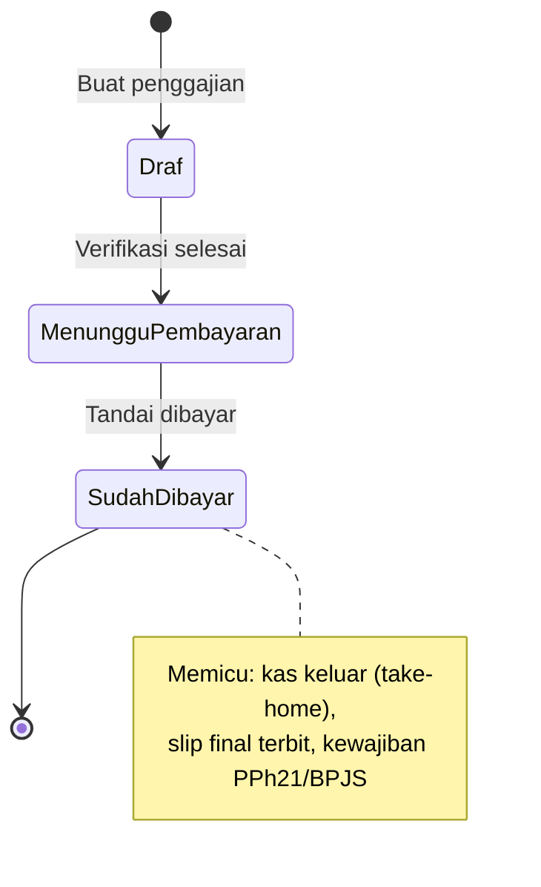

[← Daftar Isi](README.md)

---

# EP-06 — Penggajian / Slip Gaji

> **Sumber PRD:** [Bab 5.2](../prd/05-dokumen-bisnis.md#52-penggajian-payroll--slip-gaji) · **Aktor utama:** Keuangan; **Karyawan** (slip sendiri)
> **Dependencies:** [EP-02 Data Karyawan](02-master-data.md), [EP-00](00-konfigurasi-sistem.md) (komponen gaji, pengali, template slip), [EP-01](01-autentikasi-akun.md) (akun↔karyawan)
> **Diturunkan ke:** [EP-07 Arus Kas](07-arus-kas.md) (gaji bersih saat Dibayar), [EP-08 Tax Center](08-tax-center.md) (PPh21/BPJS)

---

## 1. Tujuan & Konteks

Membuat **slip gaji** per periode mengikuti format nyata, menghitung **kotor & bersih
(take-home)**, dengan **PPh 21 input manual**. Slip bersifat **rahasia**; final & dikirim hanya
setelah status **Sudah Dibayar**.

---

## 2. Functional Requirements

| ID | Requirement | Prioritas |
| --- | --- | --- |
| FR-06.1 | Buat penggajian per **periode rentang tanggal kustom** (mis. 24 Mar–24 Apr); pilih karyawan/batch. | M |
| FR-06.2 | Sistem menarik **gaji pokok, pengali status, tunjangan default** dari [EP-02](02-master-data.md)/[EP-00](00-konfigurasi-sistem.md). | M |
| FR-06.3 | Hitung **Penggajian Kotor** = gaji pokok efektif (×pengali) + tunjangan + lembur (+bonus). | M |
| FR-06.4 | **PPh 21 input manual**, **boleh 0 & tetap valid** ([BR-3](11-konvensi-global-nfr.md#8-daftar-aturan-bisnis-tidak-boleh-dilanggar-highlight-lintas-epic)); potongan lain (mis. BPJS) sesuai komponen. | M |
| FR-06.5 | **Penggajian Bersih** = Kotor − PPh 21 − potongan lain. | M |
| FR-06.6 | **Draf & pratinjau sebelum bayar** (verifikasi Keuangan). | M |
| FR-06.7 | Saat **Sudah Dibayar** → entri Arus Kas (Debit) = **gaji bersih/take-home** kategori Penggajian ([EP-07](07-arus-kas.md)); terbitkan slip final. | M |
| FR-06.8 | **PPh 21 & BPJS dipotong** menjadi kewajiban di [EP-08](08-tax-center.md) (disetor terpisah). | M |
| FR-06.9 | **Slip rahasia** — hanya karyawan ybs + Keuangan/Admin ([BR-9](11-konvensi-global-nfr.md#8-daftar-aturan-bisnis-tidak-boleh-dilanggar-highlight-lintas-epic)); pengiriman hanya ke karyawan bersangkutan. | M |
| FR-06.10 | Aksi dokumen ([EP-10](10-pengiriman-dokumen.md)); kirim WA/Email ke karyawan setelah final. | M |

---

## 3. Role / Permission Matrix

| Aksi | Admin | Keuangan | Sales | Tim Teknis | Viewer |
| --- | :-: | :-: | :-: | :-: | :-: |
| Penggajian (penuh) | CRUDES | CRUDES | – | – | – |
| Slip **milik sendiri** (lihat/unduh) | ✓ | ✓ | ✓ | ✓ | ✓ (bila punya data karyawan) |

> **Slip sendiri** dapat diakses **setiap karyawan apa pun perannya**; akses penuh penggajian hanya Keuangan/Admin ([GC-12](11-konvensi-global-nfr.md#5-keamanan--rbac-gc-12)).

---

## 4. User Stories + Acceptance Criteria

### US-06.1 — Buat penggajian periode & tarik komponen
**As a** Keuangan, **I want** membuat penggajian per periode & menarik komponen otomatis, **so that**
perhitungan cepat & konsisten. · **Prioritas: M**

```gherkin
Scenario: Tarik komponen karyawan
  Given karyawan "Andi" status Probation (pengali 0,8), gaji pokok Rp 2.800.000, tunjangan BPJS Kesehatan
  When Keuangan membuat penggajian periode 24 Mar - 24 Apr untuk Andi
  Then sistem menghitung gaji pokok efektif = 2.800.000 x 0,8 = 2.240.000
  And menambahkan tunjangan default
```

### US-06.2 — Hitung kotor & bersih dengan PPh 21 manual
**As a** Keuangan, **I want** menginput PPh 21 manual (boleh 0), **so that** sesuai kondisi pajak tiap
karyawan. · **Prioritas: M**

```gherkin
Scenario: PPh 21 = 0 tetap valid
  Given gaji Andi di bawah PTKP
  When Keuangan mengisi PPh 21 = 0
  Then slip tetap valid dan dapat diproses
  And Penggajian Bersih = Kotor - 0 - potongan lain

Scenario: Hitung bersih dengan potongan
  Given Kotor = Rp 3.000.000, PPh 21 = Rp 50.000, BPJS porsi karyawan = Rp 30.000
  When perhitungan dijalankan
  Then Penggajian Bersih (take-home) = 3.000.000 - 50.000 - 30.000 = 2.920.000
```

### US-06.3 — Draf & pratinjau sebelum bayar
**As a** Keuangan, **I want** memverifikasi draf slip sebelum membayar, **so that** kesalahan
tertangkap lebih dulu. · **Prioritas: M**

```gherkin
Scenario: Pratinjau draf
  Given penggajian dibuat berstatus "Menunggu Pembayaran"
  When Keuangan membuka pratinjau slip
  Then slip dapat ditinjau tanpa diterbitkan final & tanpa entri Arus Kas
```

### US-06.4 — Tandai Sudah Dibayar → arus kas & terbit slip
**As a** Keuangan, **I want** menandai dibayar, **so that** kas tercatat & slip resmi terbit. · **Prioritas: M**

```gherkin
Scenario: Dibayar memicu kas & slip final
  Given slip Andi take-home Rp 2.920.000 "Menunggu Pembayaran"
  When Keuangan menandai "Sudah Dibayar"
  Then Arus Kas mendapat Pengeluaran (Debit) Rp 2.920.000 kategori Penggajian (EP-07)
  And slip final diterbitkan & dapat dikirim ke karyawan
  And PPh 21 & BPJS yang dipotong menjadi kewajiban di Tax Center (EP-08)
```

### US-06.5 — Karyawan melihat slip sendiri (rahasia)
**As a** karyawan, **I want** melihat & mengunduh slip saya sendiri, **so that** saya punya bukti
penggajian. · **Prioritas: M**

```gherkin
Scenario: Akses slip sendiri
  Given karyawan tertaut akun (EP-01)
  When ia membuka "Slip Saya"
  Then ia hanya melihat slip miliknya (bukan rekan kerja)

Scenario: Cegah akses slip orang lain
  When karyawan mencoba mengakses slip karyawan lain (mis. via URL/ID)
  Then server menolak (403) - slip rahasia
```

### US-06.6 — Kirim slip ke karyawan setelah final
**As a** Keuangan, **I want** mengirim slip final ke karyawan, **so that** karyawan menerima bukti.
· **Prioritas: M**

```gherkin
Scenario: Kirim hanya setelah Dibayar & hanya ke ybs
  Given slip berstatus "Sudah Dibayar"
  When Keuangan mengirim via Email/WhatsApp (EP-10)
  Then tujuan pengiriman hanya karyawan bersangkutan (email/HP karyawan)

Scenario: Cegah kirim slip draf
  Given slip masih "Menunggu Pembayaran"
  When Keuangan mencoba mengirim ke karyawan
  Then sistem mencegah (slip final hanya setelah Dibayar)
```

---

## 5. Field Validation

| ID | Field | Tipe | Wajib | Aturan | Pesan error |
| --- | --- | --- | --- | --- | --- |
| VR-06.1 | Karyawan | Relasi | Ya | Dari EP-02, aktif | "Pilih karyawan." |
| VR-06.2 | Periode | Rentang tanggal | Ya | Mulai ≤ selesai | "Periode tidak valid." |
| VR-06.3 | Gaji pokok efektif | IDR | Ya (terhitung) | = pokok × pengali | — |
| VR-06.4 | Lembur/Tunjangan/Bonus | IDR | Tidak | ≥ 0 | "Nilai harus ≥ 0." |
| VR-06.5 | PPh 21 | IDR | Ya | **≥ 0 (0 valid)** | "PPh 21 harus angka ≥ 0." |
| VR-06.6 | Potongan lain (BPJS) | IDR | Tidak | ≥ 0 | "Nilai harus ≥ 0." |
| VR-06.7 | Penggajian Bersih | IDR | Ya (terhitung) | = Kotor − PPh21 − potongan; ≥ 0 | "Penggajian bersih tidak boleh negatif." |
| VR-06.8 | Status | Pilihan | Ya | Menunggu Pembayaran / Sudah Dibayar | — |

---

## 6. State & Transition — Status Slip



| Dari | Ke | Pemicu | Efek |
| --- | --- | --- | --- |
| Draf/Menunggu | Sudah Dibayar | Tandai dibayar | Peran sistem `DIBAYAR` → kas keluar (take-home); slip final; kewajiban pajak |

> Pengiriman & penerbitan final **hanya** setelah Sudah Dibayar ([BR-9](11-konvensi-global-nfr.md#8-daftar-aturan-bisnis-tidak-boleh-dilanggar-highlight-lintas-epic)).

---

## 7. Edge Cases & Catatan Penting

- **PPh 21 = 0 valid** ([BR-3](11-konvensi-global-nfr.md#8-daftar-aturan-bisnis-tidak-boleh-dilanggar-highlight-lintas-epic)) — jangan paksa > 0.
- **Kas keluar = take-home saja**; PPh 21 & BPJS **belum** keluar saat bayar gaji — keluar saat disetor di [EP-08](08-tax-center.md) ([BR-10](11-konvensi-global-nfr.md#8-daftar-aturan-bisnis-tidak-boleh-dilanggar-highlight-lintas-epic)), menghindari pencatatan ganda.
- **Bonus** dapat dipisah ke kategori Bonus untuk pelacakan ([EP-07](07-arus-kas.md)).
- **Kerahasiaan ketat** — akses slip orang lain ditolak server-side ([BR-9](11-konvensi-global-nfr.md#8-daftar-aturan-bisnis-tidak-boleh-dilanggar-highlight-lintas-epic)).
- **Slip final hanya setelah Dibayar** — draf tidak boleh dikirim sebagai bukti.
- **Periode kustom** — bukan selalu bulan kalender (mis. 24–24).

---

## 8. Dependencies & Keterkaitan

- **Prasyarat:** [EP-02](02-master-data.md), [EP-00](00-konfigurasi-sistem.md), [EP-01](01-autentikasi-akun.md).
- **Diandalkan oleh:** [EP-07 Arus Kas](07-arus-kas.md) (take-home), [EP-08 Tax Center](08-tax-center.md) (PPh21/BPJS).
- **Memakai:** [EP-10 Aksi Dokumen](10-pengiriman-dokumen.md).
