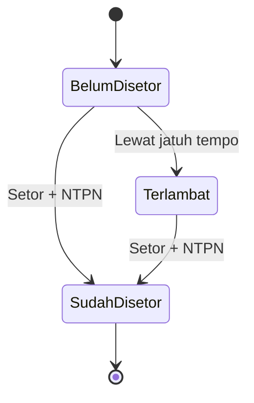

[← Daftar Isi](README.md)

---

# EP-08 — Perpajakan (Tax Center)

> **Sumber PRD:** [Bab 10](../prd/10-penanganan-pajak.md) · **Aktor utama:** Keuangan, Admin
> **Dependencies:** [EP-00](00-konfigurasi-sistem.md) (tarif, jatuh tempo, PKP), [EP-05 Faktur](05-faktur-termin.md), [EP-06 Penggajian](06-penggajian.md)
> **Diturunkan ke:** [EP-07 Arus Kas](07-arus-kas.md) (kas keluar saat setor), [EP-09 Dasbor](09-dasbor.md)

---

## 1. Tujuan & Konteks

Pusat untuk **melacak, memantau beban, dan menandai status setor** seluruh pajak & iuran dari
dokumen keuangan, dengan **tautan ke dokumen sumber**, pengingat jatuh tempo, rekonsiliasi, dan
ekspor SPT. **Akses hanya Admin & Keuangan.**

---

## 2. Functional Requirements

| ID | Requirement | Prioritas |
| --- | --- | --- |
| FR-08.1 | Entri pajak **dibuat otomatis** dari dokumen: PPN Keluaran & PPh 23 (dari Invoice), PPh 21 & BPJS (dari Penggajian). | M |
| FR-08.2 | Tiap entri: jenis, **Masa Pajak**, nilai, **dokumen sumber (tautan)**, jatuh tempo, **status setor** (Belum/Sudah), tanggal setor, **NTPN** + lampiran, catatan. | M |
| FR-08.3 | **PPh 23**: rekam **Bukti Potong dari klien** (diterima? + lampiran) — syarat klaim kredit. | M |
| FR-08.4 | Penanda status: 🟡 Belum Disetor · 🔴 Terlambat · 🟢 Sudah Disetor. | M |
| FR-08.5 | Tandai **Sudah Disetor** → buat **entri Arus Kas Pengeluaran** (kat. Pajak/BPJS) + simpan NTPN; **PPh 23 (kredit) tidak memicu kas keluar**. | M |
| FR-08.6 | **PPN Masukan (kredit)**: catat pembelian ber-PPN; PPN kurang/lebih bayar = PPN Keluaran − PPN Masukan. | S |
| FR-08.7 | **Monitoring**: kewajiban belum disetor per jenis/masa, kredit PPh 23 terkumpul, jatuh tempo terdekat/terlambat, **pengingat H-3 (in-app + email)**. | M |
| FR-08.8 | **Panel Rekonsiliasi** per masa (PPN, PPh 23 vs bukti potong, PPh 21/BPJS). | S |
| FR-08.9 | **Ekspor SPT** siap-impor (CSV/Excel) untuk SPT Masa PPN/PPh21/PPh23 & SPT Tahunan. | S |
| FR-08.10 | **Non-PKP** → PPN Keluaran tidak dibuat ([BR-5](11-konvensi-global-nfr.md#8-daftar-aturan-bisnis-tidak-boleh-dilanggar-highlight-lintas-epic)). | M |
| FR-08.11 | **Estimasi PPh Badan** untuk Laba Bersih Dasbor: metode konfigurabel — Final 0,5% omzet **atau** 22% atas laba (PPh 23 dikreditkan pada metode 22%); selalu berlabel *estimasi*; peringatan saat omzet mendekati ambang Rp 4,8 M. Konfigurasi di [EP-00](00-konfigurasi-sistem.md). | S |

---

## 3. Role / Permission Matrix

| Aksi | Admin | Keuangan | Sales | Tim Teknis | Viewer |
| --- | :-: | :-: | :-: | :-: | :-: |
| Tax Center | CRUDE | CRUDES | – | – | – |

> Hanya Admin & Keuangan ([PRD 10.6](../prd/10-penanganan-pajak.md#106-modul-perpajakan-tax-center)).

---

## 4. User Stories + Acceptance Criteria

### US-08.1 — Entri pajak otomatis dari dokumen
**As the** sistem, **I want** membuat entri pajak otomatis, **so that** kewajiban terlacak tanpa input
ganda. · **Prioritas: M**

```gherkin
Scenario: Dari Invoice Lunas
  Given Invoice Termin (PKP) ditandai Lunas (EP-05)
  Then Tax Center membuat entri "PPN Keluaran" (kewajiban) & "PPh 23 dipotong" (kredit pajak)
  And masing-masing tertaut ke No Invoice & perusahaan

Scenario: Dari Penggajian Dibayar
  Given penggajian "Sudah Dibayar" dengan PPh 21 > 0 & BPJS (EP-06)
  Then Tax Center membuat entri "PPh 21" & "BPJS" (kewajiban) tertaut penggajian + karyawan

Scenario: PPh 21 = 0 tidak membuat kewajiban PPh 21
  Given penggajian dengan PPh 21 = 0
  Then tidak ada entri kewajiban PPh 21 yang dibuat (BPJS tetap bila ada)
```

### US-08.2 — Tandai Sudah Disetor → kas keluar + NTPN
**As a** Keuangan, **I want** menandai pajak disetor dengan NTPN, **so that** kas & bukti tercatat.
· **Prioritas: M**

```gherkin
Scenario: Setor PPN
  Given entri PPN Keluaran "Belum Disetor"
  When Keuangan menandai "Sudah Disetor", mengisi tanggal setor & NTPN + lampiran
  Then status menjadi 🟢 Sudah Disetor
  And Arus Kas membuat Pengeluaran kategori Pajak (EP-07)

Scenario: PPh 23 tidak memicu kas keluar
  Given entri PPh 23 (kredit pajak)
  When status dikelola sebagai kredit
  Then tidak ada entri kas keluar (dipakai sebagai kredit di SPT Tahunan)
```

### US-08.3 — Pengingat jatuh tempo & status terlambat
**As a** Keuangan, **I want** diingatkan sebelum jatuh tempo, **so that** terhindar dari denda.
· **Prioritas: M**

```gherkin
Scenario: Pengingat H-3
  Given entri pajak dengan jatuh tempo 3 hari lagi
  Then sistem mengirim pengingat in-app + email (GC-11)

Scenario: Tandai terlambat
  Given entri "Belum Disetor" melewati jatuh tempo
  Then entri ditandai 🔴 Terlambat & muncul di ringkasan pajak Dasbor (EP-09)
```

### US-08.4 — Bukti potong PPh 23
**As a** Keuangan, **I want** mencatat penerimaan bukti potong, **so that** kredit pajak dapat diklaim.
· **Prioritas: S**

```gherkin
Scenario: Rekam bukti potong
  Given entri PPh 23 dari Invoice tertentu
  When Keuangan menandai "Bukti Potong diterima" + melampirkan dokumen
  Then entri siap dipakai sebagai kredit; rekonsiliasi PPh 23 (dipotong vs bukti diterima) terupdate
```

### US-08.5 — Rekonsiliasi & ekspor SPT
**As a** Keuangan, **I want** rekap & ekspor siap-impor, **so that** pelaporan SPT efisien. · **Prioritas: S**

```gherkin
Scenario: PPN kurang/lebih bayar
  Given PPN Keluaran & PPN Masukan satu masa tercatat
  Then panel rekonsiliasi menampilkan PPN yang harus disetor = Keluaran - Masukan

Scenario: Ekspor SPT Masa
  When Keuangan mengekspor SPT Masa PPN suatu masa
  Then dihasilkan file CSV/Excel format siap-impor (Coretax/DJP Online)
```

---

## 5. Field Validation

| ID | Field | Tipe | Wajib | Aturan | Pesan error |
| --- | --- | --- | --- | --- | --- |
| VR-08.1 | Jenis pajak | Pilihan | Ya (sistem) | PPN/PPh23/PPh21/BPJS | — |
| VR-08.2 | Masa Pajak | Periode | Ya | Bulan/tahun | "Masa pajak wajib." |
| VR-08.3 | Nilai | IDR | Ya | ≥ 0 (dari sumber) | — |
| VR-08.4 | Dokumen sumber | Relasi | Ya | Tautan ke Invoice/Penggajian | — |
| VR-08.5 | Jatuh Tempo | Tanggal | Ya | Default dari EP-00, dapat dikonfigurasi | — |
| VR-08.6 | Status setor | Pilihan | Ya | Belum/Sudah | — |
| VR-08.7 | NTPN | Teks | Ya (saat Sudah Disetor) | + lampiran bukti | "NTPN wajib saat menandai disetor." |
| VR-08.8 | Bukti Potong (PPh 23) | Boolean + lampiran | S | Untuk klaim kredit | — |

---

## 6. State & Transition — Status Setor



| Jenis | Saat "Sudah Disetor" |
| --- | --- |
| PPN Keluaran | Pengeluaran kas kat. **Pajak** |
| PPh 21 | Pengeluaran kas kat. **Pajak** |
| BPJS | Pengeluaran kas kat. **BPJS** |
| **PPh 23 (kredit)** | **Tidak ada kas keluar**; kredit di SPT Tahunan |

### Jatuh tempo default (dapat dikonfigurasi, [EP-00](00-konfigurasi-sistem.md))
- **PPh 21 & PPh 23:** setor ≤ tgl 10, lapor ≤ tgl 20 bulan berikutnya.
- **PPN:** setor & lapor akhir bulan berikutnya.
- **BPJS:** iuran ≤ tgl 10 bulan berikutnya.

---

## 7. Edge Cases & Catatan Penting

- **PPN titipan vs PPh 23 kredit** — perlakuan kas berbeda ([BR-10](11-konvensi-global-nfr.md#8-daftar-aturan-bisnis-tidak-boleh-dilanggar-highlight-lintas-epic)); PPh 23 **tidak** memicu kas keluar.
- **Non-PKP** → tak ada PPN Keluaran ([BR-5](11-konvensi-global-nfr.md#8-daftar-aturan-bisnis-tidak-boleh-dilanggar-highlight-lintas-epic)).
- **PPh 21 = 0** → tidak membuat kewajiban PPh 21 ([BR-3](11-konvensi-global-nfr.md#8-daftar-aturan-bisnis-tidak-boleh-dilanggar-highlight-lintas-epic)).
- **NTPN wajib** saat menandai disetor; lampiran bukti penting untuk audit.
- **BPJS porsi perusahaan** juga kas keluar saat penyetoran ([EP-06](06-penggajian.md)).
- **Pengingat H-3** harus aktif untuk semua jenis ([GC-11](11-konvensi-global-nfr.md#4-notifikasi--pengingat-gc-11)).
- **Akses ketat** Admin & Keuangan saja.

---

## 8. Dependencies & Keterkaitan

- **Prasyarat:** [EP-00](00-konfigurasi-sistem.md), [EP-05 Faktur](05-faktur-termin.md), [EP-06 Penggajian](06-penggajian.md).
- **Diandalkan oleh:** [EP-07 Arus Kas](07-arus-kas.md) (kas keluar saat setor), [EP-09 Dasbor](09-dasbor.md) (ringkasan pajak).
