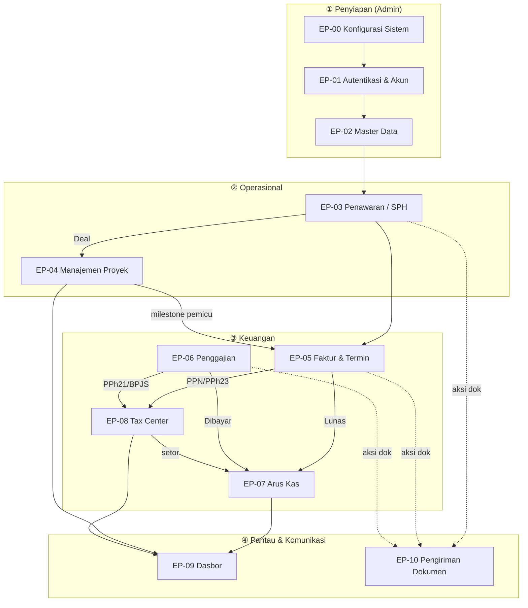

# User Stories — Sistem ERP Internal PT Sinar Buana Mandiri Jaya (SBMJ)

> Dokumen ini menerjemahkan [PRD](../prd/README.md) menjadi **user stories berstandar industri**
> untuk dipakai bersama oleh **Designer (UX/UI)**, **Developer**, dan **QA**.
> Setiap epic memuat: Functional Requirements, User Stories + Acceptance Criteria (Gherkin),
> Role/Permission Matrix, Field Validation, State & Transition, Edge Cases, dan Dependencies.

| | |
| --- | --- |
| **Produk** | Sistem ERP Internal berbasis web (Bahasa Indonesia) |
| **Sumber** | [PRD v1.0](../prd/prd.md) (Bab 0–14) |
| **Format AC** | Gherkin (Given / When / Then) |
| **Mata uang** | IDR, format `Rp 1.000.000` (tanpa desimal) |
| **Status** | Draft untuk review tim |

---

## 1. Cara Membaca Dokumen Ini

- **Epic** = satu modul/area fungsional. Tiap epic = satu file bernomor.
- **Urutan file = urutan alur sistem** dari penyiapan (konfigurasi) → operasional harian.
- Tiap epic punya struktur identik (lihat [§4 Template](#4-struktur-tiap-epic)).

### Konvensi ID (telusur antara requirement → story → test)
| Prefix | Arti | Contoh |
| --- | --- | --- |
| `EP-NN` | Epic | `EP-01` (Autentikasi) |
| `FR-NN.x` | Functional Requirement | `FR-01.3` |
| `US-NN.x` | User Story | `US-01.2` |
| `AC` (Scenario) | Acceptance Criteria di bawah tiap story | `Scenario: Kredensial salah` |
| `VR-NN.x` | Validation Rule | `VR-02.1` |

> **NN** = nomor epic (00–11). **x** = urut dalam epic. QA memetakan tiap `Scenario` → test case;
> Developer memetakan tiap `FR`/`US` → implementasi; Designer memetakan tiap `US` → layar/flow.

### Legenda RBAC
**C**reate · **R**ead · **U**pdate · **D**elete · **E**xport · **S**end · `–` tidak ada akses

### Prioritas (MoSCoW)
**M** = Must have · **S** = Should have · **C** = Could have · **W** = Won't (out of scope rilis ini)

---

## 2. Peta Alur Global Sistem

Sistem dipakai secara berurutan: **siapkan → transaksi → keuangan → pantau**.



### Urutan onboarding (jawaban atas "mulai dari mana")
1. **Konfigurasi** ([EP-00](00-konfigurasi-sistem.md)) — Admin menyiapkan tarif pajak, format penomoran, workflow status, kategori, template, akun email/SMTP.
2. **Akun & Sign-up** ([EP-01](01-autentikasi-akun.md)) — Admin membuat akun → undangan email → pengguna set sandi → login.
3. **Master Data** ([EP-02](02-master-data.md)) — input Perusahaan+PIC, Katalog Layanan, Karyawan, Profil Perusahaan.
4. **Operasional & keuangan** — Penawaran → Proyek → Faktur/Termin → Penggajian → Arus Kas → Tax Center → Dasbor.

### Diagram Sekuens End-to-End: SPH → Kas Diterima

Alur lengkap satu siklus pendapatan, dari penawaran hingga kas & pajak tercatat. Menunjukkan
**siapa melakukan apa**, **kapan otomasi berjalan**, dan **entri terpisah** yang dihasilkan.

```mermaid
sequenceDiagram
    autonumber
    actor Sales
    actor Klien
    actor Tim as Tim Teknis
    actor Keu as Keuangan
    participant SPH as EP-03 SPH
    participant PRJ as EP-04 Proyek
    participant FI as EP-05 Faktur/Termin
    participant KAS as EP-07 Arus Kas
    participant TAX as EP-08 Tax Center

    Sales->>SPH: Buat SPH (layanan, termin usulan, Estimasi Jadwal, RAB)
    SPH-->>Sales: No SPH auto (SPH/001/5.2026), Terbilang
    Sales->>Klien: Kirim SPH (Email otomatis / WA)  [EP-10]
    Note over SPH: Status: Draft -> Leads-Terkirim
    Klien-->>Sales: Setuju (Deal)
    Sales->>SPH: Status -> Convert-Deal
    SPH->>PRJ: Buat Proyek (Estimasi Jadwal -> milestone & Gantt, Nilai Kontrak)
    SPH->>FI: Buat Faktur Induk (Total Biaya, skema termin)

    Tim->>PRJ: Kerjakan milestone; tandai "Pertek selesai" (pemicu termin)
    PRJ-->>Keu: Saran generate Invoice Termin 20%
    Keu->>FI: Generate Invoice Termin (kurangi termin sebelumnya)
    Note over FI: DPP=nilai x 11/12; PPN=12% x DPP; PPh23=2% x nilai
    Keu->>Klien: Kirim Invoice (Email/WA)  [EP-10]
    Klien-->>Keu: Bayar
    Keu->>FI: Tandai Termin "Lunas"

    FI->>KAS: (1) Pendapatan jasa  (Kredit, kat. Faktur)
    FI->>KAS: (2) PPN Keluaran     (Kredit, kat. Pajak, titipan)
    FI->>KAS: (3) PPh 23 dipotong  (pengurang, kat. Pajak, kredit)
    FI->>TAX: Entri PPN Keluaran (kewajiban) + PPh 23 (kredit)
    Note over KAS: Kas diterima di bank = Nilai + PPN - PPh23

    Keu->>TAX: Setor PPN (isi NTPN + lampiran) -> "Sudah Disetor"
    TAX->>KAS: Pengeluaran (Debit) kat. Pajak  (PPh 23 TIDAK keluar kas)
    Note over FI: Saat semua termin Lunas -> Faktur Induk "Lunas"
```

> **Catatan baca:** PPN masuk sebagai Kredit saat Lunas (titipan), lalu keluar sebagai Debit saat
> **disetor** — bukan dobel ([BR-10](11-konvensi-global-nfr.md#8-daftar-aturan-bisnis-tidak-boleh-dilanggar-highlight-lintas-epic)). PPh 23 tidak pernah memicu kas keluar (jadi kredit pajak).
> Alur penggajian paralel: Penggajian **Dibayar** → kas keluar take-home ([EP-06](06-penggajian.md) → [EP-07](07-arus-kas.md)); PPh 21/BPJS disetor terpisah via [EP-08](08-tax-center.md).

---

## 3. Daftar Epic

| # | Epic | File | Sumber PRD | Aktor utama |
| --- | --- | --- | --- | --- |
| EP-00 | Konfigurasi Sistem & Master Data Terkelola | [00-konfigurasi-sistem.md](00-konfigurasi-sistem.md) | Bab 9 | Admin |
| EP-01 | Autentikasi & Manajemen Akun | [01-autentikasi-akun.md](01-autentikasi-akun.md) | Bab 2 | Admin, semua pengguna |
| EP-02 | Master Data | [02-master-data.md](02-master-data.md) | Bab 3 | Admin, Sales, Keuangan |
| EP-03 | Penawaran (Quotation / SPH) | [03-penawaran-sph.md](03-penawaran-sph.md) | Bab 4 | Sales/Marketing |
| EP-04 | Manajemen Proyek | [04-manajemen-proyek.md](04-manajemen-proyek.md) | Bab 6 | Tim Teknis, Admin |
| EP-05 | Faktur Induk & Invoice Termin | [05-faktur-termin.md](05-faktur-termin.md) | Bab 5.1 | Keuangan |
| EP-06 | Penggajian / Slip Gaji | [06-penggajian.md](06-penggajian.md) | Bab 5.2 | Keuangan, Karyawan |
| EP-07 | Arus Kas (Cashflow) | [07-arus-kas.md](07-arus-kas.md) | Bab 7 | Keuangan |
| EP-08 | Perpajakan (Tax Center) | [08-tax-center.md](08-tax-center.md) | Bab 10 | Keuangan, Admin |
| EP-09 | Dasbor (Dashboard) | [09-dasbor.md](09-dasbor.md) | Bab 8 | Semua peran (terbatas) |
| EP-10 | Pengiriman & Aksi Dokumen | [10-pengiriman-dokumen.md](10-pengiriman-dokumen.md) | Bab 11 | Sales, Keuangan |
| — | Konvensi Global & Non-Functional | [11-konvensi-global-nfr.md](11-konvensi-global-nfr.md) | Bab 13, 14 | Semua (acuan) |

---

## 4. Struktur Tiap Epic

Setiap file epic mengikuti struktur:

1. **Tujuan & Konteks** — ringkas + aktor + dependencies.
2. **Functional Requirements** (`FR-NN.x`) — pernyataan dapat-ditest.
3. **Role / Permission Matrix** — fokus aksi epic ini.
4. **User Stories + Acceptance Criteria** — `US-NN.x` + Gherkin (termasuk skenario gagal/edge).
5. **Field Validation** — tabel field · tipe · wajib · aturan (`VR-NN.x`) · pesan error.
6. **State & Transition** — bila ada workflow.
7. **Edge Cases & Catatan Penting** — detail krusial yang ditekankan.
8. **Dependencies & Keterkaitan** — epic prasyarat & turunan.

---

## 5. Role / Permission Matrix — Global (RBAC)

Acuan tunggal; tiap epic memuat irisan yang relevan. Sumber: [PRD Bab 2.2](../prd/02-peran-rbac.md#22-matriks-hak-akses-ringkas).

| Modul / Area | Admin/Owner | Keuangan | Sales/Marketing | Tim Teknis | Viewer |
| --- | :-: | :-: | :-: | :-: | :-: |
| Konfigurasi Sistem | CRUD | – | – | – | – |
| Akun Pengguna | CRUD | – | – | – | – |
| Perusahaan & PIC | CRUDE | R | CRUE | R | R |
| Katalog Layanan | CRUD | R | CRU | R | R |
| Data Karyawan | CRUD | R | – | R | – |
| Profil Perusahaan | CRUD | R | – | – | R |
| Penawaran (SPH) | CRUDES | R | CRUES | R | R |
| Manajemen Proyek | CRUD | R | R | **CRU** (assignment) | R |
| Faktur (Induk & Termin) | CRUDES | CRUDES | R | R | – |
| Penggajian / Slip | CRUDES | CRUDES | *slip sendiri* | *slip sendiri* | – |
| Arus Kas | CRUDE | CRUDE | – | – | R |
| Perpajakan (Tax Center) | CRUDE | CRUDES | – | – | – |
| Dasbor | R | R | R (terbatas) | R (proyek) | R |
| Dasbor — laba/biaya/proyeksi/pajak rinci | ✓ | ✓ | ✗ | ✗ | ✗ |

> **Catatan keamanan kunci:**
> - **Dasbor profitabilitas** (`view_profit`, `view_project_cost`, `view_forecast`, `view_tax_detail`) hanya Admin & Keuangan; panel tanpa izin **tidak dirender** (server-side). Lihat [EP-09](09-dasbor.md#3-role--permission-matrix).
> - **Slip gaji rahasia** — setiap karyawan (apa pun perannya) hanya dapat melihat/unduh **slip miliknya sendiri**; akses penuh penggajian hanya Keuangan/Admin.
> - Modul Proyek dapat diakses **semua karyawan sesuai assignment**.
> - RBAC ditegakkan **di server**, bukan hanya menyembunyikan menu di UI.

---

## 6. Aktor / Persona

| Peran | Deskripsi | Tujuan utama |
| --- | --- | --- |
| **Admin / Owner** | Akses penuh + konfigurasi. | Menyiapkan sistem, mengelola akun, melihat seluruh data. |
| **Keuangan** | Faktur, Penggajian, Arus Kas, Pajak, Dasbor keuangan. | Menagih, menggaji, mencatat kas, mengelola pajak. |
| **Marketing / Sales** | Perusahaan, Katalog, Penawaran. | Membuat SPH & mengonversi jadi Deal. |
| **Tim Teknis** | Proyek sesuai assignment (Ketua Tim, Anggota, Document Controller). | Mengeksekusi proyek & memperbarui milestone. |
| **Viewer** | Read-only modul yang diizinkan. | Memantau tanpa mengubah. |
| **Karyawan (lintas peran)** | Pemegang akun yang tertaut Data Karyawan. | Melihat slip gaji sendiri, menjadi assignee proyek. |

---

*Catatan: nilai contoh (status, langkah milestone, tarif) bersifat default & dapat dikelola sendiri klien via [EP-00 Konfigurasi](00-konfigurasi-sistem.md). Konvensi yang berlaku lintas-epic ada di [Konvensi Global & NFR](11-konvensi-global-nfr.md).*
